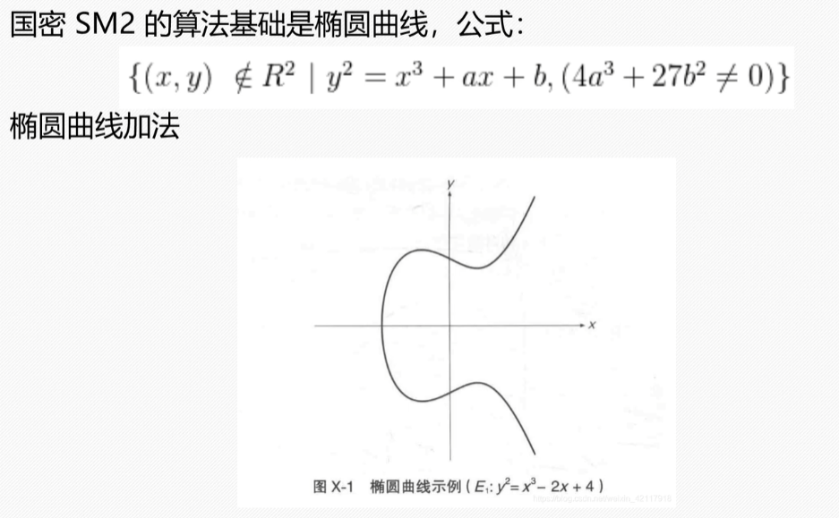
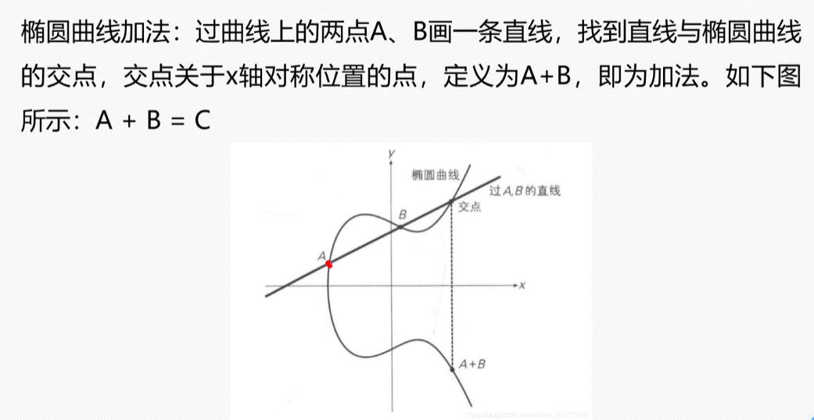
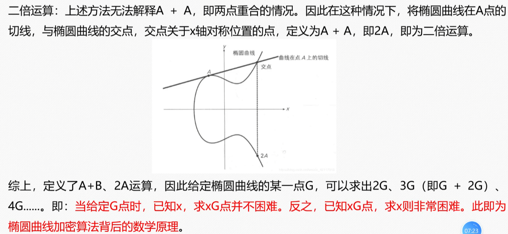
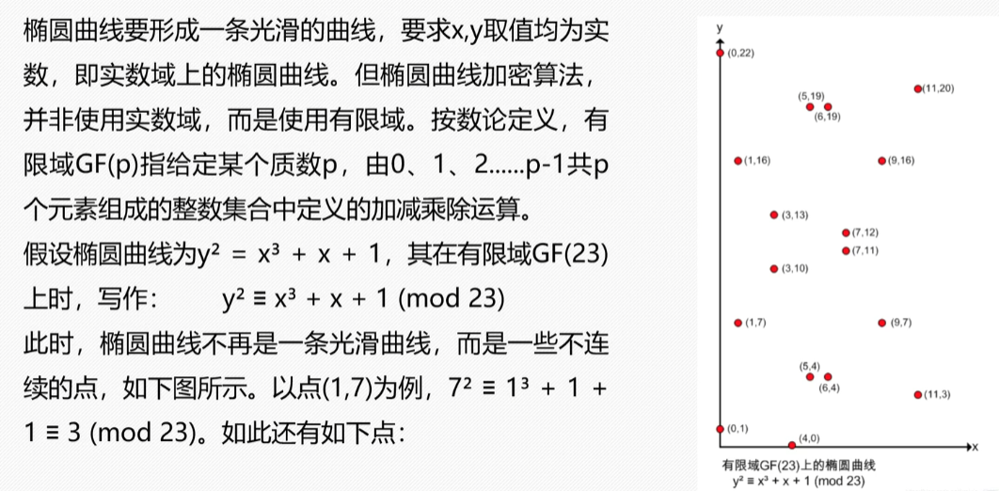
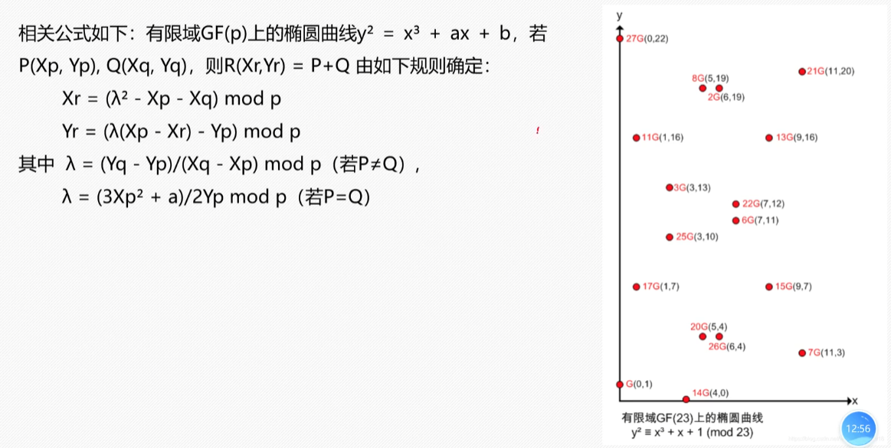
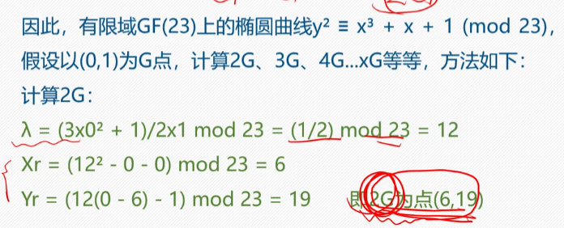
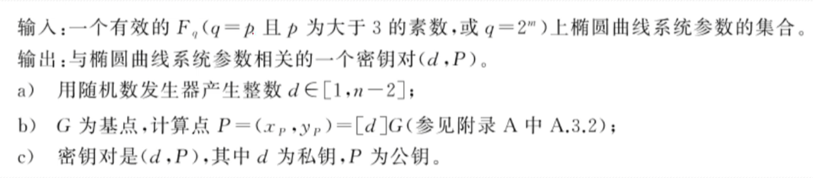
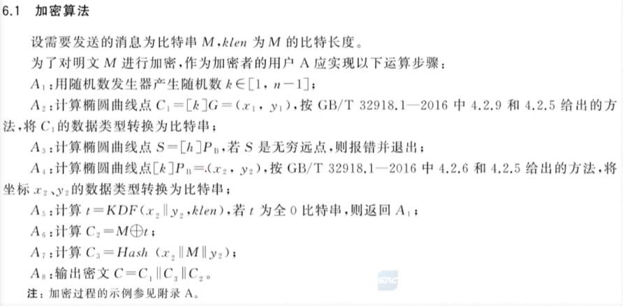
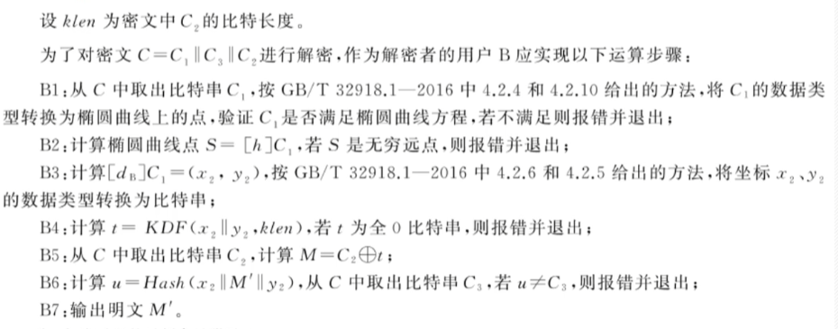

# 一、算法简介

SM2 算法是一种基于椭圆曲线密码学（ECC）的公钥密码算法标准，属于非对称加密体系。在商用密码体系中，SM2主要用于RSA加密算法。

SM2算法是基于椭圆曲线上点群离散对数难题。RSA算法基于大整数因式分解数学难题。

# 二、椭圆曲线运算



公式像椭圆曲线周长公式





# 三、有限域上的椭圆曲线运算







# 四、SM2算法

A与B互通消息：

1.B生成密钥对

2.B将公钥发给A

3.A拿B的公钥加密原文

4.生成的密文发送给B

5.B拿私钥解密

## 4.1密钥对生成



私钥256bit 公钥512bit

## 4.2加密算法



$$A_7$$的Hash算法是SM3

## 4.3解密算法



# 5.代码实现

```c
#include <stdint.h>
#include <stdbool.h>

/* --- 1. 底层大整数与点定义 --- */
// 256位大整数 (8 * 32 = 256)
typedef uint32_t sm2_bn_t[8];

// 椭圆曲线上的仿射坐标点 P = (x, y)
typedef struct {
    sm2_bn_t x;
    sm2_bn_t y;
} sm2_point_t;

/* --- 2. SM2 国家标准推荐参数 --- */
// 素数 p
static const sm2_bn_t SM2_P = {
    0xFFFFFFFF, 0xFFFFFFFF, 0x00000000, 0xFFFFFFFF,
    0xFFFFFFFF, 0xFFFFFFFF, 0xFFFFFFFF, 0xFFFFFFFE
};

// 曲线参数 a
static const sm2_bn_t SM2_A = {
    0xFFFFFFFF, 0xFFFFFFFF, 0x00000000, 0xFFFFFFFF,
    0xFFFFFFFF, 0xFFFFFFFF, 0xFFFFFFFF, 0xFFFFFFFC
};

// 曲线参数 b
static const sm2_bn_t SM2_B = {
    0x28E9FA9E, 0x9D9F5E34, 0x4D5A9E4B, 0xF421DFEA,
    0x20F6B0CB, 0x2213DF06, 0xEAC90EAB, 0x51E289C3
};

// 基点 G = (Gx, Gy)
static const sm2_point_t SM2_G = {
    {0x32C4AE2C, 0x1F198119, 0x5F990446, 0x6A39C994, 
     0x8FE30BBF, 0xF2660BE1, 0x715A4589, 0x334C74C7}, // Gx
    {0xBC3736A2, 0xF4F6779C, 0x59BDCEE3, 0x6B692153, 
     0xD0A9877C, 0x4B3469A2, 0x7EC6A911, 0x213A3C08}  // Gy
};

/* --- 3. SM2 密钥结构 --- */
typedef struct {
    sm2_bn_t    d;      // 私钥 d (范围在 [1, n-2] 之间的随机数)
    sm2_point_t P;      // 公钥 P = d * G (椭圆曲线倍乘)
} sm2_keypair_t;

/* --- 4. 核心运算接口 (需大数库实现) --- */
// 椭圆曲线点加: R = P + Q
extern void sm2_point_add(sm2_point_t *R, const sm2_point_t *P, const sm2_point_t *Q);

// 椭圆曲线倍乘: R = k * P
extern void sm2_point_mul(sm2_point_t *R, const sm2_bn_t k, const sm2_point_t *P);
```

使用 GmSSL 进行 SM2 加解密

```c
#include <stdio.h>
#include <string.h>
#include <gmssl/sm2.h>
#include <gmssl/error.h>

int main() {
    int ret;
    SM2_KEY key;
    
    // 待加密的明文
    const char *message = "Hello, SM2 Public Key Cryptography!";
    size_t msg_len = strlen(message);
    
    // 密文缓冲区 (SM2密文比明文长大约 97 字节：包含坐标、Hash和校验等)
    uint8_t ciphertext[256];
    size_t ciphertext_len;
    
    // 解密后的明文缓冲区
    uint8_t plaintext[256];
    size_t plaintext_len;

    printf("=== SM2 椭圆曲线公钥密码算法演示 ===\n");

    /* 1. 生成 SM2 密钥对 */
    // 在实际应用中，私钥应该安全存储，公钥可以发送给他人
    ret = sm2_key_generate(&key);
    if (ret != 1) {
        fprintf(stderr, "SM2 密钥生成失败\n");
        return -1;
    }
    printf("[1] 密钥对生成成功!\n");

    /* 2. SM2 公钥加密 */
    // 使用对方的公钥 (此处使用刚刚生成的 key) 对消息进行加密
    ret = sm2_encrypt(&key, (const uint8_t *)message, msg_len, ciphertext, &ciphertext_len);
    if (ret != 1) {
        fprintf(stderr, "SM2 加密失败\n");
        return -1;
    }
    printf("[2] 加密成功! 密文长度: %zu 字节\n", ciphertext_len);
    
    // 打印部分密文数据的十六进制形式
    printf("    密文 Hex (前16字节): ");
    for (int i = 0; i < 16; i++) {
        printf("%02X", ciphertext[i]);
    }
    printf("...\n");

    /* 3. SM2 私钥解密 */
    // 接收方使用自己的私钥 (key) 解密密文
    ret = sm2_decrypt(&key, ciphertext, ciphertext_len, plaintext, &plaintext_len);
    if (ret != 1) {
        fprintf(stderr, "SM2 解密失败\n");
        return -1;
    }
    
    // 补齐字符串结束符
    plaintext[plaintext_len] = '\0';
    
    printf("[3] 解密成功! 解密内容: %s\n", plaintext);

    return 0;
}
```

