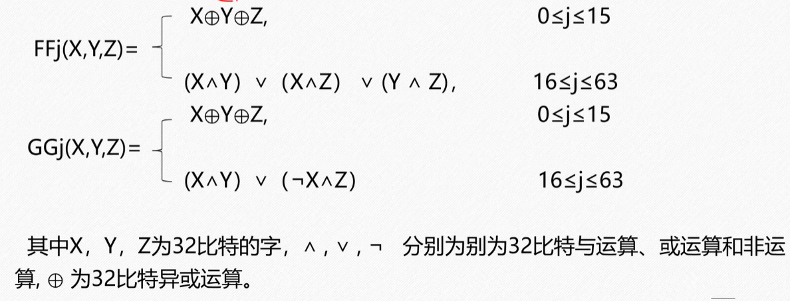
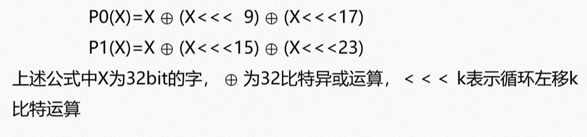
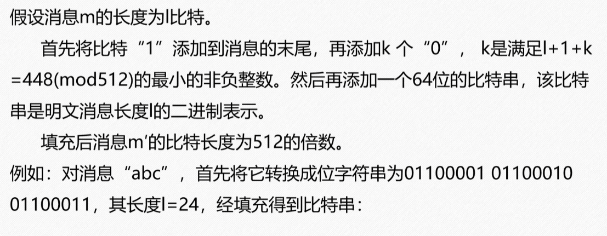
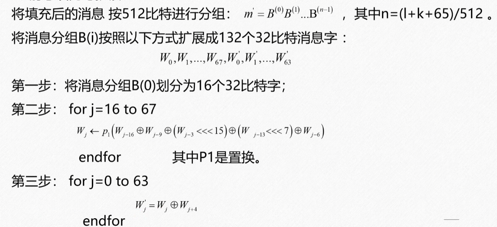
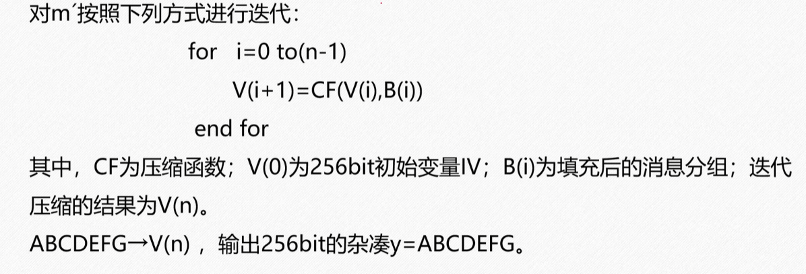
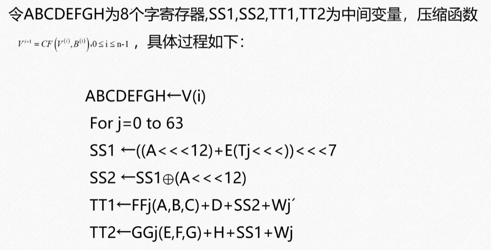
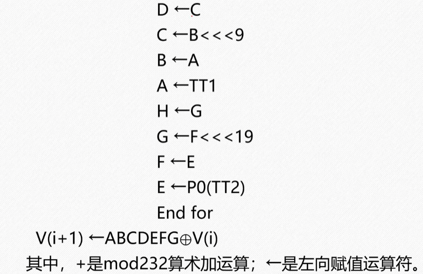

# 一、算法简介

SM3密码杂凑算法适用于商用密码中的数字签名和验证，其**安全性和****SHA-256****相当**。SM3和MD5的迭代过程类似，也采用Merkle-Damgard结构。消息分组长度为512位，摘要值长度为256位。整个算法的执行过程可以概括为四个步骤：消息填充、消息扩展、迭代压缩、输出结果。

输入长度是任意的，输出的长度是固定的。输入长度小于 $$2^{64}$$比特。

# 二、数学基础

## 2.1算法常数与函数

SM3密码杂凑算法的初始值**IV****共256比特**，用于确定压缩函数寄存器的初态，具体值如下:

IV=7380166f,4914b2b9,172442d7,da8a0600,a96f30bc,163138aa,e38dee4d,b0fb0e4e

对于SM3密码杂凑算法的常量 $$T_j$$定义如下：

$$T_j = \{79cc4519,0≤j≤15 \},\{7a879d8a,16≤j≤63 \};$$

SM3密码杂凑算法的布尔函数定义为:



对SM3密码杂凑法的**置换函数**定义如下：



# 三、SM3杂凑法工作原理

SM3密码杂凑算法是MD结构，将一个任意有限比特长度的消息m压缩到某一固定长度为n比特的杂凑值h，即H（m）=h。SM3密码杂凑算法是对长度为L（K< $$2^{64}$$）比特的消息m，经过**填充、分组和迭代压缩**，生成杂凑值。杂凑值长度为256比特。

## 3.1消息的填充与扩展

首先，无论原始消息多长，都需要被填充至512位的倍数。填充规则是：先补一个“1”，再补k个“0”，使得`(消息长度 + 1 + k) mod 512 = 448`，最后再追加一个64位的块，表示原始消息的长度（比特数）。



将填充后的每个512位消息分组扩展生成132个32位的字（W0 ~ W67 和 W0' ~ W63'）



## 3.2迭代过程







Mod $$2^{32}$$

# 4.代码实现

```c
#include <stdint.h>
#include <string.h>
#include <stdio.h>

/* --- 宏定义与辅助函数 --- */

// 32位循环左移
#define ROTL(x, n)  (((x) << ((n) & 31)) | ((x) >> (32 - ((n) & 31))))

// 常量 T_j
#define T0_15  0x79CC4519
#define T16_63 0x7A879D8A

// 布尔函数 FF_j 和 GG_j
#define FF0_15(X, Y, Z)  ((X) ^ (Y) ^ (Z))
#define FF16_63(X, Y, Z) (((X) & (Y)) | ((X) & (Z)) | ((Y) & (Z)))

#define GG0_15(X, Y, Z)  ((X) ^ (Y) ^ (Z))
#define GG16_63(X, Y, Z) (((X) & (Y)) | (~(X) & (Z)))

// 置换函数 P0 和 P1
#define P0(X) ((X) ^ ROTL((X), 9) ^ ROTL((X), 17))
#define P1(X) ((X) ^ ROTL((X), 15) ^ ROTL((X), 23))

// 大端字节序读取 32 位整数
static inline uint32_t load32_be(const uint8_t *b) {
    return ((uint32_t)b[0] << 24) | ((uint32_t)b[1] << 16) | 
           ((uint32_t)b[2] << 8)  | (uint32_t)b[3];
}

// 大端字节序写入 32 位整数
static inline void store32_be(uint32_t val, uint8_t *b) {
    b[0] = (uint8_t)(val >> 24);
    b[1] = (uint8_t)(val >> 16);
    b[2] = (uint8_t)(val >> 8);
    b[3] = (uint8_t)(val);
}

/* --- SM3 上下文结构体 --- */
typedef struct {
    uint32_t state[8];    // 8 个 32位寄存器 (A~H)
    uint64_t length;      // 处理的消息总位数
    uint8_t  buffer[64];  // 64 字节数据块缓冲 (512 bits)
    uint32_t curlen;      // 当前缓冲区的数据长度(字节)
} SM3_CTX;

/* --- 核心：数据块压缩函数 --- */
static void sm3_compress(SM3_CTX *ctx, const uint8_t block[64]) {
    uint32_t W[68], W1[64];
    uint32_t A, B, C, D, E, F, G, H;
    uint32_t SS1, SS2, TT1, TT2;
    int j;

    // 1. 消息扩展 (将 16 个字扩展为 68 个字 W 和 64 个字 W1)
    for (j = 0; j < 16; j++) {
        W[j] = load32_be(block + j * 4);
    }
    for (j = 16; j < 68; j++) {
        uint32_t tmp = W[j - 16] ^ W[j - 9] ^ ROTL(W[j - 3], 15);
        W[j] = P1(tmp) ^ ROTL(W[j - 13], 7) ^ W[j - 6];
    }
    for (j = 0; j < 64; j++) {
        W1[j] = W[j] ^ W[j + 4];
    }

    // 2. 寄存器初始化
    A = ctx->state[0]; B = ctx->state[1]; C = ctx->state[2]; D = ctx->state[3];
    E = ctx->state[4]; F = ctx->state[5]; G = ctx->state[6]; H = ctx->state[7];

    // 3. 64 步迭代压缩
    for (j = 0; j < 16; j++) {
        SS1 = ROTL((ROTL(A, 12) + E + ROTL(T0_15, j)), 7);
        SS2 = SS1 ^ ROTL(A, 12);
        TT1 = FF0_15(A, B, C) + D + SS2 + W1[j];
        TT2 = GG0_15(E, F, G) + H + SS1 + W[j];
        D = C; C = ROTL(B, 9); B = A; A = TT1;
        H = G; G = ROTL(F, 19); F = E; E = P0(TT2);
    }
    for (j = 16; j < 64; j++) {
        SS1 = ROTL((ROTL(A, 12) + E + ROTL(T16_63, (j & 31))), 7);
        SS2 = SS1 ^ ROTL(A, 12);
        TT1 = FF16_63(A, B, C) + D + SS2 + W1[j];
        TT2 = GG16_63(E, F, G) + H + SS1 + W[j];
        D = C; C = ROTL(B, 9); B = A; A = TT1;
        H = G; G = ROTL(F, 19); F = E; E = P0(TT2);
    }

    // 4. 更新状态
    ctx->state[0] ^= A; ctx->state[1] ^= B; ctx->state[2] ^= C; ctx->state[3] ^= D;
    ctx->state[4] ^= E; ctx->state[5] ^= F; ctx->state[6] ^= G; ctx->state[7] ^= H;
}

/* --- 对外接口 --- */

// 初始化 SM3
void sm3_init(SM3_CTX *ctx) {
    ctx->state[0] = 0x7380166F;
    ctx->state[1] = 0x4914B2B9;
    ctx->state[2] = 0x172442D7;
    ctx->state[3] = 0xDA8A0600;
    ctx->state[4] = 0xA96F30BC;
    ctx->state[5] = 0x163138AA;
    ctx->state[6] = 0xE38DEE4D;
    ctx->state[7] = 0xB0FB0E4E;
    ctx->length = 0;
    ctx->curlen = 0;
}

// 持续输入数据
void sm3_update(SM3_CTX *ctx, const uint8_t *data, size_t len) {
    ctx->length += len * 8; // 更新总位数
    while (len > 0) {
        size_t copy_len = 64 - ctx->curlen;
        if (len < copy_len) {
            copy_len = len;
        }
        memcpy(ctx->buffer + ctx->curlen, data, copy_len);
        ctx->curlen += copy_len;
        data += copy_len;
        len -= copy_len;

        // 缓冲区满 64 字节时进行一次压缩
        if (ctx->curlen == 64) {
            sm3_compress(ctx, ctx->buffer);
            ctx->curlen = 0;
        }
    }
}

// 输出最终的 Hash 结果 (256 bits = 32 bytes)
void sm3_final(SM3_CTX *ctx, uint8_t digest[32]) {
    // 1. 填充 (Padding): 填充一个 1，然后补 0
    ctx->buffer[ctx->curlen++] = 0x80;
    
    // 如果剩余空间不足以容纳 64 位的长度值，则先补 0 并压缩一次
    if (ctx->curlen > 56) {
        memset(ctx->buffer + ctx->curlen, 0, 64 - ctx->curlen);
        sm3_compress(ctx, ctx->buffer);
        ctx->curlen = 0;
    }

    // 2. 补 0 直到最后 8 字节前
    memset(ctx->buffer + ctx->curlen, 0, 56 - ctx->curlen);

    // 3. 填入 64 位的消息总长度 (大端序)
    ctx->buffer[56] = (uint8_t)(ctx->length >> 56);
    ctx->buffer[57] = (uint8_t)(ctx->length >> 48);
    ctx->buffer[58] = (uint8_t)(ctx->length >> 40);
    ctx->buffer[59] = (uint8_t)(ctx->length >> 32);
    ctx->buffer[60] = (uint8_t)(ctx->length >> 24);
    ctx->buffer[61] = (uint8_t)(ctx->length >> 16);
    ctx->buffer[62] = (uint8_t)(ctx->length >> 8);
    ctx->buffer[63] = (uint8_t)(ctx->length);

    // 4. 最后一次压缩
    sm3_compress(ctx, ctx->buffer);

    // 5. 提取最终的 state 到 digest 中 (大端序转换)
    for (int i = 0; i < 8; i++) {
        store32_be(ctx->state[i], digest + i * 4);
    }
}

/* --- 测试代码 --- */
int main() {
    SM3_CTX ctx;
    uint8_t digest[32];
    
    // 测试用例：对 "abc" 求 Hash
    const char *msg = "abc";
    size_t msg_len = strlen(msg);
    
    sm3_init(&ctx);
    sm3_update(&ctx, (const uint8_t *)msg, msg_len);
    sm3_final(&ctx, digest);
    
    printf("Message: %s\n", msg);
    printf("SM3 Hash: ");
    for (int i = 0; i < 32; i++) {
        printf("%02x", digest[i]);
    }
    printf("\n");
    
    // 标准答案应该输出：
    // 66c7f0f462eeedd9d1f2d46bdc10e4e24167c4875cf2f7a2297da02b8f4ba8e0
    return 0;
}
```

