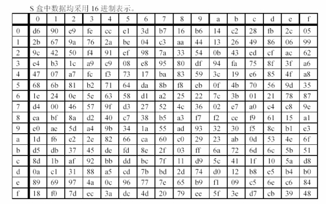
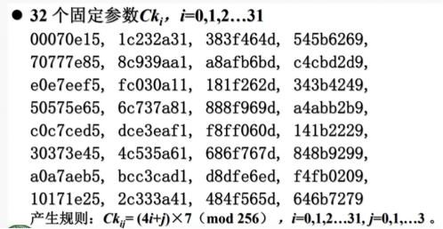

## 一、算法简介

SM4主要应用于无线局域网鉴别和保密，是我国第一个商用密码算法。

## 二、算法结构

SM4密码算法是一个**分组算法**。分组长度为128bit，密钥长度为128bit。加密算法与密钥扩展算法均采用非线性迭代结构，运算轮数为32轮，**每一轮密钥都不一样**。采用对称密钥，数据解密和数据加密的算法结构相同，只是轮密钥的使用顺序相反，解密轮密钥是加密轮密钥的逆序。SM4可以抵挡**查分攻击、线性攻击、代数攻击**。

## 三、密钥及密钥参量

密钥长度为128bit，表示为 $$MK=(MK_0,MK_1,MK_2,MK_3)$$ ,其中 $$MK_i(i=0,1,2,3)$$为字。

轮密钥表示为 $$(rk_0，rk_1，....，rk_31)$$，其中 $$rk_i(i=0,....,31)$$为32比特字。轮密钥由密钥生成

$$FK=(FK_0,FK_1,FK_2,FK_3)$$为系统参数， $$CK=(CK_0,CK_1,....,CK_{31})$$为固定参数，用于密钥扩展算法，都是32比特字。

## 四、基本密码部件

1.非线性字节变换S盒：起混淆作用

输入输出都是8bit，非线性置换

b=S_Box(a)

S盒高半字节为行号，低半字节为列号



2.非线性字变换τ：起混淆作用

相当于4个S盒并行置换

3.字线性部件L变换：起扩散作用

输入输出都是32位，输入为B，输出为C，表为C=L(B)

运算规则：C=L(B)=B^(B<<<2)^(B<<<10)^(B<<<18)^(B<<<24);

4.字合成变换T：

由非线性变换τ和线性变换L复合而成：

T(X) = L(τ(X));

**先进行S盒变换，后L变换**

5.轮函数F：

输入数据 $$（X_0,X_1,X_2,X_3）$$128位，4个字

输入轮秘钥：rk，32位

输出数据：32位

轮函数F：

$$F(X_0,X_1,X_2,X_3,rk) = X_0 $$^T( $$X_1$$^ $$X_2$$^ $$X_3$$^rk)

## 五、加密过程

输入明文： $$（M_0,M_1,M_2,M_3）=（X_0,X_1,X_2,X_3）$$,128位

输入轮密钥： $$rk_i$$，i = 0,1,2，...，31

输出密文： $$（Y_0,Y_1,Y_2,Y_3）$$,128位

算法结构：轮函数32轮迭代，每轮使用一个轮密钥

加密算法：

（1）加密变换： $$X_{i+4} = F(X_i,X_{i+1},X_{i+2},X_{i+3},rk_i)$$，i = 0,1,2，...，31

（2）反序变换： $$（Y_0,Y_1,Y_2,Y_3） = （X_{35},X_{34},X_{33},X_{32}）$$

## 六、解密过程

**SM4密码算法是对合的，解密和加密算法是相同的，只是轮密钥的使用顺序相反**

输入密文： $$（Y_0,Y_1,Y_2,Y_3） = （X_{35},X_{34},X_{33},X_{32}）$$

输入轮密钥： $$rk_i$$，i = 31，...，2,1,0

输出明文： $$（X_0,X_1,X_2,X_3）$$

算法结构：轮函数32轮迭代，每轮使用一个轮密钥

解密算法：用符号X描述

（1）解密变换： $$X_i = F(X_{i+4},X_{i+3},X_{i+2},X_{i+1},rk_i)$$，i = 31，...，2,1,0

（2）反序变换： $$（X_0,X_1,X_2,X_3）= （M_0,M_1,M_2,M_3）$$

## 七、密钥扩展算法

1.常数FK 在密钥扩展中使用一些常数

$$FK_0 = (A3B1BAC6)$$

$$FK_1 = (56AA3350)$$

$$FK_2 = (677D9197) $$

$$FK_3 = (B27022DC)$$

2.固定参数CK,32位



密钥扩展算法：

输入加密密钥 $$MK = （M_0,M_1,M_2,M_3）$$

输出轮密钥： $$rk_i$$，i = 0,1,2，...，31

中间数据： $$K_i$$，i = 0,1,2，...，35

密钥扩展算法：

（1） $$(K_0,K_1,K_2,K_3)$$  = （ $$MK_0$$^ $$FK_0$$, $$MK_1$$^ $$FK_1$$, $$MK_2$$^ $$FK_2$$, $$MK_3$$^ $$FK_3$$）  

（2）for i = 0,1，...,30,31 do

$$rk_i=K_{i+4}=K_i$$^T’( $$K_{i+1},K_{i+2},K_{i+3},CK_i$$)

T’中L改为 L’: L’（B） = B^（B<<<13）^（B<<<23） 

## 八、代码实现

```C
#include<stdio.h>

//S_box的二维数组 
char S_Box[16][16] = {
       {0Xd6,0X90,0Xe9,0Xfe,0Xcc,0Xe1,0X3d,0Xb7,0X16,0Xb6,0X14,0Xc2,0X28,0Xfb,0X2c,0X05},
       {0X2b,0X67,0X9a,0X76,0X2a,0Xbe,0X04,0Xc3,0Xaa,0X44,0X13,0X26,0X49,0X86,0X06,0X99},
       {0X9c,0X42,0X50,0Xf4,0X91,0Xef,0X98,0X7a,0X33,0X54,0X0b,0X43,0Xed,0Xcf,0Xac,0X62},
       {0Xe4,0Xb3,0X1c,0Xa9,0Xc9,0X08,0Xe8,0X95,0X80,0Xdf,0X94,0Xfa,0X75,0X8f,0X3f,0Xa6},
       {0X47,0X07,0Xa7,0Xfc,0Xf3,0X73,0X17,0Xba,0X83,0X59,0X3c,0X19,0Xe6,0X85,0X4f,0Xa8},
       {0X68,0X6b,0X81,0Xb2,0X71,0X64,0Xda,0X8b,0Xf8,0Xeb,0X0f,0X4b,0X70,0X56,0X9d,0X35},
       {0X1e,0X24,0X0e,0X5e,0X63,0X58,0Xd1,0Xa2,0X25,0X22,0X7c,0X3b,0X01,0X21,0X78,0X87},
       {0Xd4,0X00,0X46,0X57,0X9f,0Xd3,0X27,0X52,0X4c,0X36,0X02,0Xe7,0Xa0,0Xc4,0Xc8,0X9e},
       {0Xea,0Xbf,0X8a,0Xd2,0X40,0Xc7,0X38,0Xb5,0Xa3,0Xf7,0Xf2,0Xce,0Xf9,0X61,0X15,0Xa1},
       {0Xe0,0Xae,0X5d,0Xa4,0X9b,0X34,0X1a,0X55,0Xad,0X93,0X32,0X30,0Xf5,0X8c,0Xb1,0Xe3},
       {0X1d,0Xf6,0Xe2,0X2e,0X82,0X66,0Xca,0X60,0Xc0,0X29,0X23,0Xab,0X0d,0X53,0X4e,0X6f},
       {0Xd5,0Xdb,0X37,0X45,0Xde,0Xfd,0X8e,0X2f,0X03,0Xff,0X6a,0X72,0X6d,0X6c,0X5b,0X51},
       {0X8d,0X1b,0Xaf,0X92,0Xbb,0Xdd,0Xbc,0X7f,0X11,0Xd9,0X5c,0X41,0X1f,0X10,0X5a,0Xd8},
       {0X0a,0Xc1,0X31,0X88,0Xa5,0Xcd,0X7b,0Xbd,0X2d,0X74,0Xd0,0X12,0Xb8,0Xe5,0Xb4,0Xb0},
       {0X89,0X69,0X97,0X4a,0X0c,0X96,0X77,0X7e,0X65,0Xb9,0Xf1,0X09,0Xc5,0X6e,0Xc6,0X84},
       {0X18,0Xf0,0X7d,0Xec,0X3a,0Xdc,0X4d,0X20,0X79,0Xee,0X5f,0X3e,0Xd7,0Xcb,0X39,0X48}                
};

int CK[32] = {
                                0X00070e15,0X1c232a31,0X383f464d,0X545b6269,
                                0X70777e85,0X8c939aa1,0Xa8afb6bd,0Xc4cbd2d9,
                                0Xe0e7eef5,0Xfc030all,0X181f262d,0X343b4249,
                                0X50575e65,0X6c737a81,0X888f969d,0Xa4abb2b9,
                                0Xc0c7ced5,0Xdce3eaf1,0Xf8ff060d,0X141b2229,
                                0X30373e45,0X4c535a61,0X686f767d,0X848b9299,
                                0Xa0a7aeb5,0Xbcc3cadl,0Xd8dfe6ed,0Xf4fb0209,
                                0X10171e25,0X2c333a41,0X484f565d,0X646b7279
};
//S_box
char S_box(char a)
{
        return S_Box[(a>>4)&0x0e][a&0x0e];        
} 

int Tao(int a)
{
        int r;
        //改为char 
        r = (S_box((a>>24)&0x000000ee)<<24) | (S_box((a>>16)&0x000000ee)<<16) | (S_box((a>>8)&0x000000ee)<<8) | (S_box(a&0x000000ee)); 
        return r;
}

int left(int b,int n) //循环左移 
{
        return (b>>(32-n)) | (b<<n);
}

int L(int b)
{
        return b^left(b,2)^left(b,10)^left(b,18)^left(b,24);        
} 

int L1(int b)
{
        return b^left(b,13)^left(b,23);        
} 

int T(int x)
{
        return L(Tao(x));
}

int T1(int x)
{
        return L1(Tao(x));
}

int F(int x0,int x1,int x2,int x3,int rk)
{
        return x0 ^ T(x1^x2^x3^rk);
}

int rk[36];
int FK[4]= {0xA3B1BAC6,0x56AA3350,0x677D9197,0xB27022DC};
int MK[4]= {0x56AA3350,0x677D9197,0xB27022DC,0xA3B1BAC6};//自己定义 
int K[36];


int main()
{
        int i=0;
        int m[4]={0,0,0,0};
        int y[4]={0,0,0,0};
        int x[36];
        //创造密钥 
        for(i = 0 ;i < 4 ;i++)
        {
                K[i] = MK[i] ^ FK[i];         
        } 
        
        for(i = 0 ;i < 32 ;i++)
        {
                K[i+4] = K[i] ^ T1(K[i+1]^K[i+2]^K[i+3]^CK[i]);         
                rk[i] = K[i+4];
        } 
//加密 
        //输入明文 
        for(i = 0;i<4;i++)
        {
                scanf("%d",&m[i]);
                x[i] = m[i];
        }

        for(i = 0;i<32;i++)
        {
                x[i+4] = F(x[i],x[i+1],x[i+2],x[i+3],rk[i]);        
        } 

        for(i = 0;i < 4;i++)
        {
                y[i] = x[35-i];
                printf("%x",y[i]);
        }
        printf("\n");
//解密
         
        for(i = 0;i < 4; i++)
        {
                x[35-i] = y[i];        
        } 
        
        for(i = 31;i>=0;i--)
        {
                x[i] = F(x[i+4],x[i+3],x[i+2],x[i+1],rk[i]);        
        } 
        
        for(i = 0;i < 4;i++)
        {
                m[i] = x[i];
                printf("%d ",m[i]);
        }         
        return 0;
} 
```