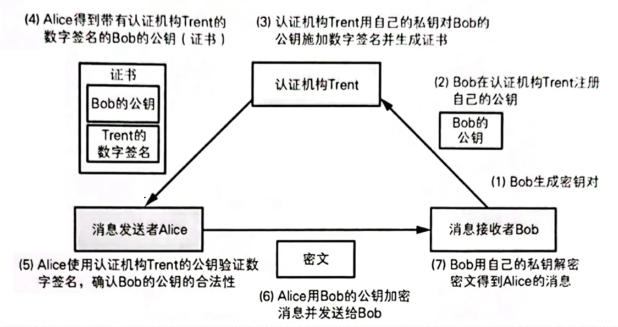
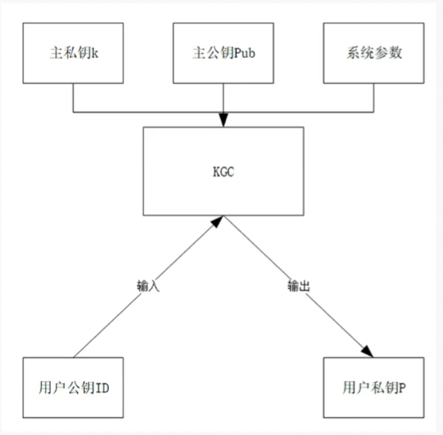
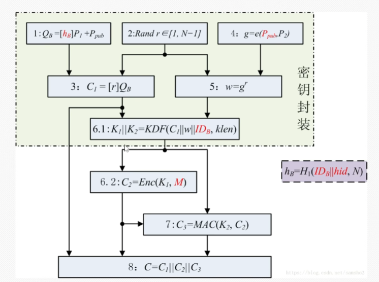
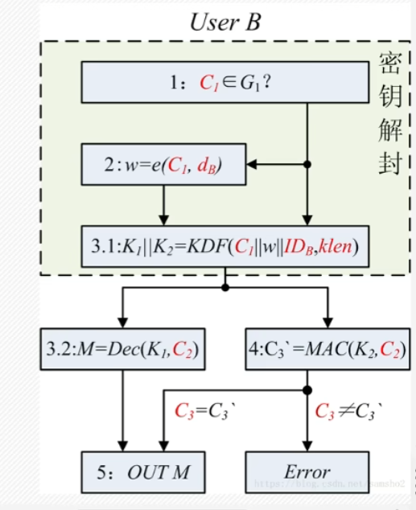

# 一、算法简介

SM9是**基于双线性对的标识密码算法**，与SM2类似，主要包含了以下四个部分：总则、数字签名算法、密钥交换协议以及密钥封装机制和公钥加密算法。SM9算法不需要申请数字证书，适用于互联网各种新兴应用的安全保障，如基于云技术的密码服务、电子邮件安全、智能终端保护、物联网安全、云存储安全等等。

证书应用场景



# 二、算法描述

双线性对是一种二元映射，作为密码学算法的构造工具在各区块链平台中广泛应用。

线性映射一个函数f是线性的是指函数f满足**可加性**和**齐次性**，也就是：

可加性： $$f(a)+f(b)=f(a+b)$$

齐次性： $$f(ka)=kf(a)$$

双线性映射和线性函数不同的点在于满足双线性的函数有两个输入，而且对这两个输入分别满足线性。一个映射e，能 $$G_1$$ 和 $$G_2$$ 中的两个元素映射为 $$G_3$$中的一个元素，并且该映射满足双线性。设 $$P_1,P_2$$分别是群 $$G_1$$ 和 $$G_2$$的元素，e是 $$G_1×G_2→G_3$$的双线性映射，那么有：

$$e(ag_1,bg_2)=ab e(g_1,g_2)=e(abg_1,g_2)=e(g_1,abg_2)$$

$$e(ag_1,bg_2)+e(cg_1,dg_2)=(ab+cd)e(g_1,g_2)$$

密钥生成分为主密钥生成和用户密钥生成两部分，主密钥由密钥生成中心（KGC）保管。

主密钥：

公钥:K*P

私钥：随机数K

用户密钥：

公钥:用户表示信息

私钥:d

## 2.1

选择256位BN椭圆曲线，群的阶为N，加法循环群 $$G_1$$的生成元 $$P_1$$,加法循环群 $$G_2$$的生成元 $$P_2$$,乘法循环圈 $$G_T$$,双线性对e是 $$G_1×G_2→G_T$$的映射

满足 $$e([a]P_1,[b]P_2) = e(P_1,P_2)^{ab}$$

## 2.2

KGC生成随机数K[1,N-1],作为系统主私钥。通过计算 $$Pub = K*P$$为系统根公钥（P位加法循环群的生成元，按照签名、加密的不同需要设置 $$P_1或P_2$$）

## 2.3

用户的标识即为用户的公钥信息。

用户私钥d需要通过KGC来进行生成，其过程为

$$t_1 = H(ID||hid,N)+k,t_2 = k*t_1^{-1},d=t_2*P$$，

H为类HASH算法，归一化信息，并计算小于N的整数，P为加法循群生成元



## 2.4加密流程



更正8： $$C=C_1||C_3||C_2$$

## 2.5解密流程



# 3.代码实现

```C
#include <stdint.h>
#include <stdbool.h>
#include <string.h>

/* --- 1. 底层大整数与扩域定义 (基于 256-bit) --- */
typedef struct {
    uint64_t v[4]; // 256位大整数，用于 Fp 域
} fp_t;

typedef struct {
    fp_t c0, c1;   // Fp2 扩域元素: c0 + c1 * u
} fp2_t;

typedef struct {
    fp2_t c0, c1, c2; // Fp12 扩域元素 (简化表示)
} fp12_t;

/* --- 2. 椭圆曲线群 G1 和 G2 上的点定义 --- */
// G1 群上的点 (基于 Fp)
typedef struct {
    fp_t x, y, z; 
} sm9_point_g1;

// G2 群上的点 (基于 Fp2)
typedef struct {
    fp2_t x, y, z;
} sm9_point_g2;

/* --- 3. SM9 密钥与签名结构体 --- */
// 主公钥 (由 KGC 密钥生成中心生成)
typedef struct {
    sm9_point_g2 Ppub; // Ppub = s * P2
} sm9_master_public_key;

// 用户私钥
typedef struct {
    sm9_point_g1 dsa; // dsA = t1 * P1
} sm9_user_private_key;

// SM9 签名结果
typedef struct {
    fp12_t h;          // h = e(G1, G2) 映射结果的 Hash
    sm9_point_g1 S;    // S = l * dsa
} sm9_signature;

/* --- 4. 核心抽象接口 (底层实现需大数库支持) --- */

// 双线性对 R-ate 计算: e(P, Q)
extern void sm9_pairing(fp12_t *out, const sm9_point_g1 *P, const sm9_point_g2 *Q);

// G1/G2 群上的标量乘法: R = k * P
extern void sm9_g1_mult(sm9_point_g1 *R, const fp_t *k, const sm9_point_g1 *P);
extern void sm9_g2_mult(sm9_point_g2 *R, const fp_t *k, const sm9_point_g2 *P);

// 密码杂凑函数 H1, H2
extern void sm9_hash1(fp_t *out, const char *id, size_t id_len, uint8_t hid);
extern void sm9_hash2(fp_t *out, const uint8_t *msg, size_t msg_len, const fp12_t *w);

/* --- 5. 算法业务逻辑骨架 (以签名为例) --- */
bool sm9_sign(sm9_signature *sig, 
              const sm9_user_private_key *dsa, 
              const char *msg, size_t msg_len) 
{
    fp_t r;
    fp12_t w;
    fp_t h_val;
    sm9_point_g1 P1; // 曲线基点 P1
    
    // 1. 生成随机数 r in [1, n-1]
    // rng_generate_r(&r);
    
    // 2. 计算 w = g^r (g = e(P1, Ppub))
    // 实际实现中通常预计算 g
    // fp12_pow(&w, &g, &r);
    
    // 3. 计算 h = H2(M || w)
    sm9_hash2(&h_val, (const uint8_t *)msg, msg_len, &w);
    
    // 4. 计算 l = (r - h) mod n
    // fp_sub_mod_n(&l, &r, &h_val);
    
    // 5. 计算 S = l * dsa
    // sm9_g1_mult(&sig->S, &l, dsa);
    
    // sig->h = h_val; // 转换为合适格式
    
    return true;
}
```


借用GaSSL调用SM9

```c
#include <stdio.h>
#include <string.h>
#include <gmssl/sm9.h>

int main() {
    int ret;
    
    // KGC (密钥生成中心) 变量
    SM9_SIGN_MASTER_KEY master_key;
    
    // 用户变量
    const char *id = "alice@example.com";
    size_t id_len = strlen(id);
    SM9_SIGN_KEY user_key;
    
    // 签名验证变量
    const uint8_t msg[] = "Hello, SM9 Identity-Based Cryptography!";
    size_t msg_len = sizeof(msg) - 1;
    uint8_t sig[512];
    size_t sig_len;
    
    printf("=== SM9 标识密码算法演示 ===\n");

    /* 1. KGC 生成主密钥对 (Master Key) */
    // 实际应用中，KGC需严密保管主私钥，公开主公钥
    sm9_sign_master_key_generate(&master_key);
    printf("[1] KGC 主密钥生成成功.\n");

    /* 2. KGC 提取用户私钥 (Extract) */
    // 用户凭借自己的标识(如邮箱)向KGC申请私钥
    // hid 是签名业务区分符，标准中签名通常取 0x01
    ret = sm9_sign_key_generate(&user_key, &master_key, id, id_len);
    if (ret != 1) {
        printf("生成用户私钥失败!\n");
        return -1;
    }
    printf("[2] 用户私钥生成成功 (标识: %s).\n", id);

    /* 3. 用户进行数字签名 (Sign) */
    // 使用用户自己的 user_key 对 msg 进行签名
    ret = sm9_sign(&user_key, msg, msg_len, sig, &sig_len);
    if (ret != 1) {
        printf("SM9 签名失败!\n");
        return -1;
    }
    printf("[3] 签名成功, 签名长度: %zu 字节.\n", sig_len);

    /* 4. 接收方验证签名 (Verify) */
    // 验证方只需要知道：系统主公钥(master_key)、用户标识(id)和消息原文
    // 注意：验证方**不需要**用户的公钥证书！
    ret = sm9_verify(&master_key, id, id_len, msg, msg_len, sig, sig_len);
    if (ret == 1) {
        printf("[4] 签名验证成功! 确认消息是由 %s 发送的.\n", id);
    } else {
        printf("[4] 签名验证失败!\n");
    }

    return 0;
}
```

