# 一、算法简介

祖冲之序列密码算法包括祖冲之算法（生成密钥流）、加密算法（128-EEA3），完整性算法（128-EIA3）。祖冲之算法（ZUC）是一种**同步序列密码算法**，**广泛应用于无线通信系统中**。它由我国学者自主设计的**流密码算法**，并成为国际密码标准。ZUC算法**以高安全性**作为优先目标，同时兼顾高的软硬件性能，ZUC算法的整体结构分为三层：线性反馈移位寄存器（LFSR）、比特重组（BR）和非线性函数F。

# 二、算法原理

ZUC算法主要包括LFSR、BR、非线性函数F。上层为线性反馈移位寄存器(LFSR)、中层为比特重组(BR)，下层为非线性函数F。

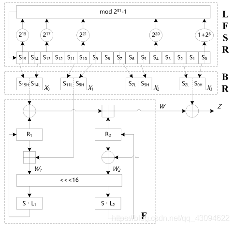

## 2.1线性反馈移位寄存器

LFSR包括16个**31比特寄存器单元** $$S_0 - S_{15}$$。

LFSR运行模式分为初始化模式和工作模式。

这两个模式主要的目的是为了 $$S_0 - S_{15}$$的更新。

**工作模式****LFSR****没有输入**，这是这两个模式的区别。

### 2.1.1初始化模式

初始化模式下，**LFSR****接收一个31比特字u**，u由非线性函数F的32比特输出w舍弃最低位（右移一位）得到。**目的是为了更新** $$S_0$$**~** $$S_{15} $$**。**

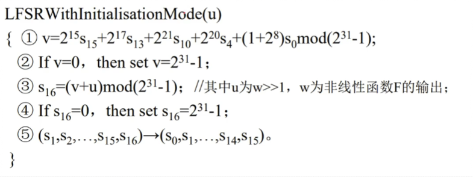

### 2.1.2工作模式

工作模式下，LFSR不接收任何输入，目的对 $$S_0$$**~** $$S_{15} $$进行更新。

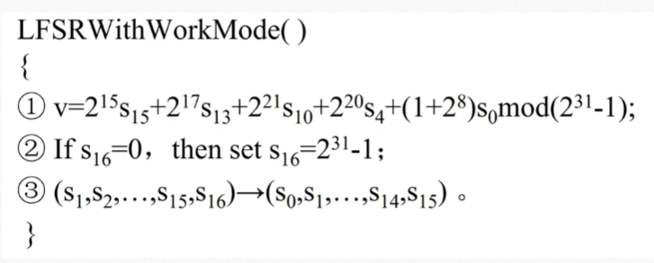

## 2.2比特重组BR

BR从LFSR特定的8个单元中抽取128位形成4个32位的字（ $$X_0,X_1,X_2,X_3$$），这里的前3个字会在F函数中使用，最后一个字涉产生密钥流。

$$X_0 = S_{15H} || S_{14L}$$

$$X_1 = S_{11L} || S_{9H}$$

$$X_2 = S_{7L} || S_{5H}$$

$$X_3 = S_{2L} || S_{0H}$$

因为S寄存器是31位的寄存器，所以选取高位时取高位的16个bit，选取低位时选取低位的16个bit

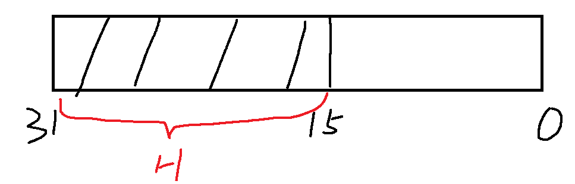

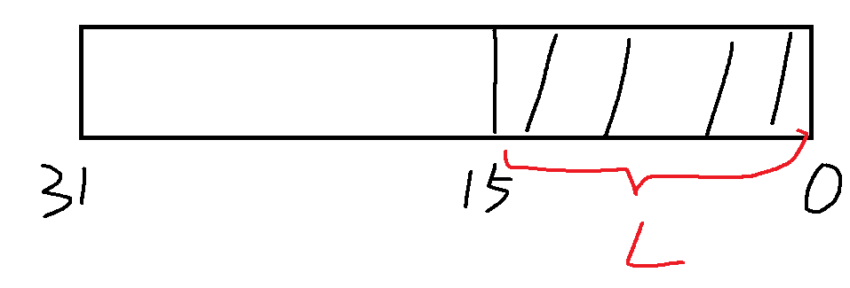

## 2.3非线性函数F

$$W=F(X_0,X_1,X_2)$$为非线性函数，非线性函数F包括两个32位的记忆单元R1和R2。F的输入为 $$X_0,X_1,X_2$$,这里的输入来自于BR的输出，然后F输出1个32位的字W。

### 2.3.1F函数的具体过程

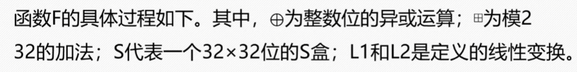

这里的田是模 $$2^{32}$$的加法

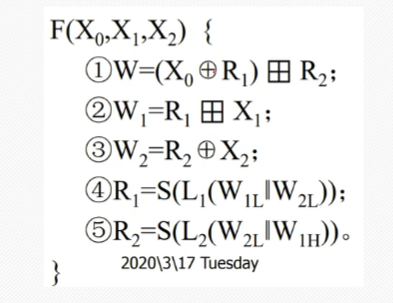

## 2.4密钥流产生

当F函数输出W之后，W与BR中输出的 $$X_3$$进行异或处理，生成Z，Z为最终的密钥

# 三、算法流程

## 3.1密钥装入

ZUC算法在执行的过程中会到的参数为128位的密钥K和一个128位的初始向量IV，用于加载在LFSR中，给S寄存器组进行初始化。

在LFSR中， $$S_i=K_i||d_i ||IV_i$$(0<=i<=15)，其中 $$K_i，IV_i $$的长度为8bit，di的长度为15bit。128bit的密钥K和初始化向量IV表示成16个字串级联的形式，将K和IV分成16份，每一份是8bit。

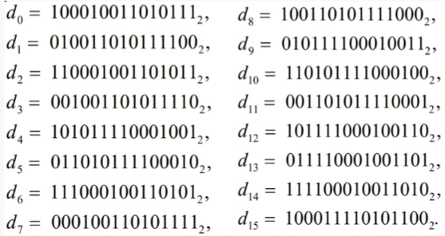

## 3.2算法运行

ZUC算法的输入参数为K,IV和正整数L，输出参数为L个密钥字Z。


### 3.2.1初始化步骤

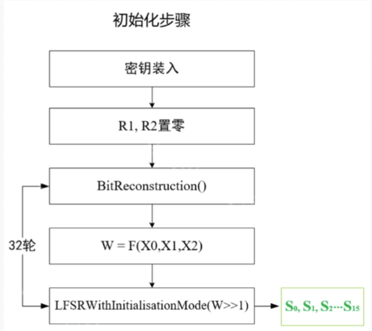

### 3.2.2工作步骤

LFSR不接收任何输入

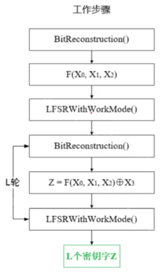

## 3.3加解密过程

L由明文的长度确定

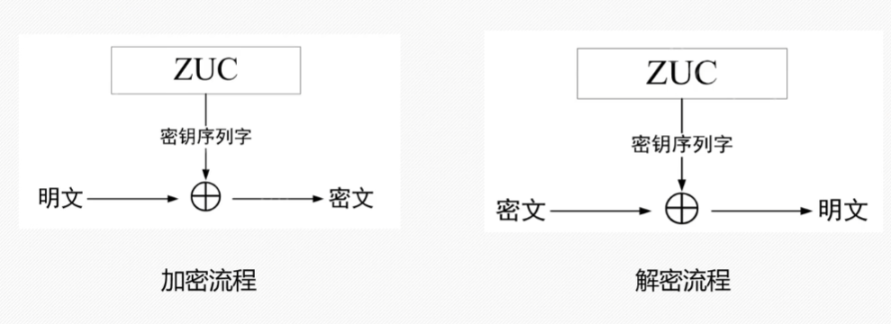

# 四、代码实现

```c
#include <stdint.h>
#include <stdio.h>
#include <string.h>

/* --- 宏定义与辅助函数 --- */
// 循环左移
#define ROTL(x, n) (((x) << (n)) | ((x) >> (32 - (n))))

// 模 (2^31 - 1) 的加法
static inline uint32_t AddMod31(uint32_t a, uint32_t b) {
    uint32_t v = a + b;
    return (v >= 0x7FFFFFFF) ? (v - 0x7FFFFFFF) : v;
}

// 计算 (x * 2^k) mod (2^31 - 1)
static inline uint32_t MulPow2(uint32_t x, int k) {
    return ((x << k) | (x >> (31 - k))) & 0x7FFFFFFF;
}

/* --- 常量定义 --- */
// 初始化常数 D (16 个 15-bit 整数)
static const uint16_t D[16] = {
    0x44D7, 0x26BC, 0x626B, 0x135E, 0x5789, 0x35E2, 0x7135, 0x09AF,
    0x4D78, 0x2F13, 0x6BC4, 0x1AF1, 0x5E26, 0x3C4D, 0x789A, 0x47AC
};

// S盒 S0 和 S1 (需按照 3GPP ZUC 标准补全 256 字节)
static const uint8_t S0[256] = {
    0x3E, 0x72, 0x5B, 0x47, 0xCA, 0xE0, 0x00, 0x33, /* ... 填入完整 256 字节 ... */
};
static const uint8_t S1[256] = {
    /* ... 填入完整 256 字节 ... */
};

/* --- ZUC 状态结构体 --- */
typedef struct {
    uint32_t s[16];   // LFSR: 16 个 31 位状态
    uint32_t X0, X1, X2, X3; // 比特重组层的 4 个 32 位输出
    uint32_t R1, R2;  // FSM: 2 个 32 位状态
} ZUC_State;


/* --- 内部模块实现 --- */

// L1 与 L2 线性变换
static inline uint32_t L1(uint32_t X) {
    return X ^ ROTL(X, 2) ^ ROTL(X, 10) ^ ROTL(X, 18) ^ ROTL(X, 24);
}

static inline uint32_t L2(uint32_t X) {
    return X ^ ROTL(X, 8) ^ ROTL(X, 14) ^ ROTL(X, 22) ^ ROTL(X, 30);
}

// S盒操作 (32-bit 转 32-bit)
static inline uint32_t S_Box(uint32_t x) {
    return ((uint32_t)S0[(x >> 24) & 0xFF] << 24) |
           ((uint32_t)S1[(x >> 16) & 0xFF] << 16) |
           ((uint32_t)S0[(x >> 8)  & 0xFF] << 8)  |
           ((uint32_t)S1[x         & 0xFF]);
}

// 比特重组层 (Bit Reorganization)
static void BitReorganization(ZUC_State *ctx) {
    ctx->X0 = ((ctx->s[15] & 0x7FFF8000) << 1) | (ctx->s[14] & 0xFFFF);
    ctx->X1 = ((ctx->s[11] & 0xFFFF) << 16) | (ctx->s[9] >> 15);
    ctx->X2 = ((ctx->s[7]  & 0xFFFF) << 16) | (ctx->s[5] >> 15);
    ctx->X3 = ((ctx->s[2]  & 0xFFFF) << 16) | (ctx->s[0] >> 15);
}

// 非线性函数 FSM
static uint32_t FSM(ZUC_State *ctx) {
    uint32_t W = (ctx->X0 ^ ctx->R1) + ctx->R2; 
    uint32_t W1 = ctx->R1 + ctx->X1;
    uint32_t W2 = ctx->R2 ^ ctx->X2;
    
    uint32_t U = L1((W1 << 16) | (W2 >> 16));
    uint32_t V = L2((W2 << 16) | (W1 >> 16));
    
    ctx->R1 = S_Box(U);
    ctx->R2 = S_Box(V);
    
    return W;
}

// LFSR 状态步进
static void LFSR_Step(ZUC_State *ctx, uint32_t u) {
    uint32_t f = ctx->s[0];
    f = AddMod31(f, MulPow2(ctx->s[0], 8));
    f = AddMod31(f, MulPow2(ctx->s[4], 20));
    f = AddMod31(f, MulPow2(ctx->s[10], 21));
    f = AddMod31(f, MulPow2(ctx->s[13], 17));
    f = AddMod31(f, MulPow2(ctx->s[15], 15));
    
    f = AddMod31(f, u);
    
    if (f == 0) {
        f = 0x7FFFFFFF;
    }
    
    // 移位
    for (int i = 0; i < 15; i++) {
        ctx->s[i] = ctx->s[i + 1];
    }
    ctx->s[15] = f;
}

/* --- 对外接口 --- */

// 初始化 ZUC
void ZUC_Init(ZUC_State *ctx, const uint8_t key[16], const uint8_t iv[16]) {
    // 1. 密钥与IV加载
    for (int i = 0; i < 16; i++) {
        ctx->s[i] = ((uint32_t)key[i] << 23) | ((uint32_t)D[i] << 8) | iv[i];
    }
    
    // 2. FSM 状态归零
    ctx->R1 = 0;
    ctx->R2 = 0;
    
    // 3. 初始化阶段：执行 32 次
    for (int i = 0; i < 32; i++) {
        BitReorganization(ctx);
        uint32_t W = FSM(ctx);
        LFSR_Step(ctx, W >> 1); // 加上 W 的高31位
    }
    
    // 4. 工作阶段：执行 1 次并丢弃输出
    BitReorganization(ctx);
    FSM(ctx);
    LFSR_Step(ctx, 0); // 正常工作模式下，不再加入 W
}

// 生成密钥流 (keystream)
void ZUC_GenerateKeystream(ZUC_State *ctx, uint32_t *keystream, int length) {
    for (int i = 0; i < length; i++) {
        BitReorganization(ctx);
        uint32_t W = FSM(ctx);
        keystream[i] = W ^ ctx->X3; // 输出密钥词
        LFSR_Step(ctx, 0);
    }
}

/* --- 测试 Main --- */
int main() {
    ZUC_State zuc;
    
    // 测试用 Key 和 IV
    uint8_t key[16] = {0x00}; // 替换为真实密钥
    uint8_t iv[16]  = {0x00}; // 替换为真实IV
    
    uint32_t keystream[4];
    
    ZUC_Init(&zuc, key, iv);
    ZUC_GenerateKeystream(&zuc, keystream, 4);
    
    printf("ZUC Keystream Output:\n");
    for (int i = 0; i < 4; i++) {
        printf("Word %d: 0x%08X\n", i, keystream[i]);
    }
    
    return 0;
}
```

