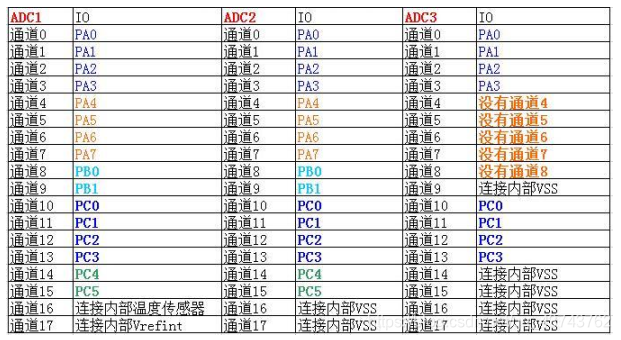
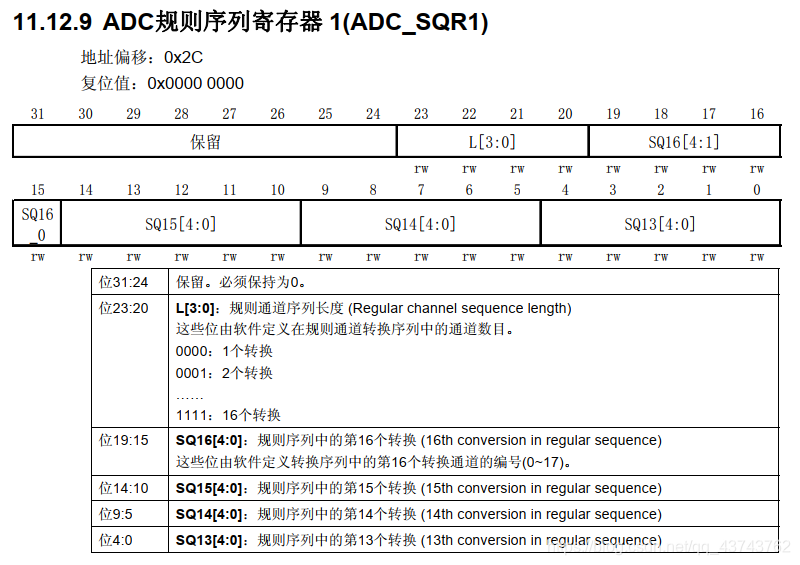
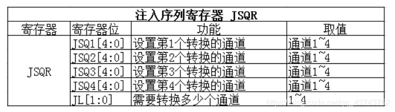

# ADC通道

### 简介

  STM32F103系列有3个ADC，精度为12位，每个ADC最多有16个外部通道。其中ADC1和ADC2都有16个外部通道，ADC3一般有8个外部通道，各通道的A/D转换可以单次、连续、扫描或间断执行，ADC转换的结果可以左对齐或右对齐储存在16位数据寄存器中。ADC的输入时钟不得超过14MHz，其时钟频率由PCLK2分频产生。

电压输入范围  0-3.3V

ADC的全部通道如示：

### 1.转换顺序

多通道使用顺序：规则通道的转换顺序和注入通道的转换顺序

**规则通道转换顺序：**

规则通道中的转换顺序由三个寄存器控制：SQR1、SQR2、SQR3，它们都是32位寄存器。SQR寄存器控制着转换通道的数目和转换顺序，只要在对应的寄存器位SQx中写入相应的通道，这个通道就是第x个转换。具体的对应关系如下：

**注入通道转换顺序**
和规则通道转换顺序的控制一样，注入通道的转换也是通过注入寄存器来控制，只不过只有一个JSQR寄存器来控制，控制关系如下

**只有当JL=4的时候**，注入通道的转换顺序才会按照JSQ1、JSQ2、JSQ3、JSQ4的顺序执行。**当JL<4时，**注入通道的转换顺序恰恰相反，也就是执行顺序为：JSQ4、JSQ3、JSQ2、JSQ1。

### 2.触发源

直接配置寄存器触发

通过内部定时器或者外部IO触发转换

### 3.转换时间

输入时钟、采样周期、转换时间

**输入时钟**
由于ADC在STM32中是挂载在APB2总线上的，所以ADC得时钟是由PCLK2（72MHz）经过分频得到的，分频因子由 RCC 时钟配置寄存器RCC_CFGR 的位 15:14 ADCPRE[1:0]设置，可以是 2/4/6/8 分频，一般配置分频因子为8，即8分频得到ADC的输入时钟频率为9MHz。
**采样周期**
采样周期是确立在输入时钟上的，配置采样周期可以确定使用多少个ADC时钟周期来对电压进行采样，采样的周期数可通过 ADC采样时间寄存器 ADC_SMPR1 和 ADC_SMPR2 中的 SMP[2:0]位设置，ADC_SMPR2 控制的是通道 0~9， ADC_SMPR1 控制的是通道 10~17。每个通道可以配置不同的采样周期，但最小的采样周期是1.5个周期，也就是说如果想最快时间采样就设置采样周期为1.5.
**转换时间**
转换时间=采样时间+12.5个周期
12.5个周期是固定的，一般我们设置 PCLK2=72M，经过 ADC 预分频器能分频到最大的时钟只能是 12M，采样周期设置为 1.5 个周期，算出最短的转换时间为 1.17us。

### 4.数据寄存器

转换完成后的数据就存放在数据寄存器中，但数据的存放也分为规则通道转换数据和注入通道转换数据的。
**规则数据寄存器**
规则数据寄存器负责存放规则通道转换的数据，通过32位寄存器ADC_DR来存放。

**注入数据寄存器**
注入通道转换的数据寄存器有4个，由于注入通道最多有4个，所以注入通道转换的数据都有固定的存放位置，不会跟规则寄存器那样产生数据覆盖的问题。 ADC_JDRx 是 32 位的，低 16 位有效，高 16 位保留，数据同样分为左对齐和右对齐，具体是以哪一种方式存放，由ADC_CR2 的 11 位 ALIGN 设置。

**看芯片手册，找相对应的寄存器来看**

### 5.中断

**（1）规则通道转换完成中断**
规则通道数据转换完成之后，可以产生一个中断，可以在中断函数中读取规则数据寄存器的值。这也是单通道时读取数据的一种方法。
**（2）注入通道转换完成中断**
注入通道数据转换完成之后，可以产生一个中断，并且也可以在中断中读取注入数据寄存器的值，达到读取数据的作用。
**（3）模拟看门狗事件**
当输入的模拟量（电压）不再阈值范围内就会产生看门狗事件，就是用来监视输入的模拟量是否正常。
**以上中断的配置都由ADC_SR寄存器决定**

### 6.电压转换

要知道，转换后的数据是一个12位的二进制数，我们需要把这个二进制数代表的模拟量（电压）用数字表示出来。比如测量的电压范围是0~3.3V，转换后的二进制数是x，因为12位ADC在转换时将电压的范围大小（也就是3.3）分为4096（2^12）份，所以转换后的二进制数x代表的真实电压的计算方法就是：
y=3.3* x / 4096

