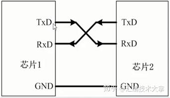
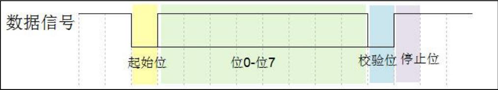
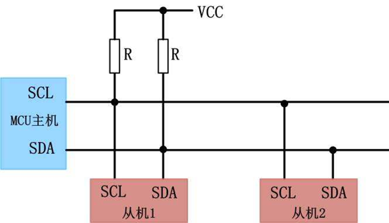
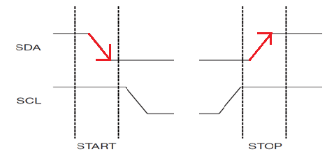
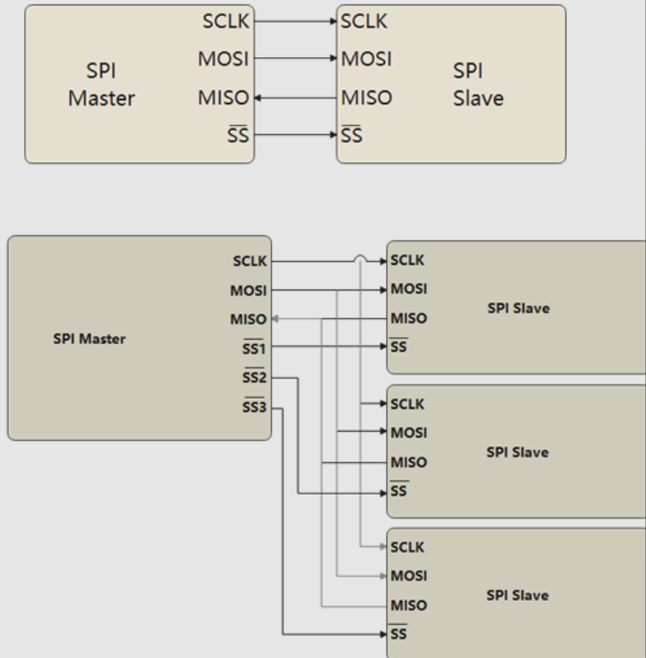
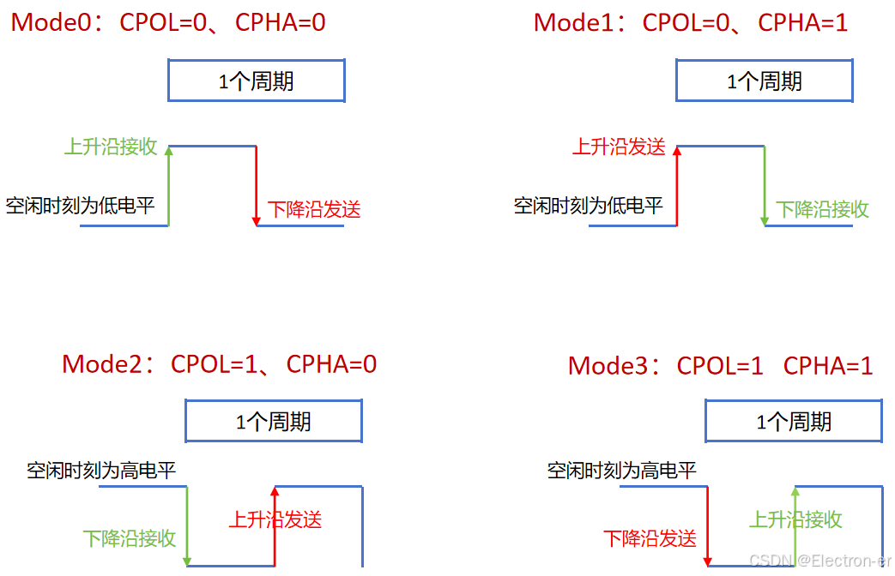

## 通信协议

在学通信协议之前，希望大家先理解几个概念**全双工、半双工、单工、同步、异步**，不懂的多去查一查，忘记的也多看一看。 

### 1.USART

简介：

USART是一个**全双工**通用**同步/异步**（区别在于是否用到了同步时钟线）串行收发模块，是外设和芯片之间通过数据信号线、地线、控制线，按位进行传输数据的一种通讯方式，主要是为了进行信息交互

#### （1）UART接线框图



RXD：数据输入引脚

TXD：数据发送引脚

#### （2）工作原理、协议规定：

USART数据信号



##### 起始位

当未有数据发送时，数据线处于逻辑“1”状态；先发出一个逻辑“0”信号，表示开始传输字符

##### 数据位

紧随起始位之后，数据位表示真正要发送或接收的信息，位数一般有8位

##### 校验位

数据位末尾可以选择是否添加奇偶校验位，用于检测数据传输是否正确

##### 停止位

代表信息传输结束的标志位，可以是1位，1.5位或2位。停止位的位数越多，数据传输的速率也越慢

##### 波特率

波特率表示每**秒**钟传输**码元**的个数，是衡量数据传输速率的指标，注意：比特率是每秒钟传输二进制bit的个数，单位bit/s；

##### 数据包格式

包头+数据+包尾，为了保证传输数据的正确性。

#### （3）USART的使用步骤

串口设置的一般步骤可以总结为如下几个步骤：

```
（1）串口时钟使能 GPIO 时钟使能
（2）串口复位
（3）GPIO 端口模式设置
（4）串口参数初始化
（5）开启中断 并且初始化 NVIC
（6）使能串口
（7）编写中断处理函数
```

**注意正点原子官方例程串口中断服务函数里是怎么处理数据包的**


### 2.IIC

简介：

IIC 即Inter-Integrated Circuit(集成电路总线），这种总线类型是由飞利浦半导体公司设计出来的一种简单、双向、二线制、**半双工同步**串行总线。它是一种多向控制总线，也就是说多个芯片可以连接到同一总线结构下，同时每个芯片都可以作为实时数据传输的控制源。这种方式简化了信号传输总线接口。

那么也就是说，只要收发双方同时接入SDA（双向数据线）、SCL（同步时钟线）便可以进行通信。

I2C总线的工作速度分为 3 种模式(实际上，IIC的通信速率由SCL决定)：

S（标准模式），测量与控制场合，100kbit/s；

F（快速模式），速率为 400kb/s；（默认，目前普遍支持的最大速率）

Hs（高速模式），速率为 3.4Mb/s（支持这种标准的器件很少）


#### （1）IIC接线框图



#### （2）IIC通信状态

空闲状态、开始信号、停止信号、应答信号、数据的有效性、数据传输、应答信号

##### 空闲状态

当SDA、SCL同时为高电平时，视为空闲状态，**这个规定是通信设备通信前的判断条件**

##### 开始信号

当SCL为高电平，且SDA**从高到低**的跳变时，视为数据开始传输

##### 结束信号

当SCL为高电平，且SDA**从低到高**的跳变时，视为数据停止传输



##### 数据的有效性

在传输数据时，应保证数据在SCL的上升沿到来之前准备好，并在下降沿到来之前必须稳定，

就是说当SCL为高电平时，SDA可以改变数据

​			当SCL为低电平时，SDA的数据就被接受

##### 数据传输

在I2C总线上传送的每一位数据都有一个时钟脉冲相对应（或同步控制），即在SCL串行时钟的配合下，在SDA上逐位地串行传送每一位数据，在一般情况下，传输数据时，**从数据的最高有效位开始发送**

##### 应答信号

在IIC中规定，发送方每发送1个字节（8位）后需要接收接收方发送的应答信号；

ACK为0时，视为有效应答；ACK为1时，视为无效响应；

谁发了数据，谁就要接收一个有效信号


### 3.SPI

简介：

SPI是一种**高速的，全双工，同步**的通信总线，并且在芯片的管脚上只占用四根线SPI分为**主、从**两种模式，一个SPI通讯系统需要包含一个（且只能是一个）主设备，一个或多个从设备。SPI接口的读写操作，都是由主设备发起。当存在多个从设备时，通过各自的片选信号进行管理。

优点：支持全双工通信、通信简单、数据传输速率快；

缺点：没有指定的流控制，没有应答机制确认是否接收到数据，所以跟IIC总线协议比较在数据的可靠性上有一定的缺陷；

标准SPI有4根线，分别是MOSI（主设备数据输出）、MISO（主设备数据输入）、SCLK（时钟）、CS（片选）

#### （1）SPI接线框图



#### （2）SPI工作模式

SPI通信有4种不同的模式，不同的从设备可能在出厂是就是配置为某种模式，这是不能改变的；但我们的通信双方必须是工作在同一模式下，所以我们可以对我们的主设备的SPI模式进行配置，通过**CPOL（时钟极性）**和CPHA（时钟相位）来控制我们主设备的通信模式。

时钟极性CPOL是用来配置SCLK的电平出于哪种状态时是空闲态或者有效态，时钟相位CPHA是用来配置数据采样是在第几个边沿：

CPOL=0，表示当SCLK=0时处于空闲态，所以有效状态就是SCLK处于高电平时；
CPOL=1，表示当SCLK=1时处于空闲态，所以有效状态就是SCLK处于低电平时；
CPHA=0，表示数据采样是在第1个边沿，数据发送在第2个边沿；
CPHA=1，表示数据采样是在第2个边沿，数据发送在第1个边沿。



对于SPI的四种通讯模式，总结起来，就是：

CPOL=0，CPHA=0：此时空闲态时，SCLK处于低电平，数据采样是在第1个边沿，也就是SCLK由低电平到高电平的跳变，所以数据采样是在上升沿；
CPOL=0，CPHA=1：此时空闲态时，SCLK处于低电平，数据发送是在第1个边沿，也就是SCLK由低电平到高电平的跳变，所以数据采样是在下降沿；
CPOL=1，CPHA=0：此时空闲态时，SCLK处于高电平，数据采集是在第1个边沿，也就是SCLK由高电平到低电平的跳变，所以数据采集是在下降沿；
CPOL=1，CPHA=1：此时空闲态时，SCLK处于高电平，数据发送是在第1个边沿，也就是SCLK由高电平到低电平的跳变，所以数据采集是在上升沿。

#### （3）SPI协议内容

主机和从机都有一个串行移位寄存器，主机通过向它的SPI串行寄存器写入一个字节来发起一次传输；串行移位寄存器通过MOSI信号线将字节传送给从机，同时从机也将自己的串行移位寄存器中的内容通过MISO信号线返回给主机。这样，两个移位寄存器中的内容就被交换；外设的写操作和读操作是同步完成的。如果只进行写操作，主机只需忽略接收到的字节；反之，若主机要读取从机的一个字节，就必须发送一个空字节来引发从机的传输。在SCLK的控制下，数据按照**从高位到低位的方式依次移出主机寄存器和从机寄存器，并且依次移入从机寄存器和主机寄存器**。当寄存器中的内容全部移出时，相当于完成了两个寄存器内容的交换。

