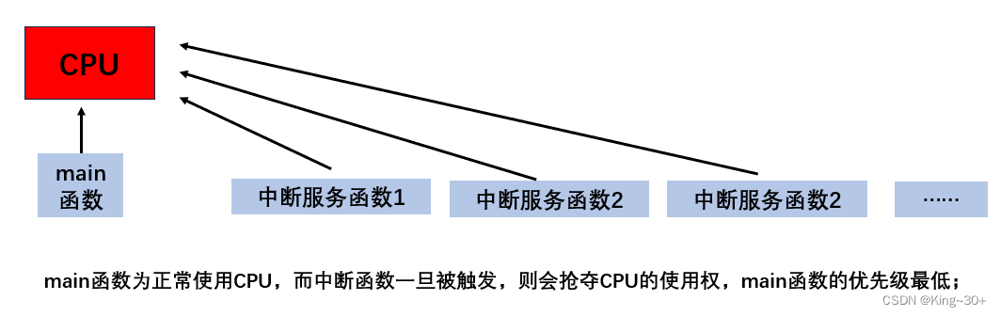
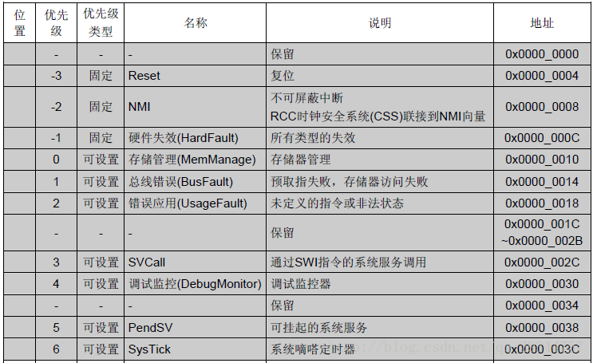
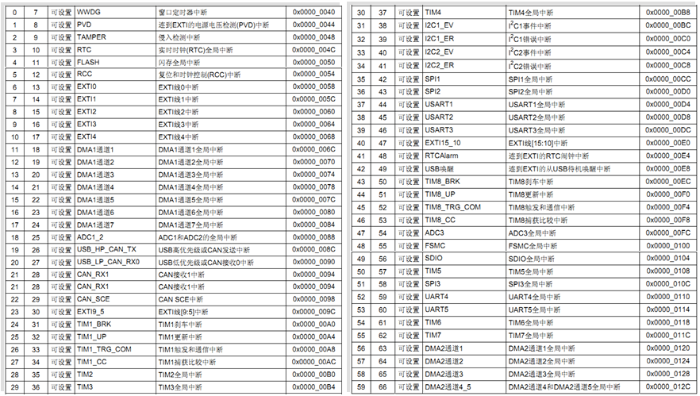
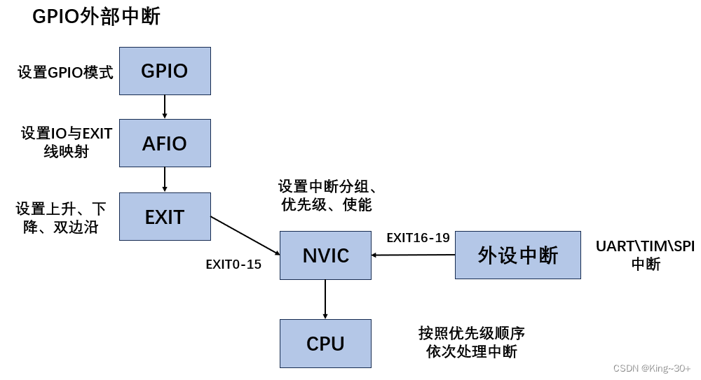

## 中断

想学好中断，要先清楚中断是什么？中断是如何产生的？如果有多个中断我该怎么去处理它？

中断优先级、中断向量表、中断函数

简介：

中断：打断CPU行正常的程序，转而处理紧急程序，然后返回原暂停的程序继续运行

```c
中断的作用和意义：
1.实时控制：在确定的时间内对相应事件做出相应；
2.故障处理：检测到故障，需要第一时间进行处理；
3.数据传输：不确定数据何时会来，利用中断进行控制；
中断的作用：高效处理紧急程序，并且不会占用CPU资源。
```

### 1.中断优先级

**NVIC**

NVIC是嵌套向量中断控制器。属于内核，是对中断进行管理的一个器件。stm32中共有10个内核中断、60个外部中断，16个中断优先级


**NVIC相关寄存器 **

| 名称                                  | 位数 | 个数 | 作用                                  |
| ------------------------------------- | ---- | ---- | ------------------------------------- |
| 中断使能寄存器（ISER）                | 32   | 8    | 每一位控制一个中断（打开）            |
| 中断失能寄存器（ICER）                | 32   | 8    | 每一位控制一个中断（关闭）            |
| 应用程序中断及复位控制寄存器（AIRCR） | 32   | 1    | 位[10:8]控制中断优先级分组            |
| 中断优先级寄存器IPR                   | 8    | 240  | 8个位对应一个中断，而STM32只使用高4位 |

```
1、ISER与ICER寄存器共有32*8=356,用于控制240个中断的打开与关闭；
2、AIRCR寄存器，位10、9、8三位用于控制优先级的分组，三位共2*2*2=8种，取其中的5组作为中断优先级的分组情况；
3、IPR寄存器，用于控制中断的优先级，包括抢占优先级与响应优先级，高4位控制，至于哪几位控制抢占，哪几位控制响应，由AIRCR寄存器说了算；
```


**中断优先级** 
 STM32中断优先级基本概念：

```
1、抢占优先级(pre):高抢占优先级可以打断正在执行的低抢占优先级中断；
2、响应优先级(sub):当抢占优先级相同时，响应优先级高的先执行，但是不能相互打断；
3、抢占优先级和响应优先级都相同的情况下，自然优先级越高的先执行；
4、自然优先级:中断向量表中的优先级；
5、数值越小，表示优先级越高；
```


### 2.中断向量表

中断向量表定义在启动文件中，发生中断时，CPU会自动执行对应的额中断服务函数；



在中断向量表中从优先级7-66（中断号从0-59）代表着STM32F103的60个中断。**优先级号越小，优先级越高**。当表中的某处异常或中断被触发，**程序计数器指针（PC）将跳转到该异常或中断的地址处执行**，该地址处存放这一条跳转指令，跳转到该异常或中断的服务函数处执行相应的功能。**因此，异常和中断向量表只能用汇编语言编写**。

在MDK中，有标准的异常和中断向量表文件可以使用（startup_stm32f10x_hd.s），在其中标明了中断处理函数的名称，不能随意定义。而中断通道NVIC_IRQChannel（即IRQn_Type类型）是在stm32f10x.h文件中进行了宏定义。

**10个内核中断（内核异常）：**



**60个中断向量的入口地址：**




### 3.中断函数

外部中断、串口中断、定时器中断这三个是最常用的中断，可以**对应**的**查找手册**查漏补缺


### 4.中断的使用步骤

这个以外部中断为例子，流程图如下：



**在这个过程中，要注意打开AFIO(io口映射）,设置中断的触发条件(上升沿、下降沿或者双边沿)，还有就是一定要配置NVIC中断向量分组，并且在主函数中初始化，最后就是最好别在中断服务函数中加延时，这样会出大问题的！！！！！！！！！！！！！！！！！！**


以上这些只是stm32的基础知识，在成为一个合格的嵌入式工程师之前还有很长的路要走，一句话送给正在路上的你们“**纸上得来终觉浅，绝知此事要躬行**”！


