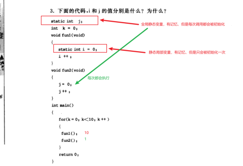
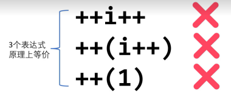
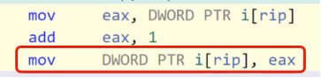
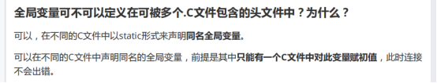
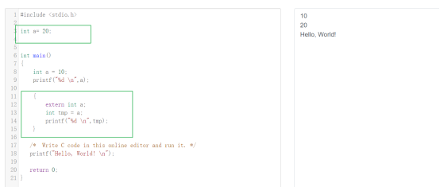

# 关键字

## 1.**continue**

continue语句的作用是跳过本次循环体中余下尚未执行的语句，立即进行下一次的循环条件判定，可以理解为仅结束本次循环。

注意：continue语句并没有使整个循环终止，**只能用在循环语句**


## 2.**break**

（1）只能用于循环语句或者开关语句

（2）会使最近包含break语句跳出

（3）在while for、循环中 跳出本层循环

（4）在swich-case中跳出对应的case

```c
//如果for(){switch case: break}，for循环不受影响
while(1)
{
    switch(1)
    {
        case 1:printf("1\n");break;			
    }
}


//如果是下面这样的话：那就直接退出循环
while(1)
{
    switch(1)

        case 1:printf("1\n");break;
}
```


（5）在swich-case语句中如果没有break语句那么就一定会执行下面的语句

```

/*首先去找有没有对应的num,如果没有就执行default语句，有就去执行对应的case语句，不论是case还是default,如果后面没有break,那么是不会跳出swicth，会继续执行完下面的所有语句直到break;*/
int num = 250;
switch(num)
{
    case 50: num = 50;
    case 100 :num = 200;
    default :{num = 250;printf("num %d\n",num);}//先找到default,发现没有break就继续执行
    case 200: num = 50;
}
printf("%d\n",num);
```


**break 语句用在循环体中，可结束本层循环，continue语句用在循环体中，可结束本次循环**


## 3.**return**

结束当前循环，退出函数，用在函数体中，返回特定值


## 4.goto

无条件跳转


## 5.volatile

**作用:告诉编译器该变量是容易发生变化的，不能对该变量进行优化，每次取值都必须从内存中取值而不是直接去取之前在寄存器中的值**


**例子：**

```c
Volatile int a=20,b,c;
b=a;
C=a;
```

代码执行流程如下;

b=a;先从a的内存中取值存放到寄存器，再把寄存器的值给存到b的内存

c=a;把寄存器的值给存到b的内存

可以看出编译器对c=a这步进行优化，不再执行从a的内存中取值，而是直接从寄存器中取值，如果这段时间内a的发生变化，那么c就不能得到最新的值，这个时候就需要使用volatile告诉编译器，不要对变量a优化，每次都是从内存中取a的值


**常见场景:**

（1）多线程使用共享变量：因为多线程是多核操作，同时进行

（2）中断：中断程序会修改其他程序中使用的变量

（3）硬件寄存器：因为寄存器随时会被修改，好比AD转换的寄存器，随时会因 为电压变化而修改

（4）外部任务会修改变量


## 6.struct

（1）在C语言中结构体是不允许有函数，但C++可以

（2）C语言结构体是不可以继承，C++可以继承

（3）C语言中结构体的使用必须要用别名或者使用struct，不能直接使用例如：

```c
struct  student
{
    int age;
    int num;
    inr sex；
} 
typedef struct student student;//必须得别名才可以使用
//或者在使用的时候加上struct,例如：
//struct student student；
```

（4）访问权限不同，在C中默认是共有，不可以修改权限，在C++中权限可以修改

（5）在C中不可以初始化数据成员，C++可以初始化

（6）C++中空结构体大小为1，C为0


## 7.class和struct的区别

（1）继承权限：class是默认private,struct是public

 （2）访问权限：class作为对象的实现体，默认是私有访问，而struct是作为数据结构的实现体，是共有访问

（3）class可以用于定义模板，而struct不能


## 8.union

（1）联合体union和结构体struct的区别：

  对于联合体所有的成员都共享一块内存，而结构体是所有变量内存的叠加，需要考虑字节对齐问题，对于联合体来说，只要你修改里面的成员的数据就会修改其他成员的数据，而结构体的成员数据是不影响的

（2）联合体一般可以用来判断大小端问题：

大端字节序：高字节存放在低位地址，低字节存放在高地址

小端字节序：低字节存放在低位，高字节存放在高位

```c
union my
{
    short  t;
    char b[2]; 
};
typedef union my  MY;

int main()
{
    MY test;
    test.t=0X0102;
    if(test.b[0]==0x01 && test.b[1]==0x02)
    {
        printf("这是大端字节序\n");
        printf("%x\n",test.b[0]);
        printf("%x\n",test.b[1]);
    }
    if(test.b[0]==0x02 && test.b[1]==0x01)
    {
        printf("这是小端字节序\n");
        printf("%x\n",test.b[0]);
        printf("%x\n",test.b[1]);
    }
    return 0;
}
```


（3）大小端转换问题：

这里主要是位移操作

```c
//32位大小端交换
int swap(int value)
{
    value=((value & 0x000000ff)<<24)|
    ((value & 0x0000ff00)<<8)|
    ((value & 0x00ff0000)>>8)|
    ((value & 0xff000000)>>24);
    return value;
}
```


（4）计算占用空间大小问题

对于不同位的操作系统，个别数据类型数据大小不一样，

long 和unsigned long在32位中是4个字节

在64位中是8个字节

计算的时候需要考虑字节对齐问题：

1. 所占空间必须是**成员变量中字节最大的整数倍**
2. 每个变量类型的**偏移量必须是该变量类型的整数倍**
3. 对于联合体，由于所有变量都是共用一块内存，**还需注意数组占用最大内存**

例如：

```c
Typedef union {double I;int k[5];char c;} DATE;
```

在联合体中成员变量最大为double为8个字节，所以最终大小必须是8的整数倍；又因为联合体是共占内存空间，即int*5=20字节，所以最终为24个字节

 ```c
Typedef struct data {int cat;DATE cow; double dog;}too;
 ```

求sizeof(too);

解：在结构体里面联合体为24，联合体的最大类型为8字节，所以联合体的起始位置必须满足偏移量为8的倍数，计算如下：

Cat：1-4,

DATE cow 8+24

Double dog 32+8=40

```c
//联合体的计算公式：
//最终的大小得是结构体中的类型的最大长度的整数倍，并且能容下所有类型
union date
{
     char a;
     double b[3];
     char c;
     };
typedef union date DATE;

/*
结构体的计算：
1.最终的大小得是结构体中的类型的最大长度的整数倍2.除了结构体中的联合体外，其他类型的偏移量必须是该类型的整数倍
3.如果里面有联合体，该联合体的起始位置要满足该联合体的里面的最大长度类型的偏移量
*/
struct test
{
    char a;//1
    DATE d;//8+24
    char b;//33
    char c; //34
};//最终40
typedef struct test TEST;
int main()
{
    printf("%ld\n",sizeof(DATE));//24
    printf("%ld\n",sizeof(TEST));//40
    return 0;
}
```


## 9.enum

里面的变量会自加

```c
int main（）
{
	enum{a,b=5,c,d=4,e};
	printf("%d %d %d %d %d",a,b,c,d,e,f);
	return 0;
} // 0 5 6 4 5 
```

默认值为0，枚举的未被赋值的变量会默认加1


## 10.typedef

（1）#define和typedef的区别  （宏，关键字，预处理，编译，检查）

#define是C语言中定义的语法，是**预处理指令**，在预处理时进行简单而机械的**字符串替换，不作正确性检查**，只有在编译已被展开的源程序时才会发现可能的错误并报错。

 typedef是**关键字**，**在编译时处理**，有类型检查功能。它在自己的作用域内给一个已经存在的类型一个别名，但不能在一个函数定义里面使用typedef。用typedef定义数组、指针、结构等类型会带来很大的方便，不仅使程序书写简单，也使意义明确，增强可读性。

 

（2）注意#define和typedef定义指针的区别

```c
#define myptr int* p
myptr a,b;//a是int * a,   b是 int b
typedef  int*  myptr;
myptr a,b;//a是int * a,   b是 int* b
typedef int (*funtion)()  //表示函数指针，重新命名为funtion
```

**补充：int *p，q表示p是指针变量，q是int变量**


## 11.const

（1）定义变量，表示该变量是个**常量**，**不允许修改**

例如：const int a=100;

错误：a=200;

（2）修饰函数参数，表示函数体内不能修改该参数的值

（3）修饰函数的返回值 const char getstr()

（4）const修饰的常见：

**const int a;int const a;**是一样的都是修饰变量a为常量

**const * int a ; int const *a ;** 修饰的是这个指针指向的内容不允许修改,这个指针的地址可以改变 常量指针

**int * Const a;** 修饰的指针，表示这个指针的地址不可以修改，地址的内容可以修改 **指针常量**

**const int * const a;**表示指针的地址不可以修改，内容也不可以修改

（5）const修饰函数在c++的类中是不能Virtua虚函数

（6）const n = 3;

假设 const n = 3;

int num[n] ={1,2,3}

问是否正确？

错误：在c语言中n并不是真正意义上的常量，它还是变量 ，对于数组来说必须要开辟一个准确的数组大小，C++中是可以编译过去。

   int n = 3;

   int num[n] = {1,2,3};//**这样也是错误的，数组必须是确定的**

 

**注意：如果数组不初始化是没有报错的**

int n = 3;

int num[n]；

引申：switch case n:**也是不可以的**

**所以在写代码的时候如果想要定义个常量最好是使用#define 而不要使用const** 

 

（7）在C++类中有常函数的概念

比如在类中定义如下函数：

void fun() const {  }

像这种就是常函数，这种函数只能读取类中数据，不能修改


（8）常对象

常对象只能调用常函数

 

（9）const 修饰的变量存放位置

对于const修饰的局部变量：**存放在栈中，代码结束就会释放**，在C语言中可以通过指针修改里面的值

**只读数据段，不可以通过指针修改里面的值，未初始化的存放在.bss**


## 12.extern

（1）声名外部变量：（保存在数据段）

在文件a.c定义和声明变量a,int a=20;//这里会建立存储空间

通过extern 在b.c文件里面声明a之后就可以使用，**记住不能初始化**

Extern int a;//正确

  Extern int a=30;//错误

 注意:如果想要定义一个变量被其他文件使用，即定义一个全局变量，这个变量不能定义在头文件里面，然后在需要调用该变量的.c文件里面extern声明该变量是不可以的，编译期会报错：multiple define 多个定义，

**正确做法如下**：

  在main.c文件里面定义变量int goble为全局变量，

  在fun.c文件里面extern int goble;即可 

**该作用主要是告诉编译器我在其他文件定义了变量a，并且分配了空间，不再为该变量申请空间**


（2）声明外部外部函数声明外部一样


（3）extern “C”

​	该作用是实现在c++中调用c语言代码，告诉编译器这部分代码要是有C编译


## 13.register

存在寄存器里面，即cpu，该值不能取地址操作，并且是整数，不能是浮点数

 

## 14.auto

一般情况下我们没有特别说明的局部变量都是默认为auto类型，存储在栈中

15.Static 


## 15.static

 (c语言：变量、函数  C++：类中变量、类中静态成员函数)

（1）定义变量

静态全局变量---->作用域只能作用域本文件，**每次函数调用该变量都会被初始化**

静态局部变量----->生命周期不会随函数结束结束，直到程序结束，但是在函数外面不能使用该变量，只能在函数中使用，该变量是有记忆的，会记住上次的值。该变量只被初始化一次

对于这两种变量来说，如果初始化的会在数据段内，未初始化的在.bss段或者初始化为0，这两种变量都会在程序结束才会释放，只不过作用域不同，静态局部变量只限定于函数中，但是该函数结束，该变量并没有被干掉，静态全局变量限定于本文件中

```c
//先来看下没有用static定义的变量a
int getdata()
{   
    int  a = 10;
    a++;
    printf("%d\n",a);
    return a;

}
int main()
{
    for(int i = 0; i < 10;i++)
    getdata();
    return 0;
}
```

打印的都是11，说明每次函数结束变量a就结束生命周期，这就是局部变量


```c
//我们再来看看有static修饰的变量a
int getdata()
{   
    static int  a = 10;
    a++;
    printf("%d\n",a);
    return a;

}
int main()
{
    for(int i = 0; i < 10;i++)
    getdata();
    return 0;
}
```

**可以看出static修饰的局部变量是不会随函数结束而结束，是保留记忆的，但是该变量只能在该函数中使用，虽然它存在，但是别人不能使用，因为他毕竟是局部变量，限定了作用域**


**静态局部变量和静态全局变量的区别**




总结静态全局变量和全局变量差不多，可以被初始化，也有记忆，但是却被限定了只能在本文件中使用


（2）定义函数

在函数返回类型前加上static关键字，函数即被定义为静态函数。静态函数只能在**本源文件**中使用；

也就是说在其他源文件中可以定义和自己名字一样的函数


（3）定义类中的静态成员变量

在类中的静态成员变量它即可以被当做全局变量那样存储，但又被隐藏与类中，类中的静态成员变量拥有一块独立的储存空间，不会占用类中的空间，所有的对象都共享该静态成员，也就是说，只要有对象改变了这个值，那么其他对象就会受影响，该数据可以使用this，也可以类中其他函数访问


注意：静态数据成员不能在类中初始化，在类中只是声明，而不是定义，静态数据必须要定义之后才能使用，实际上类定义只是在描述对象的蓝图，在其中指定初值是不允许的。也不能在类的构造函数中初始化该成员，因为静态数据成员为类的各个对象共享，否则每次创建一个类的对象则静态数据成员都要被重新初始化


（4）定义类中的静态成员函数

静态成员函数也是类的一部分，而不是对象的一部分。所有这些对象的静态数据成员都**共享**这一块静态存储空间

注意：静态成员函数不属于任何一个对象，因此C++规定静态成员函数没有this指针（划重点，面试题常考）。既然它没有指向某一对象，也就无法对一个对象中的非静态成员进行访问，即不能在静态函数里面使用this指针


## 16.switch case

 注意：

 1.switch里面不能是浮点数、double，可以是表达式，但是结果不能是浮点数或double

 2.要注意 case语句后面是否有break，如果没有，就会从找到的case语句一直执行到停止

 3.case不能是”shshj”,可以是‘s’因为字符最终也是整数，变量表达式也不行，反正这个东西必须是能确定的


## 17.do while

先do，再while判断是否符合while里面的条件


## 18.sizeof

（1）Sizeof()和strlen()的区别

首先sizeof是关键字，strlen是函数，sizeof用来计算占用内存大小，strlen是用来计算字符串的长度，特别是对于需不需要包含\0问题：

**sizeof是需要给\0计算空间的**，**strlen是不需要**，sizeof是在**编译**的时候计算的，而strlen是在**运行**的时候计算

（2）求指针大小

在32位机器下，对于sizeof(指针变量)都是4个字节，比如

```c
 int *a; 
 sizeof(a);
```

引申：**求引用大小**

sizeof(char &) //1  引用大小和数据类型有关

（3）计算数组大小

sizeof计算的是数组的大小即数据类型*[]

strlen计算的是字符串长度

```c
int num[5]={1,2,3,4};
printf("%ld\n",sizeof(num));//20
char str[10]={"hello"};
printf("%ld\n",strlen(str));//5
printf("%ld\n",sizeof(str));//10
```

（4）如何不使用sizeof求数据类型字节的大小

```c
#define mysieof(value)  (char*)(&value+1)-(char*)(&value) 
#define mysizeof(value) (char\*)(&value+1)-(char\*)(&value)
```


（5）strlen(“\0”) = ? sizeof(“\0”);

```c
printf("%d\n",sizeof("\0"));//2 因为这里有\0\0
printf("%d\n",strlen("\0"));//0
printf("%d\n",sizeof("\0"));//2
printf("%d\n",strlen("\0"));//0
printf("%d\n",sizeof('\0'));//4
//printf("%d\n",strlen('\0'));//报错
```

（6）sizeof(a++)

  ```c
int a = 2;
printf("%d\n",sizeof(a++)); //4
printf("%d\n",a); // a = 2
  ```

**注意：对于sizeof只会求所占内存大小，不会进行表达式运算**

（7）计算字符数组大小

```c
 char ch[]  = "hello";
 char str[10] = {'h','e','l','l','o'};
 printf("%d\n",sizeof(ch));//6
 printf("%d\n",strlen(ch));//5
 printf("%d\n",sizeof(str));//10
 printf("%d\n",strlen(str));//5
```

（8）sizeof(void)

出错或者为1


## 19.new、malloc        free、delete

（1）首先new/delete是运算符，而malloc和free是函数

 （2）new先为对象申请内存空间，让后再调用构造函数进行初始化，同理delete可以调用析构函数释放内存，而 malloc只是申请内存空间并不能调用构造函数进行初始化，同理free也只是释放内存

 （3）malloc的返回值需要强转为自己申请的内存指针，而new不需要

 （4）malloc需要指定申请内存的内存大小


## 20.左值和右值

左值是指出现在等号或者表达式左边的变量，一般来说就是它的值可以改变，

右值是指出现在等号的右边的变量或者表达式，它重要特点是可读

通常下，左值可以做右值，右值不能做左值

a++不能进行左值运算比如：

i++ = 5;



**补充：数组名是常量不能给数组名赋值**

```c
void test3(){
    char str[10];
    str++;  //数组名是常量不能赋值 该语句相当于 str = str + 1 也就是说不能左值
    *str = '0';
}
```


## 21.短路求值

```c
int main()
{
    int a=2;
    int b=3;
    if(a>0 || b++>2)//b++>3这个的优先级：先进行判断b>3，再b+1；
    {
        printf("%d\n",b);//b=3
        //解释：在if里面有||条件，只要满足其中一个就认为满足条件，就不再需要判断另个语句，也就是说b++并没有执行
    }
    
    if(a<0 || b++>2)
    {
        printf("%d\n",b);//b=4
        //解释：在if里面有||条件，只要满足其中一个就认为满足条件，就不再需要判断另个语句，但第一个条件并没有满足，所以就会执行b++
    }

    if(a>0 && b++>2)
    {
        printf("%d\n",b);//b=5
        //解释：在if里面有&& 条件，只有满足第一个条件才会去判断剩下的条件，第一个条件满足，所以就会执行b++
    }
    if(a<0 && b++>2)
    {
        printf("%d\n",b);//b=5
        //解释：在if里面有&&条件，只有满足第一个条件才会去判断剩下的条件，第一个条件不满足，也就是说b++并没有执行
    }
    printf("%d\n",b);
    return 0;
}
```


## 22.a++和++a区别

（1）a++是先把a赋值到一个临时空间，再对a+1赋值给临时变量，等运算结束后才返回临时变量给a  (参与运算的是自加之前的值)



解析：i++相当于i = i+1

等号右边的为右值，只能读，不能写，即右边的i只能读出放到一个临时变量里面，在这个临时变量里面进行+1操作之后，再赋值给等号左边的i

（2）++a是先给a+1,直接对a赋值，不需要开辟临时空间（参与运算的是返回值的引用）

（3）a++需要开辟空间，等运算完才返回值，所以效率比++a低


**做自加和后自加题目之前要先明白以下几点：**

1.无论是前自加还是后自加都是函数调用，都有返回值，返回值就是我们需要用来运算的

2后自加的返回值是自加前的值

3.前自加的返回值是该变量的引用不是具体的数值,做运算的时候才确定(比如+ - / % *)

4.所有的运算都是返回值的运算

比如：

int i = 1;

printf("%d\n",++i / i--); 

左边的++i的返回值是变量i的引用，这个时候 i = 2,右边i--返回的是做--之前的数值即2，这个时候i = 1,也就是说i的引用为1，即 1 / 2 = 0


## 23.局部变量能不能和全局变量重名

 能，局部变量会屏蔽全局变量，比如在一个函数里定义一个变量int a =2，在外面定义全局变量int a =1;那么在该函数里操作的是局部变量



如果想使用全局变量，可以使用{ extern int a }形式

 


## 24.gets和scanf函数的区别(空格，输入类型，返回值)

（1）gets函数可以接受空格，scanf遇到空格就会结束

 （2）gets函数仅用于读入字符串；scanf为格式化输出函数，可以读入任意C语言基础类型的变量值，而不是仅限于字符串(char*)类型

 （3）gets的返回值为**char\*型**，当读入成功时会返回输入的字符串指针地址，出错时返回NULL；

 scanf**返回值为int型，**返回实际成功赋值的变量个数，当遇到文件结尾标识时返回EOF


## 25.C语言编译过程中，volatile关键字和extern关键字分别在哪个阶段起作用

volatile预处理，因为代码优化是在编译，extern 在链接


## 26.printf()函数的返回值

 **假设1**

 int a = 241;

 Printf(“%d\n”,a);

 printf的返回值是4,也就是说返回值是a数字的字符个数+\n

 **假设2**

 printf("%d\n",printf("%d",a)); //2413

 printf("%d\n",printf("%d\n",a)); //2414 多了\n

注意空格也算


## 27.C语言中不能用来表示整常数的进制是二进制


## 28.char *str1 = “hello”和char str2[] = “hello”

数组名相当于常量指针，只可以修改数组里面的元素，不可以修改数组的地址即不能str++

字符指针相当于是指针常量，不可以修改指向的地址的内容，可以修改地址

```c
char str[] = "hello";
char *str1 ="hello";
//区别一 数组名不可以自加,因为数组名是地址常量
//str++;
//str1++;
//区别二 ,数组里面的元素可以修改，str1指向的地址的内容不可以修改 
str[0] = 'W';
*str1 = 'w';//段错误
//总结： 数组名就相当于是常量指针，只可以修改里面的内容，不可以修改指向的地址，字符指针相当于是指针常量，不可以修改指向的地址的内容，可以修改地址
```


### 29.局部变量和全局变量同名的时候如何使用全局变量

方法1：使用函数，把全局变量包到里面，作为返回值

方法2：使用

{

Extern 

}



