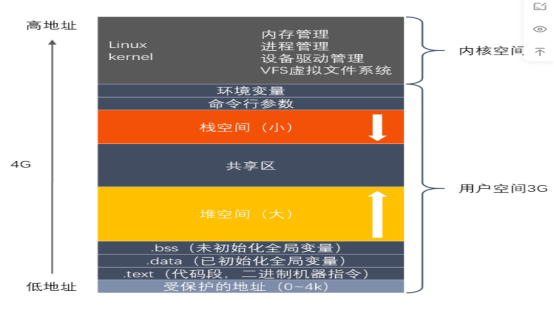

# 内存

### 1.内存分配有几种方式

（1）栈上分配

在执行函数之前，函数内部的局部变量都可以在栈上创建，函数执行完毕之后会自动释放

（2）静态全局存储

全局变量和静态变量

（3）堆上分配

由程序员分配，好比new，delete，malloc ，free


### 2.堆和栈有什么区别（申请方式、效率、方向）

（1）申请方式不同

栈是由操作系统自由分配和释放，堆是由程序员手动申请释放

（2）申请大小的限制

**栈是向低地址申请的空间**，一块连续的内存，也就是说，栈的大小和地址是由系统预先规定好的，如果申请的空间超过栈的剩余空间就会提示overflow

**堆的申请是向高地址扩张的**，是不连续的内存区域，这是由于系统使用链表来存储的空闲内存地址

（3）申请的效率

栈使用的是一级缓存，他们通常都是被调用时处于存储空间中，调用完毕立即   释放；堆则是存放在二级缓存中，速度要慢些


**题目：堆栈溢出一般是由什么原因导致的？(递归，动态申请内存，数组访问越界，指针非法访问)**

答：

1.函数调用层次太深。函数递归调用时，系统要在栈中不断保存函数调用时的现场和产生的变量，如果递归调用太深，就会造成栈溢出，这时递归无法返回。再有，当函数调用层次过深时也可能导致栈无法容纳这些调用的返回地址而造成栈溢出。

2.动态申请空间使用之后没有释放。由于C语言中没有垃圾资源自动回收机制，因此，需要程序主动释放已经不再使用的动态地址空间。申请的动态空间使用的是堆空间，动态空间使用不当造成堆溢出。

3.数组访问越界。C语言没有提供数组下标越界检查，如果在程序中出现数组下标访问超出数组范围，在运行过程中可能会内存访问错误。

4.指针非法访问。指针保存了一个非法的地址，通过这样的指针访问所指向的地址时会产生内存访问错误。


### 3.栈在c语言中有什么作用

（1）用来保存临时变量，临时变量包括函数参数，函数内部定义的临时变量

（2）多线程编程的基础就是栈，栈是缩写词编程的及时，每个线程多最少有自己的专属的栈，用来保存本线程运行时各个函数的临时变量


### 4.C++的内存管理是怎样的

在c++中虚拟内存分为代码段、数据段、bss段、堆、共享区、栈

**代码段**:包括只读存储区和文本区，其中只读存储区字符串常量，文本区存储程序的机械代码

**数据段**：全局变量、静态变量（全局、局部）

**BSS段**：未初始化的全局变量和静态变量（全局、局部），以及所有被初始化为0的全局变量和静态变量

**堆**:调用new/malloc申请的内存空间，地址由低地址向高地址扩张

**映射区**：存储动态链接库以及调用mmap函数的文件映射

**栈**：局部变量、函数的返回值，函数的参数，地址由高地址向低地址扩张


### 5.什么是内存泄漏

简单来说就是申请了内存，不使用之后并没有释放内存，或者说，指向申请的内存的指针突然又去指向别的地方，导致找不到申请的内存，有什么影响：

随着程序运行时间越长，占用内存越多，最终用完内存，导致系统崩溃


### 6.如何判断内存泄漏(如何减少内存泄漏)

1.良好的编码习惯，使用内存分配的函数，一但使用完毕之后就要记得使用对应的函数是否被free掉

2.将分配的内存的指针以链表的形式自行管理，使用之后从链表中删除，程序结束时可以检查该链表

3.使用智能指针

4.使用常见插件，ccmalloc


**内存模型**：




### 7.字节对齐问题

**什么是字节对齐：**

需要各种类型数据按照一定的规则在空间上排列，而不是顺序的一个接一个的排放，这就是对齐

常见就是求复合类型大小，比如结构体、联合体 

**为什么需要字节对齐：**

需要字节对齐的根本原因在于CPU访问数据的效率问题

比如：


### 8.C语言函数参数压栈顺序是怎样的

从右往左，并且内存中栈是由高向低扩展，所以先入栈的是右边并且地址是高位

比如printf()函数，也都是先打印最右边


### 9.C++如何处理返回值


### 10.栈的空间值最大是多少

Window是2MB，Linux是8MB

使用ulimit -s


### 11.在1G内存的计算机中能否malloc(1.2G)？为什么？

有可能，因为malloc是相进程申请虚拟内存，与物理地址空间没有直接关系


### 12.strcat、strncat、strcmp、strcpy哪些函数会导致内存溢出？如何改进


### 13.malloc、calloc、realloc内存申请函数

**申请堆内存**

```c
void *malloc(size_t size); //申请size_t个字节内存
void free(void *ptr); //释放内存，但是指针还是可以用
void *calloc(size_t nmemb, size_t size); //申请nmemb快内存，每块size_t个字节
void *realloc(void *ptr, size_t size);//申请内存，重新申请size_t字节内存，
void *reallocarray(void *ptr, size_t nmemb, size_t size);
```

说明：

**1.malloc（）**

内存未初始化，如果size为0，则malloc（）返回NULL或一个稍后可以成功传递给free （）的唯一指针值。

**2.realloc（）**

如果size_t>原来的s申请的空间大小，比如原来是100个字节，现在是150个字节，那么就有以下两种情况：

（1）原来100个字节后面还能放的下50个字节，那么就在原来地址上增加50个字节，返回的还是原来地址

（2）如果100个字节后面放不下50个字节，那么就会重新找个地址开辟150个字节空间，把原来的地址数据拷贝过来，释放掉原来地址空间，返回一个新的地址

如果size_t<原来的s申请的空间大小，比如原来是100个字节，现在是50个字节,那么就会释放掉后50个字节

```c
int *p = (int*)malloc(sizeof(int)*25);
if( p == NULL)
{
    return -1;
}
printf("malloc %p\n",p);
//p = (int *)realloc(p,10);//重新分配10个字节大小，删除原来后面的90个字节
p = (int *)realloc(p,200);//重新分配200个字节大小，可能是在原来基础上加100，也可能是重新开辟200
printf("malloc %p\n",p);
```


**（3）calloc申请内存空间后，会自动初始化内存空间为 0**


### 14.内存泄漏（补充）

内存泄漏是指动态申请内存

（1）但是不用之后内存没有释放掉，一直留在程序里

```c
void fun()
{

    char *p = (char*)malloc(sizeof(int)*25);
    if( p == NULL)
    {
        return -1;
    }
    /*
        使用内存
    */
    /*
    问题：
    1.函数结束没有调用free释放内存
    */
    
}
```


（2）或者申请了内存，指针又指向了别的地方

```c
char *p = (char*)malloc(sizeof(int)*25);
if( p == NULL)
{
    return -1;
}
printf("malloc %p\n",p);  //malloc 0x5573503ee2a0

p = "hello";
printf("hello %p\n",p);  //hello 0x55734f5eb00f
//可以看出这里出现内存泄漏:
//原本p指向使用malloc申请内存的地址0x5573503ee2a0，后来又让p指向字符串常量的地址0x55734f5eb00f，此时就找不到malloc的地址了
```


