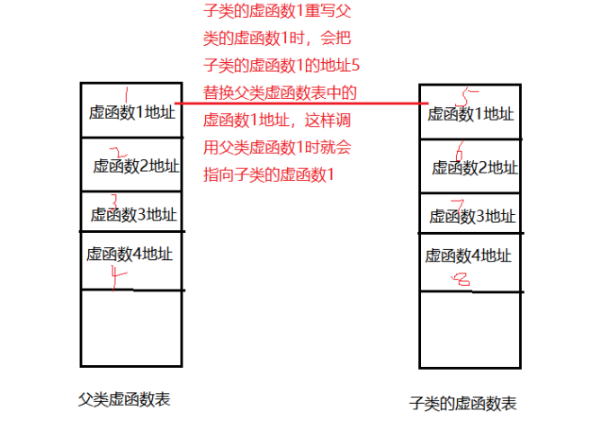
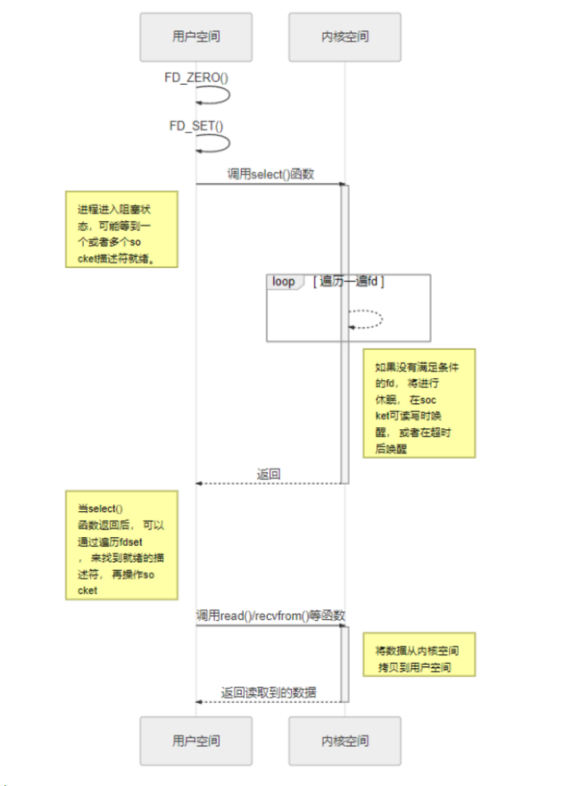
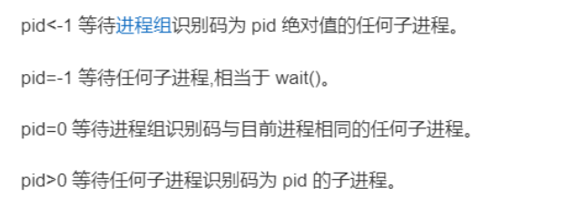
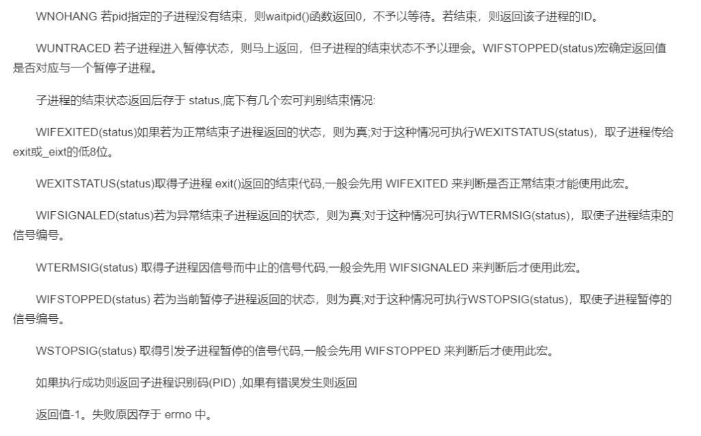
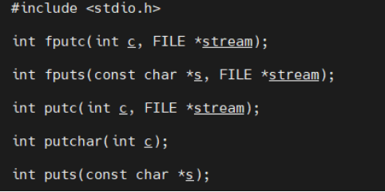
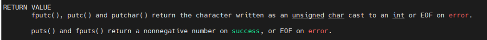
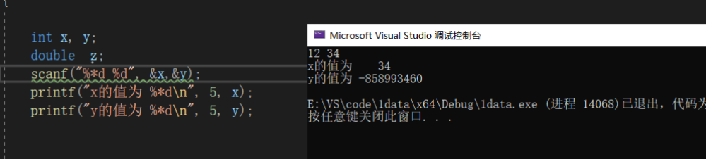

# 函数

## 1.说说内联函数和宏函数的区别(本质，效率，检查)

1.宏函数不是函数，是宏定义，只是使用起来像函数，宏函数是在预编译的时候把 所有的宏名用宏体来替换，简单的说就是字符串替换

2.内联函数，内联函数本质上是一个函数，内联函数一般用于函数体的代码比较简 单的函数，不能包含复杂的控制语句，while、switch，并且内联函数本身不 能直接调用自身

3.宏函数是在预处理的过程中就将所有的宏名用宏体来替换，内联函数则是在编译的时候进行代码插入，编译器会在每处调用内联函数的地 方直接把内联函数的内容展开，这样可以省去函数的调用的开销，提高效率

4.宏定义是没有类型检查的，无论对还是错都是直接替换；而内联函数在编译的时候会进行类型的检查，内联函数满足函数的性质，比如有返回值、参数列表


### 2.内联函数和普通函数的区别（寻址，复制）

内联函数一般用于函数体的代码比较简单的函数，不能包含复杂的控制语句，while、switch， 并且内联函数本身不能直接调用自身**内联函数一般用于函数体的代码比较简单的函数，不能包含 复杂的控制语句，while、switch，并且内联函数本身不能直接调用自身**

最根本的区别是普通函数在调用时会调到函数入口，执行函数，再返回来，**而内联函数不需要寻址**，直接再该处将函数张开，如果N处调用了内联函数则会有n处复制该代码，而普通函数只有一个复制


### 3.为什么析构函数必须是虚函数？

默认的类中的析构函数并不不是虚函数，之所以要是虚析构函数，主要是考虑继承时子类内存释放问题

将可能会被继承的父类的析构函数设置为虚函数，可以保证当我们new一个子类，然后使用基类指针指向该子类对象，释放基类指针时可以是释放掉子类的空间，防止内存泄漏


### 4.为什么C++默认的析构函数不是虚函数

当类中有虚成员函数时，类会自动生成虚函数表和虚表指针，虚表指针指向虚函数表。每个类都有自己的虚函数表，虚函数表的作用就是保存本类中虚函数的地址，我们可以把虚函数表形象地看成一个数组，这个数组的每个元素存放的就是各个虚函数的地址。

这样一来，就会占用额外的内存，当们定义的类不被其他类继承时，这种内存开销无疑是浪费的


### 5.静态函数和虚函数的区别？

静态函数在编译的时候就已经确定运行时机，虚函数在运行的时候动态绑定，虚函数因为用了虚函数表机制，调用的时候会增加一次内存开销


### 6.重载和重写(覆盖)

**1.重写**

是指**派生类中存在重写函数，函数名，参数，返回值类型必须和基类中被重写的函数一样**，只是它们的函数体不一样，被**重写的函数必须用virtual**修饰

```c++
Class A{
Public：
Virtual void fun(int a){ cout << “this A ”;  }
}；
Class B :public  A{
Public：
void fun(int a){cout << “this B ”;}
}
```

派生类对象调用时会调用派生类的重写函数，不会调用被重写函数


**2.重载**

**是指函数名相同，函数参数不同，不关心返回值类型**

函数重载是指同一可访问区内被声明的几个具有不同参数列（参数的类型，个数，顺序不同）的同名函数，根据参数列表确定调用哪个函数，重载不关心函数返回类型

```c
void fun() {};  
void fun(int i) {};  
void fun(int i, int j) {};
```


### 7.虚函数表具体怎么实现运行是多态？

主要是通过虚函数表

首先虚函数表是一个类的虚函数的地址，每个对象在创建时，都会有一个指针指向该类的虚函数表，每一个类的虚函数表按照函数声明的顺序，会将函数地址存在虚函数表里，当子类对象重写父类的虚函数时，父类的虚函数表中对应的虚函数的地址就会被子类的虚函数地址覆盖




### 8.构造函数有几种，分别什么作用

默认构造函数、初始化构造函数、拷贝构造函数、移动构造函数

**1.默认构造函数和初始化构造函数。**

 在定义类的对象的时候，完成对象的初始化工作，有了有参的构造了，编译器就不提供默认的构造函数

```c++
class Student{
public:
//默认构造函数 
Student() { num=1001; age=18; }
//初始化构造函数
Student(int n,int a):num(n),age(a){}
private:
int num; 
int age;
};
int main(){
//用默认构造函数初始化对象S1  
Student s1; 
//用初始化构造函数初始化对象S2  
Student s2(1002,18);  
return 0;
}
```


**2.拷贝构造函数**

```c++
#include "stdafx.h" 
#include "iostream.h"  
class Test 
{   
int i; 
int *p; 
public: 
Test(int ai,int value) 
{ 
    i = ai; 
    p = new int(value); 
 } 
   ~Test() 
    { 
        delete p; 
    }  
   Test(const Test& t) //拷贝构造
    { 
        this->i = t.i; 
        this->p = new int(*t.p); 
    } 
}; 
//复制构造函数用于复制本类的对象 
int main(int argc, char* argv[]) 
{ 
    Test t1(1,2); 
    Test t2(t1);//将对象t1复制给t2。注意复制和赋值的概念不同 
    return 0; 
}
```


**3.移动构造函数**

用于将其他类型的变量，隐式转换为本类对象


### 9.只定义析构函数，会自动生成哪些构造函数

编译器会自动生成拷贝构造函数和默认构造函数


### 10.说说一个类，默认会生成哪些函数

无参的构造函数 拷贝构造函数 赋值运算符 析构函数（非虚）


### 11.说说 C++ 类对象的初始化顺序，有多重继承情况下的顺序

父类构造函数–>成员类对象构造函数–>自身构造函数


### 12.select函数

**1.作用：**监听设置的fd集合

**2.工作流程：**

会从用户空间拷贝 fd_set 到内核空间，然后在内核中遍历一遍所 有的 socket 描述符，如果没有满足条件的 socket 描述符，内核将进行休眠，当设备驱动发生 自身资源可读写后，会唤醒其等待队列上睡眠的内核进程，即在 socket 可读写时唤醒，或 者在超时后唤醒

如图所示：



**3.函数原型：**

int select(int maxfdp1,fd_set *readset,fd_set *writeset,fd_set *exceptset, 

, →const struct timeval *timeout) 

参数说明：

maxfdp1指定感兴趣的 socket 描述符个数，他是套接字最大 socket 描述符加 1，socket 描述符 0、1、2 …maxfdp1-1 均将被设置为感兴趣（即会查看他们是否可读、可写），注意0，1，2  ...maxfdp1-1均将被设置为感兴趣（即会查看他们是否可读、可写），注意0,1,2会事先被设置为感兴趣，也就是说我们自己的fd是从3开始。 


下面几个参数设置什么情况下该函数会返回：

• readset：指定这个 socket 描述符是可读的时候才返回。 

• writeset：指定这个 socket 描述符是可写的时候才返回。 

• exceptset：指定这个 socket 描述符是异常条件时候才返回。 

• timeout：指定了超时的时间，当超时了也会返回。 

注意:如果对某一个的条件不感兴趣，就可以把它设为空指针。 

返回值：就绪 socket 描述符的数目，超时返回 0，出错返回-1。

 

**4.优缺点:（开销大，监听个数固定1024，遍历fd）**

（1）每次调用 select ，都需要把 fd 集合从用户态拷贝到内核态，这个开销在 fd 很多时会很大。 

（2）同时每次调用 select 都需要在内核遍历传递进来的所有 fd ，这个开销在 fd 很多时也很大。 

（3）每2次在 select() 函数返回后，都要通过遍历文件描述符来获取已经就绪的 socket


**5.文件描述符集合操作**

文件描述符集合的所有操作都可以通过这四个宏来完成，这些宏定义如下所示： 

```c
#include <sys/select.h> 
void FD_CLR(int fd, fd_set *set); 
int FD_ISSET(int fd, fd_set *set);
void FD_SET(int fd, fd_set *set); 
void FD_ZERO(fd_set *set); 
```

这些宏按照如下方式工作： 

FD_ZERO()将参数 set 所指向的集合初始化为空； 

FD_SET()将文件描述符 fd 添加到参数 set 所指向的集合中； 

FD_CLR()将文件描述符 fd 从参数 set 所指向的集合中移除；

如果文件描述符 fd 是参数 set 所指向的集合中的成员，则 FD_ISSET()返回 true，否则返回 false，一般用来判断返回的文件描述符是否为目标文件描述符


**注意事项:**

每次调用select()函数 时，当监听到某个文件描述符可读或写或异常时，只把该文件描述符返回，也就是说，会修改我们前面设置的监听集合

**举个例子：**

这里添加两个文件描 述符到监听可读集合里，当有文件描述符可读时就会返回该文件描述符，假设是0，此时 readfds 指向的集合中就只包含了文件描述0，也就是说监听到文件描述符就绪后就会修改集合里面定义值，后面再想监听全部的文件描述符的话就需要事先搞个备份出来，比如：

```c
fd_set rdfds;
My_rdfds= rdfds;
FD_ZERO(&rdfds); 
FD_SET(0, &rdfds); //添加键盘 
FD_SET(fd, &rdfds); //添加鼠标
ret = select(fd + 1, &My_rdfds, NULL, NULL, NULL); 
```

**每次监听都是监听**My_rdfds，这样就可以保证rdfds是不变的


### 13.Fork  wait  exec函数

父进程通过fork函数创建一个子进程，此时这个子1进程知识拷贝了父进程的页表，两个进程都读同一个内存，exec函数可以加载一个elf文件去替换父进程，从此子进程就可以运行不同的程序，父进程wait函数之后会阻塞，直到子进程状态发生改变

```c
pid_t wait(int *wstatus);
pid_t waitpid(pid_t pid, int *wstatus, int options);
```

wait和waitoid的区别在于，前者不能等待指定的pid子进程

-Pid 



-options的说明：




### 14.select epoll poll 函数区别

（1）select，poll实现需要自己不断轮询所有fd集合，直到设备就绪，期间可能要睡眠和唤醒多次交替。

而epoll其实也需要调用epoll_wait不断轮询就绪链表，期间也可能多次睡眠和唤醒交替，但是它是设备就绪时，调用回调函数，把就绪fd放入就绪链表中，并唤醒在epoll_wait中进入睡眠的进程。虽然都要睡眠和交替，但是select和poll在“醒着”的时候要遍历整个fd集合，而epoll在“醒着”的时候只要判断一下就绪链表是否为空就行了，这节省了大量的CPU时间。这就是回调机制带来的性能提升。

（2）select，poll每次调用都要把fd集合从用户态往内核态拷贝一次，并且要把current往设备等待队列中挂一次，而epoll只要一次拷贝，而且把current往等待队列上挂也只挂一次（在epoll_wait的开始，注意这里的等待队列并不是设备等待队列，只是一个epoll内部定义的等待队列）。这也能节省不少的开销。


### 15.字符输入函数






fputc、putc、putchar返回字符，puts、fputs返回非负数


### 16.fseek函数

int fseek(FILE *stream, long offset, int whence);

参数：文件流，偏移量，起始位置


### 17.文件位置函数

ftell() 函数用于得到文件位置指针**当前位置相对于文件首的偏移字节数**；

fseek()函数用于**设置文件指针的位置**；

rewind()函数用于将文件内部的位置指针重新指向一个流(数据流/文件)的**开头**；

ferror()函数可以用于检查调用输入输出函数时出现的错误。

```c
int fseek(FILE *stream, long offset, int whence);
long ftell(FILE *stream);
void rewind(FILE *stream);
int fgetpos(FILE *stream, fpos_t *pos);该函数相当于ftell
int fsetpos(FILE *stream, const fpos_t *pos);该函数相当于fseek
```


### 18.处理信号的函数

typedef void (*sighandler_t)(int);

sighandler_t signal(int signum, sighandler_t handler);


### 19.Scanf函数

scanf输入的时候能制定长度，但不能指定精度


### 20.printf()函数和scanf()函数中的*

在printf（）中表示占位符

在scanf中表示忽略输入

例子：




当我们输入12 34的时候会自动忽略12 把34作为x的值，所以相当于y没有输入

输出的时候由于使用了占位符，5表示占5位置，所以如果x不够5位那么就会补3位，如果大于5位那就直接输出x


