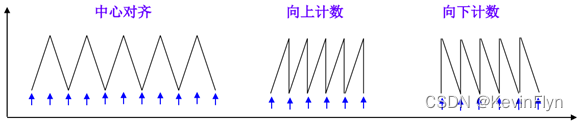
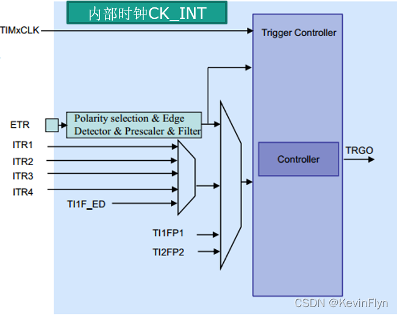
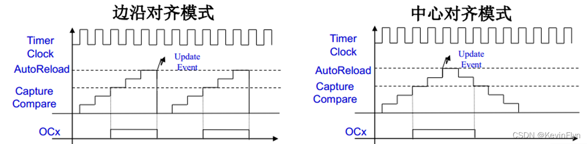
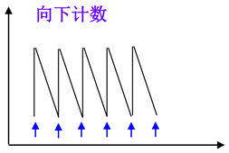
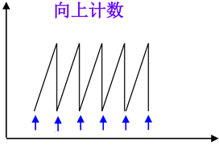
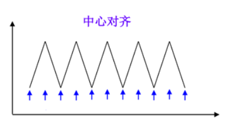

## 定时器

### 一、定时器基本介绍

#### 1.STM32定时器

定时器就是用来定时的机器，是存在于STM32单片机中的一个外设。STM32总共有8个定时器，分别是2个高级定时器（TIM1、TIM8），4个通用定时器（TIM2、TIM3、TIM4、TIM5）和2个基本定时器（TIM5、TIM6）

这三种定时器的区别如下：

 

即：高级定时器具有捕获/比较通道和互补输出，通用定时器只有捕获/比较通道，基本定时器没有以上两者。

#### 2.通用定时器功能和特点

STM32的众多定时器中我们使用最多的是高级定时器和通用定时器，而高级定时器一般也是用作通用定时器的功能，下面我们就以通用定时器为例进行讲解，其功能和特点包括：

（1）位于低速的APB1总线上(APB1)
（2）16 位向上、向下、向上/向下(中心对齐)计数模式，自动装载计数器（TIMx_CNT）。
（3）16 位可编程(可以实时修改)预分频器(TIMx_PSC)，计数器时钟频率的分频系数 为 1～65535 之间的任意数值。
（4）4 个独立通道（TIMx_CH1~4），这些通道可以用来作为： 

```c
1.输入捕获 
2.输出比较
3.PWM 生成(边缘或中间对齐模式) 
4.单脉冲模式输出 
```

（5）可使用外部信号（TIMx_ETR）控制定时器和定时器互连（可以用 1 个定时器控制另外一个定时器）的同步电路。
（6）如下事件发生时产生中断/DMA（6个独立的IRQ/DMA请求生成器）：   

```c
1.更新：计数器向上溢出/向下溢出，计数器初始化(通过软件或者内部/外部触发) 
2.触发事件(计数器启动、停止、初始化或者由内部/外部触发计数) 
3.输入捕获 
4.输出比较 
5.支持针对定位的增量(正交)编码器和霍尔传感器电路 
6.触发输入作为外部时钟或者按周期的电流管理
```

（7）STM32 的通用定时器可以被用于：测量输入信号的脉冲长度(输入捕获)或者产生输出波形(输出比较和 PWM)等。   
（8）使用定时器预分频器和 RCC 时钟控制器预分频器，脉冲长度和波形周期可以在几个微秒到几个毫秒间调整。STM32 的每个通用定			时器都是完全独立的，没有互相共享的任何资源。

#### 3.计数器模式

通用定时器可以**向上计数、向下计数、向上向下双向计数模式**。

①**向上计数模式**：计数器从0计数到自动加载值(TIMx_ARR)，然后重新从0开始计数并且产生一个计数器溢出事件。

②**向下计数模式**：计数器从自动装入的值(TIMx_ARR)开始向下计数到0，然后从自动装入的值重新开始，并产生一个计数器向下溢出事件。

③**中央对齐模式（向上/向下计数）**：计数器从0开始计数到自动装入的值-1，产生一个计数器溢出事件，然后向下计数到1并且产生一个计数器溢出事件；然后再从0开始重新计数。



#### 4.定时器工作原理

**时钟产生器部分**
在第一部分时钟选择上，STM32定时器有四种时钟源选择，分别是：

```
①内部时钟(CK_INT)
②外部时钟模式：外部触发输入(ETR)
③内部触发输入(ITRx)：使用一个定时器作为另一个定时器的预分频器，如可以配置一个定时器Timer1而作为另一个定时器Timer2的预分频器。
④外部时钟模式：外部输入脚(TIx)
```

这四种情况可由下图表示：




其中，内部触发输入口1~4除了ITR1/ITR2/ITR3/ITR4之外还有一种情况：用一个定时器作为另一个定时器的分频器。

外部捕获比较引脚有两种，分别是：

```c
引脚1：TI1FP1或TI1F_ED
引脚2：TI2FP2
```

**时基单元**
时基单元就是定时器框图的第二部分，它包括三个寄存器，分别是：计数器寄存器（TIMx_CNT)、预分频器寄存器（TIMx_PSC)和自动装载寄存器（TIMx_ARR)。对这三个寄存器的介绍如下：

```c
计数器寄存器（TIMx_CNT):向上计数、向下计数或者中心对齐计数；

计数器寄存器（TIMx_CNT):可将时钟频率按1到65535之间的任意值进行分频，可在运行时改变其设置值；

自动装载寄存器（TIMx_ARR):如果TIMx_CR1寄存器中的ARPE位为0，ARR寄存器的内容将直接写入影子寄存器；如果ARPE为1，ARR寄存器的那日同将在每次的更新时间UEV发生时，传送到影子寄存器；

如果TIM1_CR1中的UDIS位为0，当计数器产生溢出条件时，产生更新事件。
```

**输入捕获通道**

```c
IC1、2和IC3、4可以分别通过软件设置将其映射到TI1、TI2和TI3、TI4;
4个16位捕捉比较寄存器可以编程用于存放检测到对应的每一次输入捕捉时计数器的值;
当产生一次捕捉，相应的CCxIF标志位被置1;同时如果中断或DMA请求使能，则产生中断或DMA请求。
如果当CCxIF标志位已经为1，当又产生一个捕捉，则捕捉溢出标志位CCxOF将被置1。
```

**输出比较通道（PWM）**
PWM模式运行产生: 定时器2、3和4可以产生4独立的信号。

频率和占空比可以进行如下设定:

```c
(1)一个自动重载寄存器用于设定PWM的周期;
(2)每个PWM通道有一个捕捉比较寄存器用于设定占空时间。
例如:产生一个40KHz的PWM信号:在定时器2的时钟为72MHz下，占空比为50% :预分频寄存器设置为0 (计数器的时钟为TIM1CLK/(O+1))，自动重载寄存器设为1799，CCRx寄存器设为899。        
```

两种可设置PWM模式:

    边沿对齐模式
    中心对齐模式



### 二、定时器中断应用

####  1.内部时钟选择


 除非APB1的分频系数是1，否则通用定时器的时钟等于APB1时钟的2倍。

默认调用SystemInit函数情况下：

SYSCLK=72M

AHB时钟=72M

APB1时钟=36M

所以APB1的分频系数=AHB/APB1时钟=2

所以，通用定时器时钟CK_INT=2*36M=72M

#### 2.计数器模式

向下计数模式：（时钟分频因子=1）




向下计数模式：（时钟分频因子=1）



中央对齐计数模式：（时钟分频因子=1 ARR=6）



 

####  3.定时器中断相关寄存器

```C
计数器当前值寄存器CNT
预分频寄存器TIMx_PSC
自动重装载寄存器（TIMx_ARR)
控制寄存器1（TIMx_CR1）
DMA中断使能寄存器（TIMx_DIER）
```

#### 4.定时器常用库函数

**结构体内部成员**

```c
typedef struct
{
  uint16_t TIM_Prescaler;        
  uint16_t TIM_CounterMode;     
  uint16_t TIM_Period;        
  uint16_t TIM_ClockDivision;  
  uint8_t TIM_RepetitionCounter;
} TIM_TimeBaseInitTypeDef;
```

**定时器参数初始化**

```c
void TIM_TimeBaseInit(TIM_TypeDef* TIMx,TIM_TimeBaseInitTypeDef*TIM_TimeBaseInitStruct);
```

**声明方式**

```c
TIM_TimeBaseStructure.TIM_Period = 4999; 
TIM_TimeBaseStructure.TIM_Prescaler =7199; 
TIM_TimeBaseStructure.TIM_ClockDivision = TIM_CKD_DIV1; 
TIM_TimeBaseStructure.TIM_CounterMode = TIM_CounterMode_Up; 
TIM_TimeBaseInit(TIMx, &TIM_TimeBaseStructure); 
```

**函数**

```c
void TIM_Cmd(TIM_TypeDef* TIMx, FunctionalState NewState)
void TIM_ITConfig(TIM_TypeDef* TIMx, uint16_t TIM_IT, FunctionalState NewState);
FlagStatus TIM_GetFlagStatus(TIM_TypeDef* TIMx, uint16_t TIM_FLAG);
void TIM_ClearFlag(TIM_TypeDef* TIMx, uint16_t TIM_FLAG);
ITStatus TIM_GetITStatus(TIM_TypeDef* TIMx, uint16_t TIM_IT);
void TIM_ClearITPendingBit(TIM_TypeDef* TIMx, uint16_t TIM_IT);
```

#### 5.定时器中断实现步骤

```c
①使能定时器时钟。
	RCC_APB1PeriphClockCmd();
②初始化定时器，配置ARR,PSC。
	TIM_TimeBaseInit();
③开启定时器中断，配置NVIC。
	void TIM_ITConfig();
	NVIC_Init();
④使能定时器。
	TIM_Cmd();
⑥编写中断服务函数
	TIMx_IRQHandler();
```


