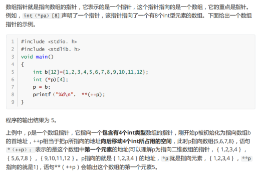
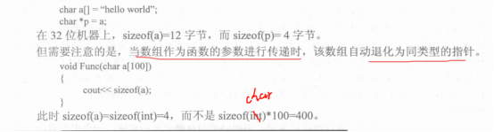
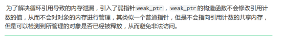
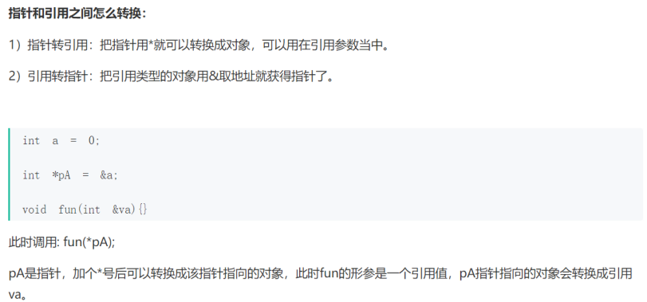
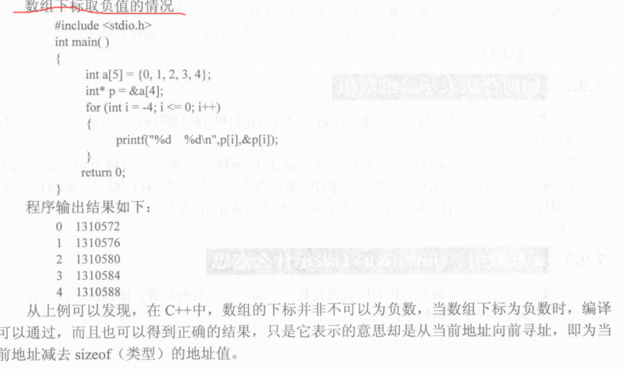
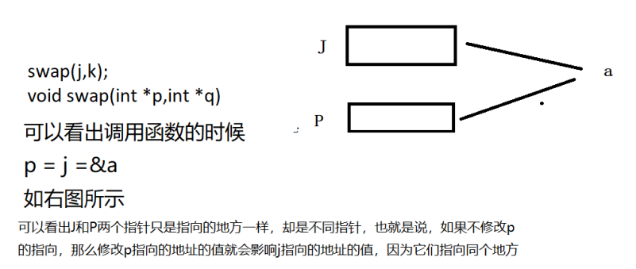

# 指针和数组

**难点在于：一、二维数组的初始化，数组名的加法和&数组名的加法，指针数组和数组指针和一、二维数组的关系**


### 1.什么是指针？

指针其实也是个变量，只不过这个变量里面存储的是内存地址


### 2.什么是指针的类型？

举个例子

```c
int *a;//指针类型为int *
char *c;//指针类型为char *
```


### 3.什么是指针所指向类型

举个例子

```c
int *a;//指针类型为int 
char *c;//指针类型为char 
```


### 4.指针的值————或者叫指针所指向的内存区域地址

**注意：这个指针的类型是什么？指针指的类型是什么？该指针指向了哪里？（重点注意）**


### 5.指针本身所占据的内存区

占用内存的大小，在32为系统中无论是什么类型的指针都是4个字节


### 6.指针的运算

例子1：

int *ptr;//假设指针指向的地址是0x 00 00 00 00

Ptr++;//运算之后指针指向0x 00 00 00 04


注意P+1也是加4个字节

因为int在32位系统中是32位，运算的时候是以单元为单位及一个int，即4个字节

 

Char *p;

P++;//地址偏移1

 

注意:对于一级指针的++操作偏移量要看指针指向的是什么类型

对应二级指针偏移量，对于32系统是4个字节，因为二级指针指向的类型就是指针，所以永远是一个指针类型的大小

 

 

例子2：

```c
#include<stdio.h> 
int main() 
{ 
char a[20]="You_are_a_boy"; 
char *p=a; char **ptr=&p; 
printf("ptr=%c\n",ptr); 
ptr++; 
printf("ptr=%c\n",ptr); 
}
```

在这个例子中是无法确定二级指针++之后指向的地址内容，因为二级指针(ptr)指针指向的一级指针的地址，如果二级指针(ptr)++之后，那么就会指向一级指针的后4个字节(对于32位操作系统来说指针类型是4字节)，至于这个地址里面是啥无从得知


### 7.认识这些指针运算指针的自加

**\*p++  \*(p++)     (\*p)++    \*++p    ++\*p**


（1）(\*p)++  地址前后都不会变化，变化的是地址里面的值，先赋值给别人，\*p再++

（2）\*(p++)和\*p++一样  地址发生变化，先把*p赋值给别人，再++地址

（3）*++p  地址发生改变，先把地址++，再把地址变化后的里面的值给别人

（4）++\*p  地址不发生变化，\*p的值++之后再赋值给别人


### 8.指针函数

首先是个指针，这个指针指向函数

应用场景：回调

例如：

int  (*fun) (int ,int );


实例：

```c
nt max(int x,int y)
{
    int z;
    if (x > y)
    {
        z=x;
    }
    else
    {
        z=y;
    }
    return z;
}
int main()
{
    int (*p) (int ,int );//定义一个函数指针
    int a,b,c;
    p=max;//把函数的地址给指针
    a=20;
    b=30;
    c=(*p)(a,b);//调用函数指针
    printf("%d\n",c);
    return 0;
}
```


### 9.指针数组

首先是个数组，这个数组里的元素是指针

例如:

```c
int *p [4];
int a[4]={1,2,3,4};
p[0]=&a[0];
printf("%d\n",*p[0]);
```


### 10.数组指针和一维数组

首先是个指针，这个指针指向数组

例如：

```c
int (*p) [4];//表示一个指向有4个int 元素的数组的指针，所以p+1，加的是4个int
int num[8] ={1,2,3,4,5,6,7,8};
int (*p)[4] ;
p = num;
printf("%d\n",sizeof(p));//8 因为p是指针，64位系统8个字节
printf("%p\n",p);//0x7ffe11d8a4e0 
printf("%p\n",p+1);//0x7ffe11d8a4f0 //加的是指针指向的类型大小，这里指针指向的是有四个4int元素的数组，所以加的是16个字节
```

如何求某个元素？

比如求num[5]的元素

表示如下：

\*(\*(p+1)+1)

其实你就把数组指针看成是二维数组就行，p+1，加的是一个一维数组的长度，\*（p+1）就是二维变一维组数，(\*(p+1)+1)表示后移一个地址，\*(\*(p+1)+1)取出元素                                                                                                                                                                              




### 11.指针函数

首先是个函数，这个函数的返回值是个指针类型

例如：

int * fun(int x,int y){}


### 12.指针和数组的区别？

（1）概念

数组：是同种类型的集合

指针：里面保存的地址的值

（2）赋值：

同种类型指针之间可以直接赋值，数组只能一个个元素赋值

（3）存储方式：

数组是连续的一段空间，指针的存储空间是不确定的

（4）修改内容不同

比如：

char p[] =”hello”,我们可以执行p[0] = ‘s’操作原因是p是数组，可以使用下标的方式进行修改数组内容

Char * p = “hello” 执行p[0] = ‘s’是错误的，原因是p是指针，指向字符串常量，常量是不允许修改的

（5）所占字节不同

指针永远是4个字节在32为系统中，而数组是不固定的，要看数组的类型和元素个数




### 13.什么是野指针？如何产生？如何避免？

野指针：是指 指针指向的地址是不确定的；

原因：释放内存之后，指针没有及时置空

避免：

（1）初始化置NULL

（2）申请内存后判空

（3）指针释放后置NULL

（4）使用智能指针


一般流程如下：

Assert函数：

void assert(int expression);

**expression** -- 这可以是一个变量或任何 C 表达式。如果 **expression** 为 TRUE，assert() 不执行任何动作。如果 **expression** 为 FALSE，assert() 会在标准错误 stderr 上显示错误消息，并中止程序执行。

```c
int *p1 = NULL; //初始化置NULL
p1 = (int *)calloc(n, sizeof(int)); //申请n个int内存空间同时初始化为0 
assert(p1 != NULL); //判空，防错设计
free(p1);  
p1 = NULL; //释放后置空
```


### 14.智能指针

智能指针是个类，用来存储指针(指向动态分配对象的指针)

C++程序中使用堆内存是非常频繁的，堆内存的申请和释放由程序员手动管理，这很容易造成堆内存的泄漏，使用智能指针能更好的管理堆内存


### 15.智能指针的内存泄漏问题是如何解决的？

为了解决循环引用导致的内存泄漏，引入了weak_ptr




### 16.数组名num / &num的区别

（1）对于一维数组来说

num+1是偏移到下个元素，&num+1是偏移整个数组

 

（2）对于二维数组来说

num+1是偏移一个一维数组，&num+1是整个数组


### 17.二级指针和指针引用


### 18.有了指针为什么还要引用

**直接的原因是为了支持运算符重载**

用指针的使用经常犯得错：

1，操作空指针

2，操作野指针

3，不知不觉改变了指针的值，而后还以为该指针正常。

如果我们要正确的使用指针，我们不得不人为地保证这三个条件。而引用的提出就解决了这个问题。

引用区别于指针的特性是 ：

1，不存在空引用（保证不操作空指针）

2，必须初始化（保证不是野指针）

3，一个引用永远指向他初始化的那个对象（保证指针值不变）

 

### 19.使用指针的好处

1.指针可以动态分配内存

2.在链表中可以方便修改链表的节点

3.解析字符串

4.相同类型的指针可以直接复制


### 20.指针常量、常量指针、指向常量的常量指针

1.const int* p //常量指针----->指针指向的地址的内容不可以改变

2.int const *p//常量指针

3.int * const p 指针常量-------->指针指向的地址可以不改变

4.const int *  const p //指向常量的常量指针


### 21.指针和引用的异同，如何转换

（1）都是指针的概念，指针保存的是内存的地址，引用是某块内存的别名，这个内存一但初始化就不能再去指向别的内存

（2）两者都会占用内存


区别：

（1）指针是实体，而引用是别名

（2）引用的本质是指针常量，指向指针的地址不可以改变，指向地址的内容可以改变

（3）自增表示的意义不同，指针自增表示地址自增，引用表示值自增

（4）引用必须初始化

（5）引用不能为空

（6）Sizeof(引用)得到的是所指向的变量的大小，sizeof(指针)的到的是指针大小

（7）引用不需要解引用


**转换：**




### 22.sizeof(数组名)和sizeof(&数组)

```c
int Num[100];
printf("%ld\n",sizeof(Num));//400
printf("%ld\n",sizeof(&Num));//8起始就是打印int *指针大小
printf("%ld\n",sizeof(int *));//8
```


### 23.数组下标是负数




### 24.二维数组

int a[3][3];

（1）int a[3][3];表示是个三行三列的二维数组

（2）数组名表示数组首元素的地址，即第0行第0个地址

（3）a+1表示地址偏移一个一维数组的地址，即三列\*int大小=3*4 = 12

（4）\*a 表示去二维变一维，*a就相当于一维数组的数组名，比如 *a +1 表示第0行下标为1的元素地址，只是偏移一个Int地址

（5）若要表示a[2][2]的元素 即 \*(*(a+2)+2)  

//解释：

a+2表示偏移2个一维数组， 地址

*(a+2)表示去二维变一维数组   地址

\*(*(a+2)+2) 表示在一维的基础上偏移两个元素  数值

（6）a[0] + 1// 相当于一维数组移动一个int地址，

比如表示a[2][2]元素 

*(a[2] + 2)

 

对于二维字符数组的初始化

char str[][2] ={“h”,”h”};

字符二维数组的初始化不能是字符，要是字符串


### 25.指针减指针

地址相减 =  （地址a -地址b）/sizeof（指针指向的类型）

```
int a[3];
a[0] = 0;
a[1] = 1;
a[2] = 2;
int *p, *q;
p = a;
q = &a[2];
printf("%p\n",p);//0x7ffe80e38b0c   
printf("%p\n",q);//0x7ffe80e38b14   

printf("%d\n",q-p);//2        ( q - p) /sizeof(int )
```

那么就有
a[q-p]  =  a[2] = 2


### 26.数组作为参数传递

```c
//数组名作为参数传递时，实际上是变为指针，所以，sizeof（arr）是指针的大小
void print_array(int arr[]) {
    int n = sizeof(arr) / sizeof(arr[0]);
    for (int i = 0; i < n; i++)
        printf("%d ", arr[i]);// 1 2
}

int main() {
    int arr[] = {1, 2, 3, 4, 5};
    print_array(arr);
    return 0;
}
```


### 27.数组初始化

对于二维数组可以

Int num[][10]  第一个[]可以不填，但是第二个必须填，但是这个数组必须初始化

对于一维数组

Int num[] 这[]可以不填但是这个数组必须初始化

 

总结：

数组的最左边的[]可以不填，这个时候数组必须初始化，二维数组的第二个[]必须填，不管有没有初始化

 ```c
int a[][2]; //不允许
int b[][2]={1,2,3,4};//可以
int c[] = {1,2,3};可以
int c[]; //不可以
int d[][]//不允许，第二个[]必须填，不管有没有初始化
 ```

对于二维数组来说，第一维就是最左边的[]，也就是行数


### 28.调用Free释放内存后，指针还能用吗

Free释放掉内存后，只是把内存的使用权就被归还给系统，内存里面的东西可能被清除也可能是垃圾值，但是指向这个内存的指针还是指向这块内存，并不会NULL


### 29.指针不能加指针

​	指针之间可以做减法，但不能做加法


### 30.指针作为函数参数传递问题

```c
//函数1，交换两个数
void swap1(int *p,int *q)
{	
 	int num =  *p;
 	*p =*q;
 	*q  = num;
}
//函数2，让p指针指向a，想重新给p赋值为90，之后再交换p,q
void swap(int *p,int *q)
{	int a =90;
	 p = &a;
 	int num =  *p;
 	*p =*q;
 	*q  = num;
}
int main()
{
	
	int a =2,b =3;
	int * j = &a;  // 指针j指向a
	int * k =&b;  //指针 k 指向 b

	swap(j,k); //调用函数
	printf("a =%d   b= %d\n",a,b);// a = 2 b = 90;
   return 0;
}
```

对于函数swap1我们可以正常交换两个值，但是swap函数却不是我们想要的，我们想要的答案是 a = 3 b = 90;可是发现，a的值压根没变，这是为什么呢？



指针p只是指针j的复制品，只是它们都指向同个地址，所以如果在swap函数里面如果不修改p的指向，那么就会影响j

由于我们在swap函数里面让修改了指针p的指向，指向另个变量地址，所以修改p的值就不会影响j指向的地址的值

**总结：**

**如果在函数形参里的指针变量不修改指向，那么就会影响传递过来的指针**


### 31.**空指针的指向问题**

空指针是指指向地址为0的地方


### 32.数组声明和引用的下标

声明下标只能是常量

引用下标可以是整形常量，整形表达式，整形变量


### 33.二维数组和数组指针

总结：数组指针指向二维数组之后用法和二维数组名用法一样，因为数组指针本身就是二维数组

```c
int main()
{

/*二维数组和数组指针*/
int (*p)[3];
int s[3][3]={1,4,7,4,9,6,2,7,9};
p = s;
printf("p addr is = %p\n",p);//0x7ffde8cdf0a0
printf("s addr is = %p\n",s);//0x7ffde8cdf0a0
/*可以发现p+1和s+1是一样的都是加一个一维数组*/
printf("p + 1 addr is = %p\n",p + 1);//0x7ffde8cdf0ac
printf("s + 1 addr is = %p\n",s + 1);//0x7ffde8cdf0ac
/*可以发现使用p表示二维数组的元素和二维数组名表示元素是一样的用法*/
printf("*(*(p + 1))  is = %d\n",*(*(p + 1)));//*(*(p + 1))  is = 4
printf("*(*(s + 1))  is = %d\n",*(*(s + 1)));//*(*(s + 1))  is = 4
printf("*(p[1]+0)  is = %d\n",*(p[1]+0));//*(p[1]+0)  is = 4
printf("*(s[1]+1)  is = %d\n",*(s[1]+1));//*(s[1]+1)  is = 9
    return 0;
}
```


一维数组：

int  num[2];  

printf("%p \n",num);  //0x7fffe2a8cde8

printf("%p \n",num+1); //0x7fffe2a8cdec  

printf("%p \n",&num+1);  //0x7fffe2a8cdf0 

 

可以看出：

num +1 加的是一个Int

&num + 1加的是整个数组

 

二维数组;

int  num[2][2];

printf("%p \n",num); //0x7ffe18f73560 

printf("%p \n",num+1); //0x7ffe18f73568 

printf("%p \n",&num+1); //0x7ffe18f73570 

 

可以看出：

num +1 加的是一个一维

&num + 1加的是整个数组

 

总结无论是几维数组，&num +1加的都是整个数组大小，

num+1  -----》一维数组就加一个类型

num+1  -----》二维维数组就加一个一维

num+1  -----》三维数组就加一个二维

```c
int main() 
{ 
    int num[2][3]={1,2,3,4,5,6};
    int (*p)[3];
    p = num;

    printf("%p\n",p);//0x7ffffad71df0
    printf("%p\n",p+1);//0x7ffffad71dfc
  

    
    printf("%p\n",num[0]+1);//0x7ffffad71df4
    printf("%p\n",*p+1);//0x7ffffad71df4
注意这里&p+1
    printf("%p\n",&num+1);//0x7ffffad71e08
    printf("%d\n",**p);//1
}
```


### 34.野指针

```c
int a = 30;
int* p;
scanf("%d", &a);
*p = a;
```


