# 操作系统

### **1.什么是进程？什么是线程？**

进程是**资源分配**的基本单位，他是程序执行是的一个实例，在程序运行是创建

线程是**程序执行**的最小单位，是进程的一个执行流，一个进程里包含多个线程


### **2.进程、线程、协程的区别？**

进程是**资源分配**的基本单位，他是程序执行是的一个实例，在程序运行是创建

线程是微进程，**程序执行**的最小单位，是进程的一个执行流，一个进程里包含多个线程

协程是微线程，在子程序内部执行，可在子程序内部中断，转而执行别的子程序，在适当的时候再返回来接着执行


进程和线程区别：(开销问题、通信、线程（进程）之间影响)

（1）进程是资源最小分配单位

（2）线程是最小的执行单位，也是处理器调度的基本单位

（3）进程拥有自己的独立地址空间，每启动一个进程，系统就会分配地址空间，建立数据表来维护代码段，数据段，堆栈段，进程的全局变量是不共用的，这种开销是非常大，而线程是共享进程的数据，使用相同的地址空间，因此，CPU切换一个线程的开销远小于进程的切换

（4）线程之间的通信更加方便，同一进程下的线程共享全局变量、静态数据、而进程间的通信需要以通信的方式IPC进行，但是线程的缺点是同步和互斥是编写多线程的难点，多进程的优点是一个进程死掉不会对另个进程有影响，而多线程只要一个线程死掉整个进程就会死掉

（5）每个线程拥有自己的栈段和寄存器组


线程和协程的区别：

（1）协程执行效率极高：协程直接操作栈基本没有内核切换的开销，所以上下文切换非常快

（2）协程不需要多线程的锁机制，因为多个线程从属一个线程，不存在同时写冲突


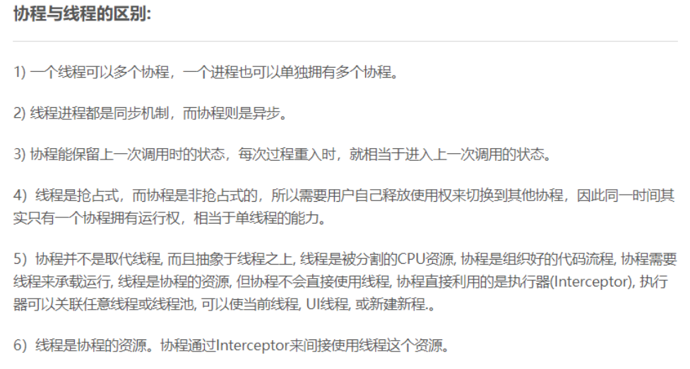


### 3.何时使用多进程？何时使用多线程？(考虑优缺点)

对资源保护和管理要求高，不限制开销和效率使用多进程

要求效率高，切换频繁，使用多线程


### 4.创建进程的方式？

（1）系统初始化，像后台进程，守护进程

（2）一个进程开启另个进程fork（）

（3）用户的交互式请求

子进程拷贝了父进程的**数据段、堆、栈以及继承了父进程打开的文件描述符**，父进程与子进程并**不共享这些存储空间**，这是子进程对父进程相应部分存储空间的完全复制，执行fork()之后，**每个进程均可修改各自的栈数据以及堆段中的变量，而并不影响另一个进程**


### 5.进程有几种状态？

有五种状态：创建、就绪、运行、阻塞、终止

在linux系统中，进程的生命周期是从执行到终止

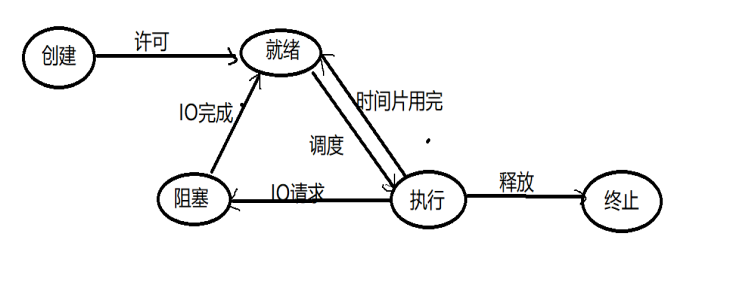


### 6.进程间通信方式有哪些？

**管道**、**系统IPC**（包括消息队列、信号量、信号、共享内存）、**套接字socket**

IPC:  Inter-Process Communication

1.管道(pipe)

2.信号量(semophore)

3.消息队列(messge queue)

4.信号（signal）

5.共享内存(Shared memory)

6.套接字(socket)


**管道：**分为有名和无名管道，无名管道只能有血缘关系的进程间通信，是半双工通信，而有名管道允许无血缘进程之间通信

**信号量：**是个计数器，用来控制多个进程对共享资源的访问，用于进程间的同步和互斥

消息队列：消息的链接表，放在内核中，消息队列独立于发送和接收的进程，进程终止后，消息队列并不会消失，消息队列可以实现消息的随机查询，可以按照消息的类型读取

**信号：**用于通知接收进程某个事件已经发生。主要作为进程间以及同一进程的不同线程间的同步手段

**共享内存：**共享内存就是映射一段能被其他进程访问的内存，这段共享内存有一个进程创建，但多个进程都可以访问，共享内存是最快的IPC，它往往配合其他通信机制使用，如：信号量来实现同步和通信

​		**原理：**开辟一个物理内存空间，各个进程物理地址映射到自己的虚拟地址空间，通过虚拟地址就可以直接访问，进而实现数据共享，共享内存是最快的通信方式，因为少了数据的拷贝

```c
步骤： shmid=shmget(key,size,IPC_CREAT);//1.开辟共享内存
  		addr=shmat(shmid,NULL,0);//2.映射到进程虚拟地址
 		memcpy(addr,buf,sizeof(buf));//3.操作数据
 		int ret=shmdt(addr);//解除映射
```

**套接字:**它可用于不同机器之间的进程通信

其中信号量、信号、消息队列可以用来同步


### 7.进程间通信的选择

管道通信主要是应用在进程间护法短小、频率很高的消息

共享内存主要是在接进程间共享数据庞大、读写频繁的数据(因为是把物理地址映射到进程)

其他考虑socket


### 8、什么是僵尸进程、孤儿进程、守护进程？

**僵尸进程：**一个进程使用fork出一个子进程，如果子进程退出，但是父进程没有使用  wait或者waitpid函数回收子进程的资源，那么该进程就是僵尸进程

**孤儿进程：**是指父进程异常退出，而子进程还没退出，那么子进程就会被1号进程(init)收养

**守护进程：**是指后台进程，有意把父进程先结束，然后被1号进程收养


### 9.僵尸进程有什么危害？

僵尸进程的进程号并不会被释放，但是系统的进程号是有限的，如果出现大量僵尸进程就会导致系统无进程号可用就无法产生新进程

**如何杀死僵尸进程：**

可以通过杀死其父进程来结束僵尸进程


### 10.线程间通信方法有哪些？

临界区、互斥量、信号量、事件、条件变量、读写锁

 

**临界区：**每个线程访问临界资源的那段代码叫临界区，每次只允许一个线程进入临界区，进入后其他线程无法进入

**互斥量：**采用互斥对象机制，只有拥有互斥对象的线程才可以访问

**信号量：**计数器，允许多个线程同时访问统一资源

**条件变量：**通过条件变量通知操作的方式保持多线程同步

**读写锁：**读写锁和互斥量类似，但互斥量要么是锁住状态，要么就是不加锁状态。读写锁一次只允许一个线程写，但允许一次多个线程读，这样效率就比互斥锁要高


### 11.说说线程，进程同步方式有哪些？

线程间的同步方式包括互斥锁、信号量、条件变量、读写锁


### 12.什么是内核线程和用户线程？

用户线程是由用户进行管理，用户线程的创建、调度、同步和销毁全又库函数在用户空间完成，不需要内核的帮助，这种线程开销是比较小的

内核线程由操作系统创建和销毁


### 13.如何实现守护进程？

（1）创建子进程，终止父进程

（2）调用setsid创建一个新会话

（3）将当前目录更改为根目录

（4）重设文件权限掩码，文件权限掩码是指屏蔽掉文件权限的对应为

（5）关闭不再需要的文件描述符


### 14.进程调度算法即策略有哪些？

（1）先来先服务

（2）短作业优先调度

（3）高优先级优先

（4）时间片论

（5）多级反馈队列


### 15.并发和并行

并发是对于单个cpu来说，在一个是个只能一个进程运行，但是线程的切换时间则是减少到纳秒数量级，多个任务不停的来回切换

并行是对于多个CPU来说，多个进程同时运行

**区别：**并行的"同时"是同一时刻可以多个任务在运行(处于running)，并发的"同时"是经过不同线程快速切换

 


### 16.进程间的通信中的管道通信实现原理是什么

操作系统在内核中开辟一块缓冲区(称为管道)用于通信

编程步骤：

（1）父进程调用pipe开辟管道,得到两个文件描述符指向管道的两端

（2）父进程调用fork创建子进程,那么子进程也有两个文件描述符指向同一管道

（3）父进程关闭管道读端,子进程关闭管道写端。父进程可以往管道里写,子进程可以从管道里读,管道是用环形队列实现的,数据从写端流入从读端流出,这样就实现了进程间通信

```c
#include<unistd.h>     
#include<stdio.h>     
#include<stdlib.h>     
#include<string.h>     
#define INPUT  0  //读数据fd    
#define OUTPUT 1   //发数据fd  
     
int main(){     
//创建管道     
    int fd[2];     
    pipe(fd);     
    //创建子进程     
    pid_t pid = fork();     
    if (pid < 0){     
        printf("fork error!\n");     
        exit(-1);     
    }     
    else if (pid == 0){//执行子进程   
        printf("Child process is starting...\n");    
       //子进程向父进程写数据，关闭管道的读端    
        close(fd[INPUT]);   
        write(fd[OUTPUT], "hello douya!", strlen("hello douya!"));   
        exit(0);   
    }   
    else{//执行父进程   
        printf ("Parent process is starting......\n");   
        //父进程从管道读取子进程写的数据 ，关闭管道的写端     
        close(fd[OUTPUT]);     
        char buf[255];   
        int output = read(fd[INPUT], buf, sizeof(buf));   
        printf("%d bytes of data from child process: %s\n", output, buf);   
    }   
    return 0;     
} 
```


### 17.有抢占式和非抢占式的区别

非抢占式优先权算法 在这种方式下，系统一旦把处理机分配给就绪队列中优先权最高的进程后，该进程便一直执行下去，直至完成

抢占式优先权调度算法 在这种方式下，系统同样是把处理机分配给优先权最高的进程，使之执行。但在其执行期间，只要又出现了另一个其优先权更高的进程，进程调度程序就立即停止当前进程(原优先权最高的进程)的执行，重新将处理机分配给新到的优先权最高的进程


### 18.说说什么死锁，产生的条件，如何解决？

死锁是指多个进程在执行过程中，因争夺资源而造成互相等待，此时系统产生了死锁

产生条件：

（1）互斥条件：进程对所分配的资源不允许其他进程访问，若其他进程需要访问，只能等待，知道该进程使用完毕后释放资源

（2）请求保持条件：进程获得一定资源后，有对其他资源发出请求，但该资源被其他进程占用，此时请求阻塞，而且这个进程不会释放自己已经占有的资源

（3）不可剥夺条件：进程获得资源，只能自己释放，不可剥夺 

环路等待条件：若干进程之间形成一种头尾相接等待资源关系

**解决：** 

资源一次性分配，从而解决请求保持的问题 

可剥夺资源：当进程新的资源未得到满足时，释放已有的资源；

资源有序分配：资源按序号递增，进程请求按递增请求，释放则相反


### 19.单核机械上写多线程程序，是否考虑加锁，为什么？

需要

因为线程锁只要是用来实现线程的同步和通信，在抢占是操作系统中，通常为每个县城分配一个时间片，当某个线程时间片耗尽时，操作系统会将其挂起，然后运行另一个线程。如果这两个线程共享某些数据，不使用线程锁的前提下，可能会导致共享数据修改引起冲突


### 20.互斥锁机制，互斥锁和读写的区别？

**互斥锁机制：**mutex，用于保证在任何时刻，都只能有一个线程访问该对象。当获取锁操作失败时，线程会进入睡眠，等待锁释放时被唤醒

**互斥锁和读写锁：**

（1） 读写锁区分读者和写者，而互斥 锁不区分

（2）互斥锁同一时间只允许一个线程访问该对象，无论读写；读写锁同一时间内只允许一个写者，但是允许多个读者同时读对象

函数 acquire() 获取锁，而函数 release() 释放锁


### 21.什么是信号量，有什么作用？

由于信号量只能进行两种操作等待和发送信号，即P(sv)和V(sv)，

（1）P(sv)操作：如果sv的值大于零，就给它减1；如果它的值为零，就挂起该进程的执行（信号量的值为正，进程获得该资源的使用权，进程将信号量减1，表示它使用了一个资源单位）。

（2）V(sv)操作：如果有其他进程因等待sv而被挂起，就让它恢复运行，如果没有进程因等待sv而挂起，就给它加1（若此时信号量的值为0，则进程进入挂起状态，直到信号量的值大于0，若进程被唤醒则返回至第一步）。

 

**作用：**用于多进程对共享数据对象的读取，它主要是用来保护共享资源（信号量也属于临界资源），使得资源在一个时刻只有一个进程独享。


### 22.进程、线程的中断切换的过程是怎样的？

**上下文切换**指的是内核（操作系统的核心）在CPU上对进程或者线程进行切换

进程上下文切换

（1）保护被中断进程的处理器现场信息

（2）修改被中断进程的进程控制块有关信息，如进程状态等

（3）把被中断进程的进程控制块加入有关队列

（4）选择下一个占有处理器运行的进程

（5）根据被选中进程设置操作系统用到的地址转换和存储保护信息

（6）根据被选中进程恢复处理器现场


### 23.多线程和单线程有什么区别，多线程编程要注意什么，多线程加锁需要注意什么？


### 24.为什么要创建线程池？线程池的设计思路，线程池中线程的数量由什么确定？

**（1）为什么要创建线程池？**

原因：减少资源的消耗

创建和销毁线程的花销是比较大的，这些时间可能比处理业务时间还要长，这样频繁的创建和销毁线程，再加上业务工作的线程，消耗系统资源的时间，可能导致系统资源不足，线程池可以提升系统效率

**（2）实现线程池步骤**

①设置一个生产者消费队列，作为临时资源

②初始化n个线程，并让其运行起来，加锁去队列里去任务运行

③当任务队列为空时，所有线程阻塞

④当生产者队列来了一个任务后，先对队列加锁，把任务挂到队列上，然后使用条件变量通知阻塞中的线程来处理


（3）线程的数量

与CPU有关、I/O并发、并行

如果是CPU密集型应用，则线程池大小设置为：CPU数目+1

如果是IO密集型应用，则线程池大小设置为：2*CPU数目+1

最佳线程数目 = （线程等待时间与线程CPU时间之比 + 1）* CPU数目


### 25.多路IO复用技术

**select，poll，epoll**都是IO多路复用的机制，I/O多路复用就是通过一种机制，可以监视多个文件描述符，一旦某个文件描述符就绪（一般是读就绪或者写就绪），能够通知应用程序进行相应的读写操作


（1）每次调用select，都需要把fd集合从用户态拷贝到内核态，这个开销在fd很多时会很大；而epoll保证了每个fd在整个过程中只会拷贝一次

（2）每次调用select都需要在内核遍历传递进来的所有fd，才知道哪些fd是被设置了；而epoll只需要轮询一次fd集合，同时查看就绪链表中有没有就绪的fd就可以了

​														**Select设置监听的集合不能被重新使用**

（3）**select**支持的文件描述符数量太小了，默认是**1024**；而**epoll没有这个限制**，它所支持的 fd上限是最大可以打开文件的数目，这个数字一般远大于2048


epoll为什么高效：拷贝、查询、返回

**epoll 最大的优点就在于它 只管就绪的 socket 描述符，而跟 socket 描述符的总数无关**

（1）select，poll实现需要自己不断轮询所有fd集合，直到设备就绪，期间可能要睡眠和唤醒多次交替。而epoll只要判断一下就绪链表是否为空就行了，这节省了大量的CPU时间

（2）select，poll每次调用都要把fd集合从用户态往内核态拷贝一次，并且要把当前进程往设备等待队列中挂一次，而epoll只要一次拷贝，而且把当前进程往等待队列上挂也只挂一次，这也能节省不少的开销。

（3）当我们调用 epoll_wait() 函数返回的不是实际的描述符，而是一个代表就绪描述符数 

量的值，这个时候需要去 epoll 指定的一个数组中(**epoll_event**定义的结构体)依次取得相应数量的 socket 描述符即可，这个数组里面保存的都是可以的文件描述符，而不需要遍历扫描所有的 socket 描述符，因此这里的时间复杂度是 O(1)，

这里和select的区别是select返回的也是可用的数量，但是并没有告诉你可用的文件描述符是谁，你必须得遍历全部的文件描述符，才知道是那些就绪了


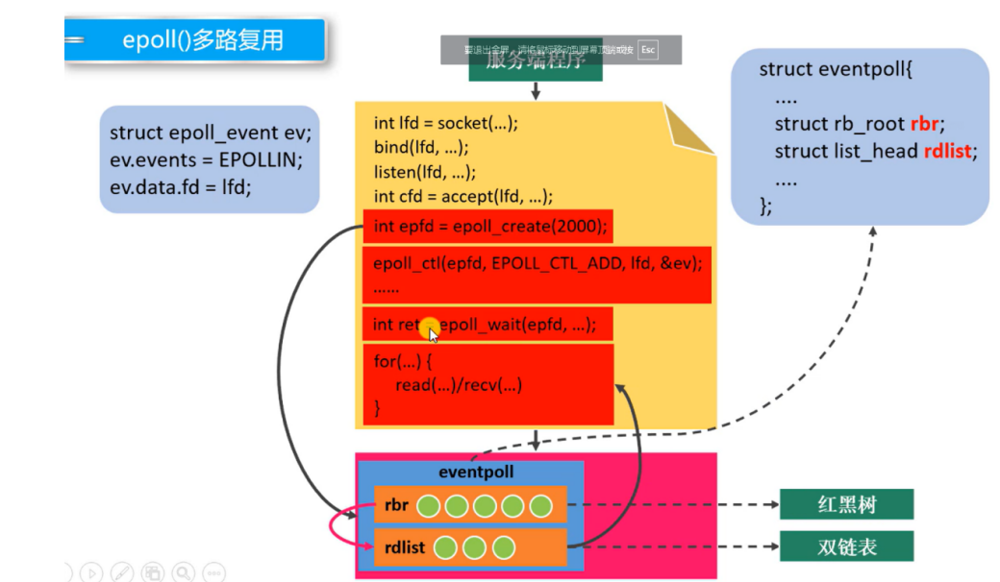


调用epoll_creat创建一个epoll实例，就会在内核中创建 用来存放监听文件描述符的红黑树，另一个是就绪表


Epoll的工作模式为LT和ET即水平触发和边缘触发，默认是水平触发

区别：

水平触发：一但文件描述符就绪后就会一直通知你去读取数据，直到你把数据读完

边沿触发：一会通知你一次有数据可读，所以你必须得把数据读完，不然会在再通知你数据可读，下次再来数据的时候才会再通知你，必须配合无阻塞即read/rec为非阻塞读数据数据，如果使用阻塞就到导致重新阻塞，无法继续监听其他文件描述符

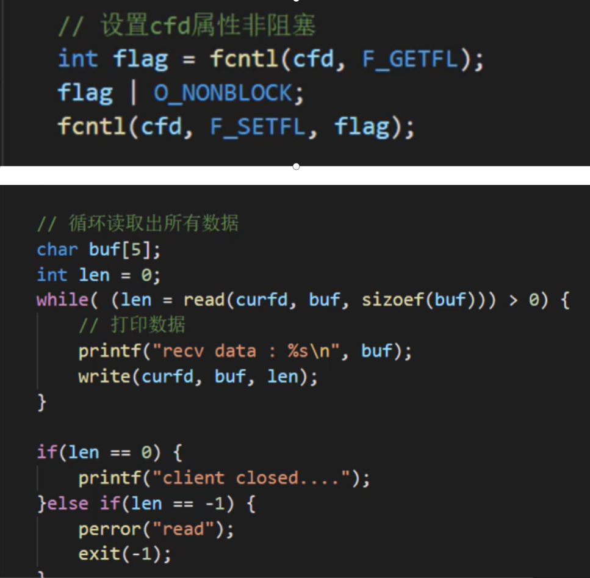

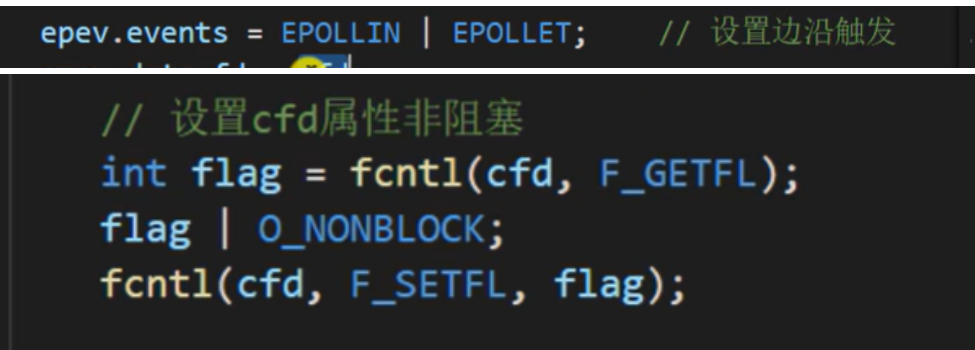


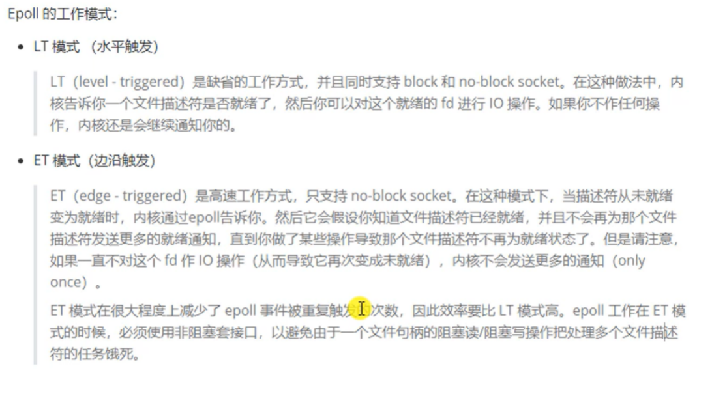

**epoll使用原理：**

1、首先使用epoll_create(监听的最大数量)，

2、把需要监听的文件描述符添加到epoll里面去  epoll_ctl(epfd,EPOLL_CTL_ADD,sockfd,&ev);

  需要设置监听那个文件描述符，什么类型，比如监听的是可写还是可读，使用struct epoll_event结构体设置

  参数说明：

```c
其中EPOLL_CTL_ADD表示添加，相反的还有删除EPOLL_CTL_DEL
ev是个 struct epoll_event结构体，这个结构体可以用来设置需要监听的文件描述符
struct epoll_event
{
  uint32_t events;   /* Epoll events */
  epoll_data_t data; /* User data variable 
};
其中events可以设置为
enum EPOLL_EVENTS
{
  EPOLLIN = 0x001,//表示被监听的文件为可读时发生
#define EPOLLIN EPOLLIN
  EPOLLPRI = 0x002,
#define EPOLLPRI EPOLLPRI
  EPOLLOUT = 0x004,
#define EPOLLOUT EPOLLOUT  //可写时发生
  EPOLLRDNORM = 0x040,
```

3.等待监听的文件描述符发生epoll_wait(epfd,events,Maxsize,-1);

  events是epoll_event结构体用来已经保存可读或可写的文件描述符，用户只需通过判断该结构体中的data.fd即可知道是否为需要的文件描述符

  -1 表示阻塞等待


**使用例子:使用epoll监听服务器的客户端**

(1)创建套接字

(2)绑定IP，端口

(3)监听

(4)Epoll_create创建epoll的文件描述符或者说句柄

(5)epoll_ctl()设置监听的文件描述符，。这里主要是创建的套接字

(6)Epoll_wait()等待文件描述符可用，返回值为可用的文件描述符数量

(7)判断可用的文件描述符是否为创建的套接字，如果是则表示有新客户连接，服务器需要接收连接，并把通信的fd设置到监听里面去

(8)如果判断不是创建的套接字，则表示是客户端的fd，那么此时需要去处理客户端的信息，比如读取客户端发上来的数据，或者发数据给客户端，又或者创建线程处理复杂任务

```c
int main()
{
    int sockfd,confd[1024]={0};
    struct sockaddr_in serveraddr_in,clientaddr_in;
//1.创建套接字
    sockfd=socket(AF_INET,SOCK_STREAM,0);
    if(sockfd==-1)
    {
        perror("socket");
        exit(1);
    }
//2.绑定
    memset(&serveraddr_in,0,sizeof(serveraddr_in));
    serveraddr_in.sin_family=AF_INET;
    serveraddr_in.sin_port=htons(6868);
    serveraddr_in.sin_addr.s_addr=inet_addr("172.18.125.34");
    int ret=bind(sockfd,(struct sockaddr *)&serveraddr_in,sizeof(serveraddr_in));
    if(ret==-1)
    {
        perror("bind");
        exit(1);
    }
//3.监听
    ret=listen(sockfd,10);
    if(ret==-1)
    {   
        perror("listen");
        exit(1);
    }
    
    int length=sizeof(clientaddr_in);
    char buf[128]={0};
    int Maxsize=128;
    struct epoll_event ev,events[Maxsize];//ev用来写进监听，events[]用来保存监听到的
    ev.events=EPOLLIN;//监听可读
    ev.data.fd=sockfd;
    
    int epfd=epoll_create(Maxsize);//1.创建epoll对象
    if(-1==epfd)
    {
        perror("epfd");
        exit(1);
    }
    ret=epoll_ctl(epfd,EPOLL_CTL_ADD,sockfd,&ev);//2.给epoll添加fd到集合,
    if(ret==-1)
    {
        perror("epoll_ctl");
    }
    while(1)
    {
        int i;
        int num=epoll_wait(epfd,events,Maxsize,-1);//3. -1表示阻塞等待epoll可读，监听的保存到events，返回值为可读fd个数
        if(-1==num)
        {
            perror("epoll_wait");
            exit(1);
        }
        for(i=0;i<num;i++)
        {
            int fd;
            if(events[i].data.fd==sockfd)//4.判断是否为sockfd,是表示有新客户端连接,处理：接受连接，保存通信fd到监听集合
            {
                fd=accept(sockfd,(struct sockaddr* )&clientaddr_in,&length);
                printf("客户端%s连接成功 fd=%d\n",inet_ntoa(clientaddr_in.sin_addr),fd); 
                
                ev.events=EPOLLIN;
                ev.data.fd=fd;
                ret=epoll_ctl(epfd,EPOLL_CTL_ADD,fd,&ev);//5.给epoll添加客户端fd------->通信的fd,
                if(ret==-1)
                {
                   perror("epoll_ctl");
                    exit(1);
                }
            }
            
            else//表示是客户端的通信fd可用
            {
                if(events[i].events & EPOLLIN)//判断是否为可读
                {
                    ret=recv(events[i].data.fd,buf,sizeof(buf),0);//
                    if(ret==-1)
                    {
                        perror("recv");
                    }
                    if(ret==0)
                    {
                         perror("退出");
                         ev.data.fd=events[i].data.fd;
                         ev.events=EPOLLIN;
                         epoll_ctl(epfd,EPOLL_CTL_DEL,ev.data.fd,&ev);//删除掉线的文件描述符
                         close(ev.data.fd);
                    }
                    else
                    {
                        printf("收到来自%d的信息:%s\n",events[i].data.fd,buf);
                         memset(buf,0,sizeof(buf));
                    }
                } 
            }
        }
    }
    
    return 0;
}
```


**Select函数的使用：**

函数原型：

 int select(int nfds, fd_set *readfds, fd_set *writefds,fd_set *exceptfds, struct timeval *timeout);

-参数：

  -nfds:表示最大的文件描述符号+1,之所以加1因为内核遍历哪些文件描述符可用时是从0开始，比如最大文件描述符为4，那么就需要遍历4+1次才能遍历到文件描述符4

-readfds：文件描述符可读的集合，当调用select函数之后，比如监听的可读文件描述符总共有4个，但只有文件描述符3可读时，该函数会把readfds里的其他文件描述符置0,所以要想每次都监听全部的文件描述符就需要事先保存下来

-timeout：设置阻塞监听时间，为null时阻塞，为0时不阻塞

注意;不需要监听的集合只需要设置为null即可


void FD_CLR(int fd, fd_set *set);//清除监听集合中的fd文件描述符，清除之后不再监听

int  FD_ISSET(int fd, fd_set *set);//判断监听集合中，fd文件描述符是否可用

void FD_SET(int fd, fd_set *set);//设置文件描述符fd到监听集合中监听

void FD_ZERO(fd_set *set);//清除所有的文件描述符

该函数只能监听1024个文件描述符，因为sizeof(fd_set)=128个字节，128*8=1024位，每一位表示一个文件描述符

**工作流程：**

1.用户设置需要监听的文件描述符到监听的集合

void FD_SET(int fd, fd_set *set);//设置文件描述符fd到监听集合中监听

2.调用select函数监听文件描述符集合

int select(int nfds, fd_set *readfds, fd_set *writefds,fd_set *exceptfds, struct timeval *timeout);

此时用会把需要监听的集合拷贝到内核

3.监听到集合中文件描述符可用时，把监听的集合从内核拷贝到用户(内核自己完成)

4.判断集合中是否有自己想要的文件描述符

int  FD_ISSET(int fd, fd_set *set);//判断监听集合中，fd文件描述符是否可用


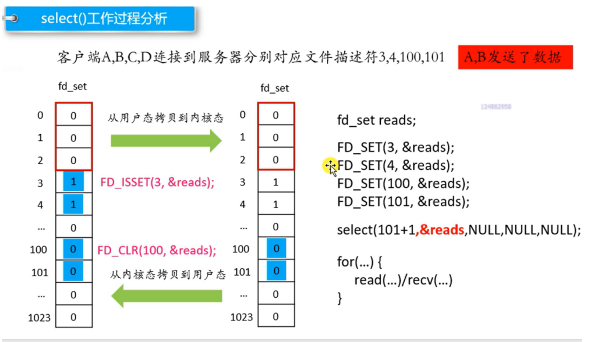


```c
int main()
{
    int sockfd,confd[1024]={0};
    struct sockaddr_in serveraddr_in,clientaddr_in;

    //1.创建套接字
    sockfd=socket(AF_INET,SOCK_STREAM,0);
    if(sockfd==-1)
    {
        perror("socket");
        exit(1);
    }
//2.绑定
    memset(&serveraddr_in,0,sizeof(serveraddr_in));
    serveraddr_in.sin_family=AF_INET;
    serveraddr_in.sin_port=htons(6868);
    serveraddr_in.sin_addr.s_addr=inet_addr("172.18.125.34");
    int ret=bind(sockfd,(struct sockaddr *)&serveraddr_in,sizeof(serveraddr_in));
    if(ret==-1)
    {
        perror("bind");
        exit(1);
    }
//3.监听
    ret=listen(sockfd,10);
    if(ret==-1)
    {
        perror("listen");
        exit(1);
    }
    
    int length=sizeof(clientaddr_in);
    fd_set readfd,tmpfd;    //监听集合
    FD_ZERO(&readfd);       //清空集合
    FD_SET(sockfd,&readfd); //设置集合
    int maxfd=sockfd; //设置监听个数
    char buf[128]={0};
    while(1)
    {
        tmpfd=readfd;//保存集合，因为当有文件有可读或写异常时，会把其他文件描述符删掉，留下可用的文件描述符
        int ret=select(maxfd+1,&tmpfd,NULL,NULL,NULL);//监听有可读文件描述符
        if(ret==-1)
        {
            perror("select");
            exit(1);
        }

        if(FD_ISSET(sockfd,&tmpfd))//判断是否为sockfd,是，表示新客户端连接
        {
            int i;
            for( i=0;i<1024;i++)//判断哪个通信fd是没用过的，因为当客户端退出后，那个位置就为0
            {
                if(confd[i]==0)
                {
                    break;
                }
            }
          //4.接受链接
            confd[i]=accept(sockfd,(struct sockaddr*)&clientaddr_in,(socklen_t *)&length);
            if(confd[i]==-1)
            {
                perror("accept");
                exit(1);
            }
        //打印连接的客户端IP
            printf("客户端%s连接成功 fd=%d\n",inet_ntoa(clientaddr_in.sin_addr),confd[i]);
            FD_SET(confd[i],&readfd);//把上线的客户端的文件描述符写入集合
            if(confd[i]>maxfd)//修改监听的最大个数
            {
                maxfd=confd[i];
            }
        }
        else//表示是通信描述符的
        {
            memset(buf,0,sizeof(buf));//清除Buf
            for(int i=0;i<1024;i++)//判断是哪个通信文件描述符
            {
                if(FD_ISSET(confd[i],&tmpfd))
                {
                    int ret=recv(confd[i],buf,sizeof(buf),0);//接收来自客户端信息
                    if(ret==-1)
                    {
                        perror("recv");
                        
                    }
                    if(ret==0)//判断是否为退出
                    {
                        perror("客户端退出");
                        close(confd[i]);//关闭通信文件描述符
                        FD_CLR(confd[i],&readfd);//从监听集合中清除通信文件符
                        confd[i]=0;//文件描述符置0
                    }
                    else
                    {
                        printf("收到客户%d的信息:%s\n",confd[i],buf);//打印信息
                    }
                    break;
                }
            }
        }
    }
    
    return 0;
}
```


### 26.管道通信

1.创建fifo文件

2.打开fifo文件

3.读写fifo文件


### 27.信号的常见知识

（1）**信号的作用**：用于通知接收进程有某种事件发生，除了用于进程间通信，还可以发送信号给自己

（2）常见信号：

SIGKILL

SIGSTOP

SIGCONT

SIGALRM

（3）发送信号：

1.int kill(pid_t pid, int sig)

参数说明：

  如果pid为正，则将信号sig发送到pid指定ID的进程

  如果pid等于0，则sig被发送到调用进程的进程组中的每个进程

  如果pid等于-1，则sig被发送到调用进程有权发送信号的每个进程，进程除外（初始）

返回值：成功0，失败-1

 发送信号给进程或线程


2.int raise(int sig)  (只能发送给自己)

对于进程该函数相当于： kill(getpid(), sig);

对于线程该函数相当于：pthread_kill(pthread_self(), sig);


（4）进程可以对信号的操作：

1.缺省方式

2.忽略信号

3.捕捉信号

void ( *signal(int signum, void (*handler)(int)) ) (int);

signum:要设置的信号类型

handler :指定的信号处理函数：

SIG_DFL代表缺省处理----->系统默认处理方式，比如终止终端

SIG_IGN代表忽略信号

捕捉信号 ----》自己定义的处理方法  

​        

(新版本）sighandler_t signal(int signum, sighandler_t handler);

signum:要设置的信号类型

handler :指定的信号处理函数：

SIG_DFL代表缺省处理

SIG_IGN代表忽略信号

捕捉信号---》自己定义的处理方法  

注意： The signals SIGKILL and SIGSTOP cannot be caught or ignored.

不能捕捉或忽略信号SIGKILL和SIGSTOP


（5）创建定时器：

常用于检测网络超时

   unsigned int alarm(unsigned int seconds);

  参数说明:seconds为秒，如果seconds为0则取消定时器

  返回值：成功返回上个定时器的剩余时间，失败返回EOF


注意一个进程只能创建一个定时器，时间到就产生SIGALRM信号

通过这个函数我们可以设计一个定时器，时间到之后进程就会产生一个SIGALRM信号，接收进程只需调用void ( \*signal(int signum, void (\*handler)(int)) ) (int);函数收信号即可

```c
void signal_funtion(int signal)
{
    if(signal==SIGALRM)
    {
        printf("alarm\n");

    }
}
int main()
{
    int ret;
    ret=alarm(3);//1.设置闹钟信号
    printf("%d\n",ret);
    signal(SIGALRM,signal_funtion);//2.改变SIGALRM信号默认处理方式
    ret=pause();//3.进入睡眠（防止闹钟时间过长，还没到时间程序就运行完），直到中断信号出现，才有可能继续往下
    printf("pause %d\n",ret);
return 0;
}
```


### 28.共享内存

线程A

1）创建共享内存

2）映射到进程地址

3）通过映射地址操作共享内存

4）关闭映射

 

线程B

1）打开共享内存

2）映射

3）操作共享内存

4）关闭映射


### 29.软链接和硬链接的区别

软连接相当于快捷方式，硬连接是删除其中一个不会影响另一个

1) 定义不同：

软连接又叫符号连接，这个文件包含了另一个文件名

硬连接就是一个文件的一个或多个文件名

2) 限制不同

硬连接只能对已经存在的文件连接，不能交叉文件系统进行硬链接的创建

软连接可以对不存在的文件或目录进行连接，可交叉文件系统

3) 影响不同

删除一个硬链接文件并不影响其他有相同 inode 号的文件

删除软链接并不影响被指向的文件，但若被指向的原文件被删除，则相关软连接被称为死链接（即 dangling link，若被指向路径文件被重新创建，死链接可恢复为正常的软链接）。

 

使用ln -s指令进行软连接


### 30.静态库和动态库怎么制作及如何使用，区别是什么

**1.静态库的制作：**

1）编译成可执行的.o文件

Gcc hello.c -c

2）将可执行文件制作成库

  Ar rcs libhello.a hello.o 

静态库的使用：

 Gcc main.c -lhello -o main

**2.动态库的制作：**

gcc -shared -fpic hello.c -o libhello.so

  -shared 指定生成动态库 

-fpic ：fPIC选项作用于编译阶段，在生成目标文件时就得使用该选项，以生成位置无关的代码。

动态库的使用：

gcc main.c -lhello -L ./ -o main


**3.区别;什么时候加载，加载速度如何，内存占用大小，执行效率**

1)静态库代码装载的速度快，执行速度略比动态库快。

2)动态库更加节省内存，可执行文件体积比静态库小很多。

3)静态库是在编译时加载，动态库是在运行时加载。

4)生成的静态链接库，Windows下以.lib为后缀，Linux下以.a为后缀。生成的动态链接库，Windows下以.dll为后缀，Linux下以.so为后缀

 

### 31.简述GDB常见的调试命令，什么是条件断点，多进程下如何调试

1）在编译的时候必须加上参数-g

Gcc main.c -g -o ma in

2)多进程下如何调试：用set follow-fork-mode child 调试子进程

  或者set follow-fork-mode parent 调试父进程

3)条件断点：break if 条件 以条件表达式设置断点


### 32.Linux系统态与用户态，什么时候会进入系统态？

内核态是指拥有最高权限，可以访问所有的指令，用户态只能访问一部分指令

什么时候进入内核态：a.系统调用(主动) b.异常 c.设备中断

为什么区分用户态和内核态：在cpu中有些指令比较危险，如果用错就会导致系统崩溃，比如清内存


### 33.什么是页表，为什么要有？

页表是虚拟内存的概念，虚拟内存映到物理内存的映射表，就是页表


**原因：**虚拟内存要和物理地址映射起来，就必须要通过映射表找到物理地址，如果将每一个虚拟内存的 Byte 都对应到物理内存的地址，每个条目最少需要 8字节（32位虚拟地址->32位物理地址），在 4G 内存的情况下，就需要 32GB 的空间来存放对照表，那么这张表就大得真正的物理地址也放不下了，于是操作系统引入了页（Page）的概念，使用4个字节的映射就对应物理内存的1页--->4k内存，这样把全部虚拟地址映射到页表就会节省很大空间


一般来说进程的虚拟地址要想找到物理地址就必须通过MMU，MMU里面放的就是映射表，通过虚拟内存的高20位知道自己在映射表的位置，也就是对应的物理地址的页起始位置，虚拟地址的低12位对应物理地址的页里面的具体地址

比如：0x00003 005中前20位对应映射表的0x80003000,那么就会去找物理地址0x8000 3000为起始的页，005表示在页中的第几个，这样就可以找到具体物理地址

由于映射表是4个字节就映射物理地址的1页即4k,那么映射完整个物理地址之后就会节省大量空间，不同进程之间的页表是不一样的

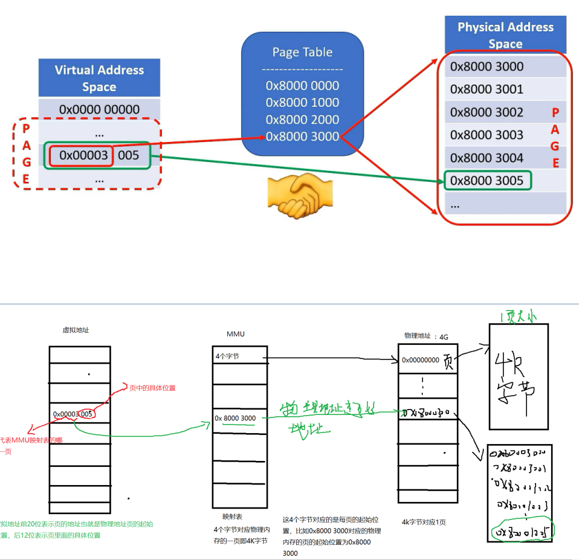


### 34.简述操作系统中malloc的实现原理

malloc底层实现：

当开辟的空间小于 128K 时，调用 **brk（）**函数；

当开辟的空间大于 128K 时，调用**mmap（）**。

malloc采用的是内存池的管理方式，以减少内存碎片。先申请大块内存作为堆区，然后将堆区分为多个内存块。当用户申请内存时，直接从堆区分配一块合适的空闲快。采用隐式链表将所有空闲块，每一个空闲块记录了一个未分配的、连续的内存地址


### 35.简述操作系统中的缺页中断

malloc和mmap函数在内存分配时只是建立了进程的虚拟地址，并没有分配虚拟地址对应的物理内存，当进程访问这些没有建立映射关系的虚拟内存时，处理器自动触发一个缺页异常，引发缺页中断

缺页异常后将产生一个缺页中断，此时操作系统会根据页表中的外存地址在外存中找到所缺的一页，将其调入内存


### 36.简述mmap的原理和使用场景

原理：mmap是一种内存映射文件的方法，即将一个文件或者其它对象映射到进程的地址空间，实现文件磁盘地址和进程虚拟地址空间中一段虚拟地址的一一对映关系。实现这样的映射关系后，进程就可以采用指针的方式读写操作这一段内存，而系统会自动回写脏页面到对应的文件磁盘上，即完成了对文件的操作而不必再调用read, write等系统调用函数。相反，内核空间对这段区域的修改也直接反映用户空间，从而可以实现不同进程间的文件共享

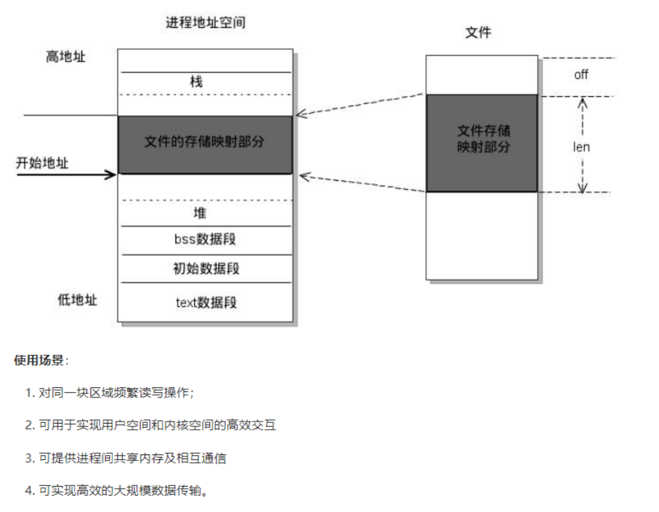


### 37.为什么使用虚拟内存

（1）扩大地址空间。每个进程独占一个4G空间，虽然真实物理内存没那么多。

（2）内存保护：防止不同进程对物理内存的争夺和践踏，可以对特定内存地址提供写保护，防止恶意篡改。

（3）可以实现内存共享，方便进程通信。

（4）可以避免内存碎片，虽然物理内存可能不连续，但映射到虚拟内存上可以连续


### 38.用户空间和内核空间的通信方式

1.使用内核提供的API函数

copy_from_user      copy_to_user

2.proc文件系统

3.mmap系统调用


### 39.中断的响应执行流程？听说过顶半部和底半部吗？

cpu接收中断----->保存中断上下文跳转到中断的处理函数----->执行中断上半部分----->执行中断的下半部分----->恢复中断的上下文

 

顶半部执行一般是比较紧急的任务，比如**清中断**，下半部执行的一些不太紧急的人任务可以节省中断处理时间


### 40.什么是根文件系统

是内核启动时所挂载的第一个文件系统，内核代码映像文件保存在根文件系统中


### 41.自旋锁是什么？信号量是什么？二者有什么区别？

自旋锁：---->不会进入睡眠

自旋锁只有两个状态锁定和解锁，在锁定期间其他进程我是不能进行访问资源，比如B想访问只能在外面等到解锁之后才能访问，如果B等待的时间过长那么就要考虑使用互斥锁

 

信号量：------>会进入睡眠

信号量是个计数器，用来统计资源的可用次数，比如B进程想使用资源，当资源可用的是时候就会去通知B，而不是让B在哪里等着，不会一直占用CPU，这样就可以提高系统的执行效率

 

区别：

信号量会让等待信号的的进程进入睡眠，所以信号量适用于锁会被长时间持有的情况

自旋锁会一直在哪里循环判断所是否可用占用极高CPU所以不适用长时间持有所的情况

自旋锁禁止处理器抢占，信号量允许，这也就是为什么自旋锁不能睡眠的原因，如果自旋锁睡眠，那么就无法通过抢占唤醒睡眠的自旋锁

信号量不能用于中断中，因为信号量会引起休眠，中断不能睡眠，自旋锁可以


### 42.为什么堆的空间不是连续的？

堆内存的管理只要是靠链表来维护已用和空闲的内存，当我们申请堆内存空间时会在空间里面找到一个满足要求的内存，当我们释放掉大的内存空间时，这些大块空间就会和那些零散的空间合并成一个空间快


### 43.Linux内核的组成部分（进程、内存管理、文件系统、网络接口）

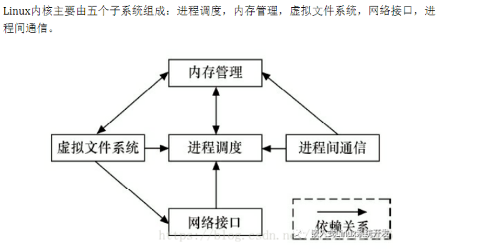


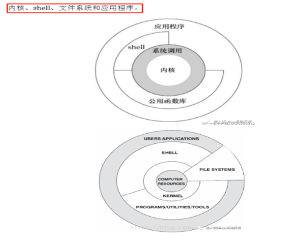


### 44.线程的同步和互斥的区别和联系

同步是指按照一定顺序执行，同步里面包含了互斥，互斥是指一个资源只能出现一个进程进行访问，但是互斥没办法按照顺序执行，是无序的


### 45.常见命令

（1）解压、压缩命令

tar是操作.tar的命令

Zip 后缀.zip 

unzip

gzip是压缩.gz压缩包的命令

compress：压缩.Z文件

uncompress：解压缩.Z文件


（2）查看内存

free 

cat /proc/meminfo

df -h

top


（3）查看cpu

cat /proc/cpuinfo


（4）修改文件权限

chmod u+rwx g+rwx o+rwx


（5）ps grep|xxx


（6）查看内核

uname -a


（7）查看栈大小

ulimit -s


### 46.进程终止

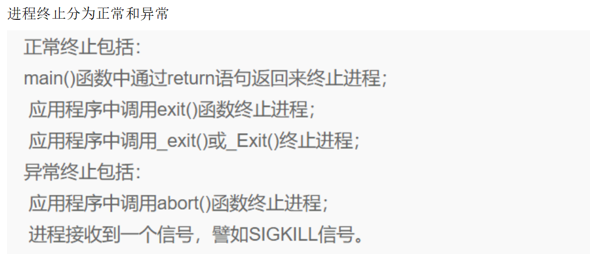


### 47.特殊进程

Linux下有3个特殊的进程，

idle进程(PID = 0), idle进程是由系统自动创建，运行在内核态

init进程(PID = 1)，init进程是由idle创建运行在用户空间，其父进程就是idle

kthreadd(PID = 2)。内核线程，负责内核线程的创建工作，其父进程就是idle


### 48.多线程中使用较多的函数

1.获得父进程ID

pthread_t pthread_self(void);

2.互斥量初始化

int pthread_mutex_init(pthread_mutex_t *restrict mutex,const pthread_mutexattr_t *restrict attr);


### 49.pthread_cond_signal()和 pthread_cond_broadcast()

如果调用 pthread_cond_signal()和 pthread_cond_broadcast()向指定条件变量发送信号时，若无任何线程等待该条件变量， 这个信号也就会不了了之


### 50.驱动里面为什么需要并发和互斥

并发是指多个单元同时执行，这样就会是共享内存的数据被修改，形成一种竞争，所以我们需要互斥让一个时间段只能一个单元对数据访问，像自旋锁，信号量都是可用的操作


### 51.软中断和硬中断的区别

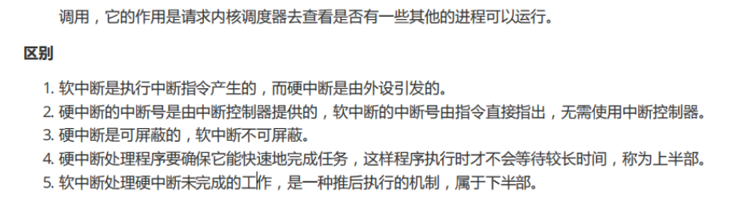


### 52.fork和vfork的区别

vfork中子进程修改全局变量会影响父进程的全局变量

注意第二点

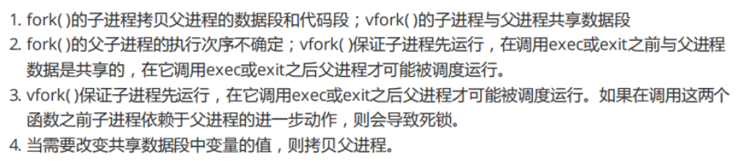


### 53.虚拟内存

虚拟内存是一种内存管理技术，之所以有这个虚拟内存，主要是为了扩张内存，因为我们的这个代码数据什么都是存在硬盘中的，而CPU是没办法直接去拿硬盘的数据，必须借助内存，但是这个内存是有限的，所以但内存不够的时候就会把一部分这个硬盘作为虚拟内存，这样cpu就可以读取虚拟内存的数据


### 54.并发编程的三个概念

在并发编程中，我们通常会遇到以下三个问题：

原子性问题，可见性问题，有序性问题

 

**原子性**：即一个操作或者多个操作 要么全部执行并且执行的过程不会被任何因素打断，要么就都不执行

**可见性**：是指当多个线程访问同一个变量时，一个线程修改了这个变量的值，其他线程能够立即看得到修改的值

**有序性**：即程序执行的顺序按照代码的先后顺序执行


### 55.同步和异步

同步一般是指阻塞等待，异步一般是不需要等待，比如你发送数据到服务器，那么就不需要等待，直接去干别的事，一般来说异步的效率高于同步

