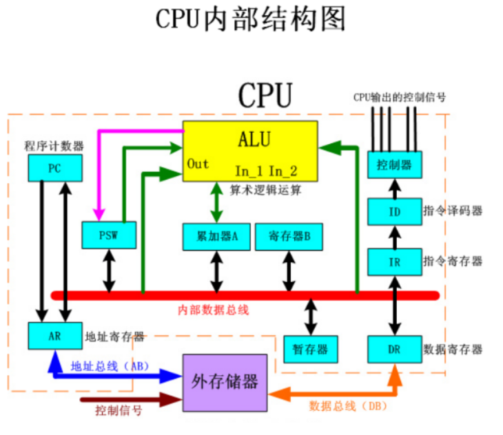
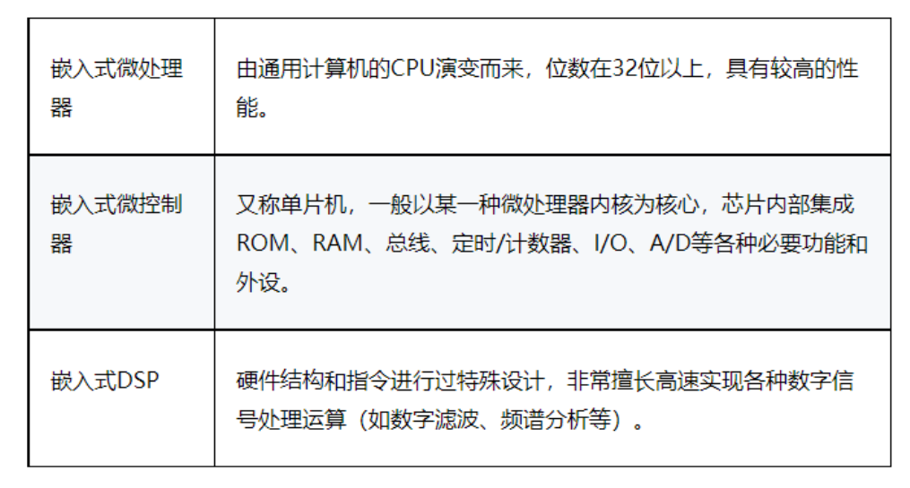
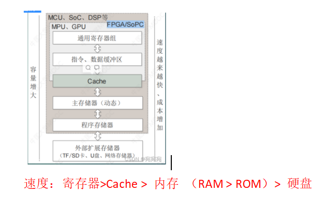
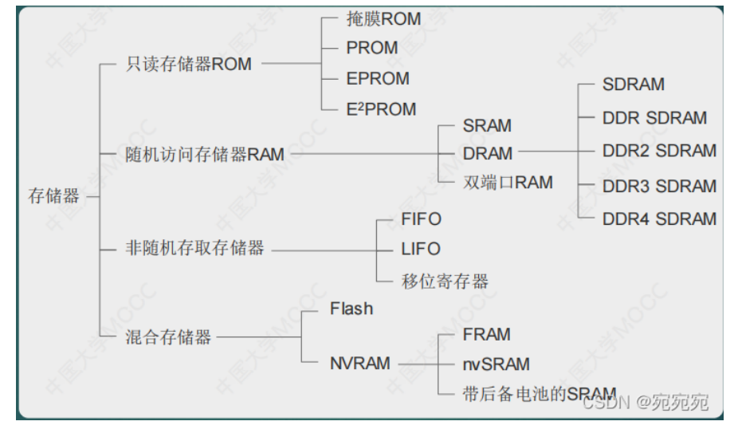
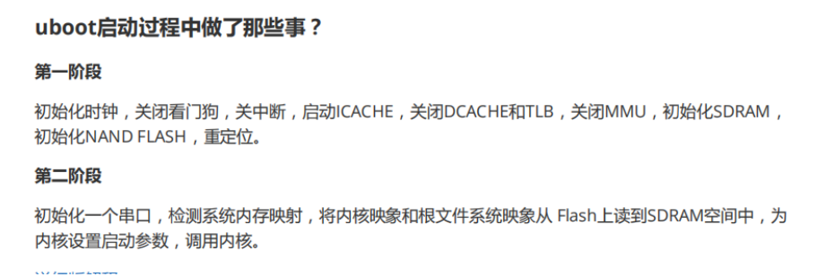
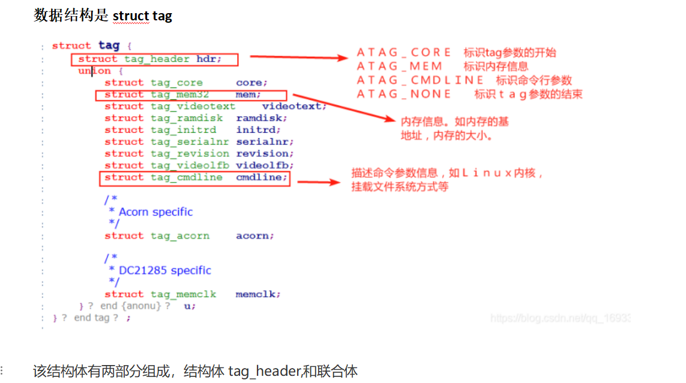

# 硬件

## 1.Cortex-M3和Cortex-M4可以同时支持小端模式和大端模式

## 2.CPU内部结构

控制单元、存储单元、运算单元、时钟

## 3.CPU、内存、虚拟内存、硬盘的关系

1.cpu:  cpu是从内存或者缓存中拿到指令，放入寄存器，并对指令译码分解成一系列微操作，然后发出控制命令，执行微操作

2.CPU并不能直接调用存储在硬盘上的系统、程序和数据，所以必须先将硬盘上的数据、内容存储在内存中，这样才能被CPU读取，所以内存是硬盘和CPU的中转站

3.内存一般是比较小的，当内存超出额度之后，就会把硬盘上的部分空间模拟成内存----->虚拟内存，将暂时不用的数据或程序保存到虚拟内存，等到需要的时候再调用

 

总结：CPU是工厂，内存是中转站，硬盘是仓库，虚拟内存是临时中转站

## 4.ARM结构处理器分类

1.嵌入式微处理器  ------>具有32位以上的处理器

2.嵌入式微控制器 -------->单片机，以某种微处理器内核为核心，芯片内部集成ROM，RAM等功能

3.嵌入式DSP处理器------>擅长数字信号处理

## 5.嵌入式微处理器和嵌入式DSP有什么区别？

偏重的方向不一样，微处理器偏向于界面的操作，他的速度和，计算能力一般，一般使用在消费电子方面

DSP的计算能力较强，对于数据的处理能力极好，所以一般用作计算，比如军用，伺服电机

## 6.存储

1.通用计算机采用了Cache（高级缓冲存储器）、主存储器（RAM，内存）、外部存储器组成的三级存储体系

2.嵌入式系统存储体系如下图所示：

3.嵌入式存储器类型

4.RAM

RAM叫做随机存储器，是直接和CPU进行交互的内存（主存），通常作为正在运行程序和临时数据的存储煤质

RAM分类：

静态SRAM： SRAM，速度比DRAM快，不需要时钟同步

动态DRAM：同步动态RAM ，需要周期性刷新，密度比SRAM高，需要时钟同步

 

片内ram集成在CPU芯片内部，它是在CPU设计时就加上的，它使用和CPU几乎一样的制作工艺和材料，而且增加了芯片的大小，所以成本比较高，一般也就只有几十K字节，好钢当然要用在刀刃上，片内ram用来存放中断处理handler、RTOS调度器、任务上下文切换、内存分配释放等使用频率最高的代码和中断堆栈这种读写频率极高的内存区，如果有多余的部分也可以放一些经常被引用到的全局变量

 

片外RAM一般就是采购的市面上的成品，如Samsung，Hynix，Apmemory等，价格相对便宜，其容量的可选范围也较为宽松，从几M到几G的都有，它可以用来存储全局变量，bss，以及我们常用到的malloc所分配的堆空间等。

5.ROM

只读存储器，AM和ROM相比，两者的最大区别是RAM在断电以后保存在上面的数据会自动消失，而ROM不会自动消失，可以长时间断电保存

 

ROM一般是有两种，

一种是指集成在CPU芯片内部的一块只读存储区域，一般是几K到几十K字节大小，用来存储系统刚上电时对cpu和一些核心外设（如时钟，串口，MMU、DRAM、Flash等）进行初始化的代码，它在程序运行中也是不可写的，要对它执行写操作只能使用硬件烧写器进行，也就是一般所说的下载程序，这部分的代码在芯片测试阶段可以进行编程器下载更新，量产后一般就会固化，不能做任何修改的；

 

ROM另一种指的就是flash，它和硬盘有一个显著的区别：flash里存放的代码是可以由CPU直接取指并执行的，而PC上硬盘里的程序都需要加载到内存里才能运行，

**falsh和RAM对比**

flash的写操作要比RAM麻烦的多了，flash在写之前需要发送多个命令字来握手，还要先对即将要写的地址所在的扇区进行整体擦除，就是把该扇区里的内容全设为1，所谓写flash就是把其中的一些bit设为0；更要命的是，flash的每个独立bit位的写次数是有上限的，市面上大部分的产品都只能写10~100万次。多说一句，每个bit位的寿命是独立的，如果一个bit位在擦除和写的动作中，它的值始终为1，则不会有影响；例如反复对一个地址写0xF0，则不会影响高4bit的寿命，而低4bit每次都要先擦成1，再写入0，这样就会降低其寿命

 

NOR闪存与NAND型闪存相比，写入速度较慢，但一般不需要纠错码

在 NAND 类型的闪存中，存储器可以按字、页甚至按位寻址

 

 

常见的Nand Flash，内部只有一个chip，每个chip只有一个plane

Block：一个Nand Flash由很多个块做成，块是Nand Flash的擦除操作的基本/最小单位。

Page：每个块里面有很多页page，页是读写操作的基本单位

 

**思考：**

引导程序（系统的初始化代码）就必须放到ROM里。在CPU刚上电时，只能去一个默认的地址去取第一条指令，开始干活，这个地址都是映射到片内的ROM里，原因很简单，此时，作为外设的flash和DDR等都还没有初始化，CPU根本无法从它们那里读写数据，片内ROM里的这些代码就需要完成这些模块的初始化。另外，一个项目的处理器和主要外设确定了以后，这部分初始化代码在很长的时间里，都不需要做任何修改的

6.DDR

是SDRAM的一种，DDR 全称是 Double Data Rate SDRAM，也就是双倍速率 SDRAM，SDRAM 在一个 CLK 周期传输一次数据，

DDR 在一个 CLK 周期传输两次数据，也就是在上升沿和下降沿各传输一次数据，这个概念叫做预取(prefetch)，相当于 DDR 的预取为 2bit，

DDR2 在 DDR 基础上进一步增加预取，增加到了 4bit，也就是在一个 CLK 周期传输4次数据，DDR3 在 DDR2 的基础上将预取提高到 8bit，也就是在一个 CLK 周期传输8次数据

7.Cache

只读数据（代码段、程序里的const、字符串等）一般来说，这些数据应该放在Flash里，可能有人会有疑问，放在flash里，会不会读取的速度很慢？读ROM的速度是比读RAM的数据要慢一点，但是不要忘了，现代CPU都有强大的cache，而且数据Dcache和指令Icache都是分开的，在系统运行中，cache的命中率可以高达80~90%，所以大部分时候CPU都可以在第一时间就拿到想要的指令和数据。

Cache写操作有两种，写回和写直达

写回和写直达都有优点。

写回的优点为：

· 处理器可以以cache而不是存储器接收的速度写单个的字

· 同一块内的多次写只需要对存储器层次结构的较低层写一次

· 当块被写回时，由于是写一整块，系统可以有效利用高传输带宽

写直达的优点为：

· 缺失较简单，代价较小，因此不需要把整个块写回到较低的存储器层次中

· 写直达比写回更易于实现，但是写直达cache仍需要一个写缓冲区

Cache的映射方法：

cache的映射技术，通常有三种：直接映射、关联映射、组关联映射

8.简述处理器在读内存的过程中，CPU核、cache、MMU如何协同工作？画出CPU核、cache、MMU、内存之间的关系示意图加以说明

## 7.常见的CPU指令集

CISC（Complex Instruction Set Computer）复杂指令集

特点：指令系统的指令不等长，指令的数目非常多

 

RISC（Reduced Instruction Set Computing）是“精简指令集

特点：采用RISC指令集的微处理器处理能力强，并且采用超标量和超流水线结构，大大增强了并行处理能力

## 8.CPU的流水线工作原理

CPU执行一条指令时，也分为几个步骤，如

指令取指（InstrucTIon Fetch）-----> 指令译码（InstrucTIon Decode）-----> 指令执行（Execute）------- > 访存（Memory Access）-----> 写回（Write-Back），

**重点：CPU并不会等一条指令完全执行完才执行下一条指令，而是像流水一样**

## 9.嵌入式流水线工作有什么不同？

嵌入式CPU为了提高效率，采用超流水线结构，我们知道，CPU执行一条指令被分成5个步骤，每个步骤可能都需要1ns，但是有个长指令，被分成5个步骤时，指令执行这个步骤却需要2ns,那么整个时间就被限制了

为了提高效率，我们可以把指令执行（Execute）这个步骤再拆分成两组（寄存器+组合逻辑），每组执行时间为1ns，这样我们的普通流水线成了六级流水线了，这就是超流水线

## 10.Uboot启动过程做了什么事

## 11.中断和异常

中断是指，停止当前的工作，转去执行另个任务，执行完成后发回继续执行

异常是指，由于指向内部指令引起的错误

 

 区别：中断由外因引起，异常由CPU本身原因引起

## 12.DMA和中断的区别

DMA不需要CPU参与，就可以进行数据的传输，大大提高数据传输时CPU的效率，而对于中断来说，必须要CPU的一个参与

DMA的工作模式有两种，一种要求原地址和目标地址都必须是连续，另一种就没有这种要求

## 13.中断函数注意

1.中断函数应该遵循快进快出，把比较消耗时间的任务放到中段下文处理，比如tasklet，工作队列

2.中断函数的返回值，应该使用内核定义的宏，而不是自定义

3.中断不能有阻塞，不能让中断进入睡眠，比如中不能有信号量

## 14.为什么要向内核传参

因为内核并不是对于所有的开发板都是完美适配的，内核对于开发板的环境是一无所知的，所以要想启动内核，就需要通过传参告诉内核当前的环境

## 15.如何传参

uboot传的是R0,R1,R2参数，R0默认是0，R1存放的就是CPU的型号，R2里面存放的是些基地址，比如内存的起始地址，内存大小，根文件系统的信息

 

规定参数的格式：

Linux内核2.4以后都是以标记列表tagged_list的形式来传递参数，标记列表就是挨着存放多个标记，标记列表以标记ATAG_CORE开始，ATAG_NONE结束

## 16.uboot为什么要关闭caches

Caches是cpu的2级缓存，主要作用是将常用的指令和数据存在cpu内部，刚上电CPU还不能管理caches，指令caches可以关闭，也可以不关闭，但是数据caches必须关闭，否则可能由于刚开始的代码到caches里面取数据的时候，由于caches还没准备好，会导致数据异常

## 17.驱动申请内存的函数

kmalloc()

vmalloc 

 

 

Kmalloc会在“lowmem  : 0xc0000000 - 0xef600000”地址空间里申请内存(底端内存)

 

Vmalloc 会在0xef800000 - 0xfee00000”地址空间里申请内存（高端内存）

 

kmalloc 分配的内存大小有限制（**128KB**），而 vmalloc 没有限制

kmalloc 分配内存的开销小，因此 **kmalloc 比 vmalloc 要快**；

 

内核中一般使用 kmalloc()，而只有在需要获得大块内存时才使用 **vmalloc()，得到的地址非线性**

 

kmalloc获取到的是**连续的地址**，vmalloc获取的是**不连续的**，一般情况下，vmalloc申请的是以M为单位，kmalloc申请的是以B为单位

 

 

 

函数 devm_kzalloc() 和kzalloc()一样都是内核内存分配函数

但是devm_kzalloc()是跟设备(device)有关的，当设备(device)被detached或者驱动(driver)卸载(unloaded)时，内存会被自动释放。另外，当内存不在使用时，可以使用函数devm_kfree()释放。

而kzalloc()则需要手动释放(使用kfree())，但如果工程师检查不仔细，则有可能造成内存泄漏

## 18.AD转换的原理

A/D转换器的工作原理，主要介绍以下三种方法:

1.逐次逼近法;

2.双积分法;

3.电压频率[转换法](https://baike.so.com/doc/2783113-2937563.html)。

**A/D转换四步骤:采样、保持、量化、编码。**

采用电压频率转换法的A/D转换器，由计数器、控制门及一个具有恒定时间的时钟门控制信号组成，它的工作原理是V/F转换电路把输入的模拟电压转换成与模拟电压成正比的脉冲信号。电压频率转换法

电压频率转换法的工作过程是:当模拟电压Vi加到V/F的输入端，便产生频率F与Vi成正比的脉冲，在一定的时间内对该脉冲信号计数，时间到，统计到计数器的计数值正比于输入电压Vi，从而完成A/D转换

