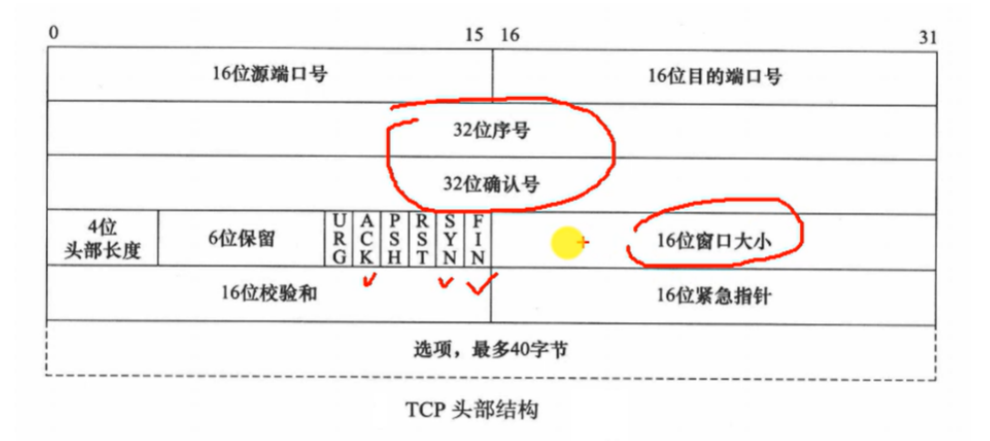
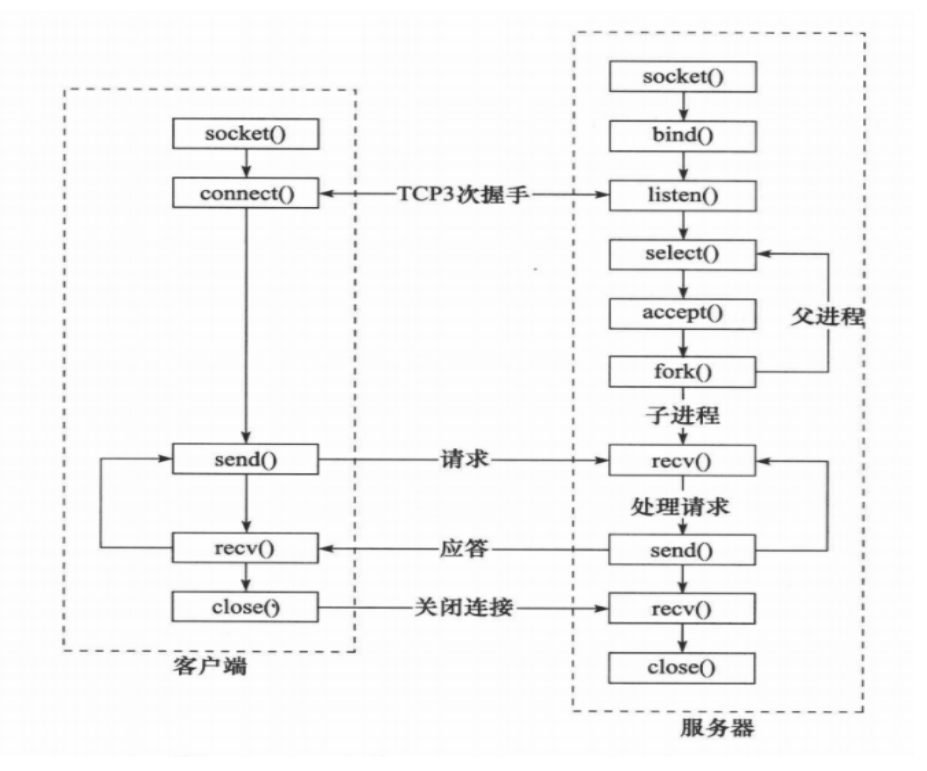
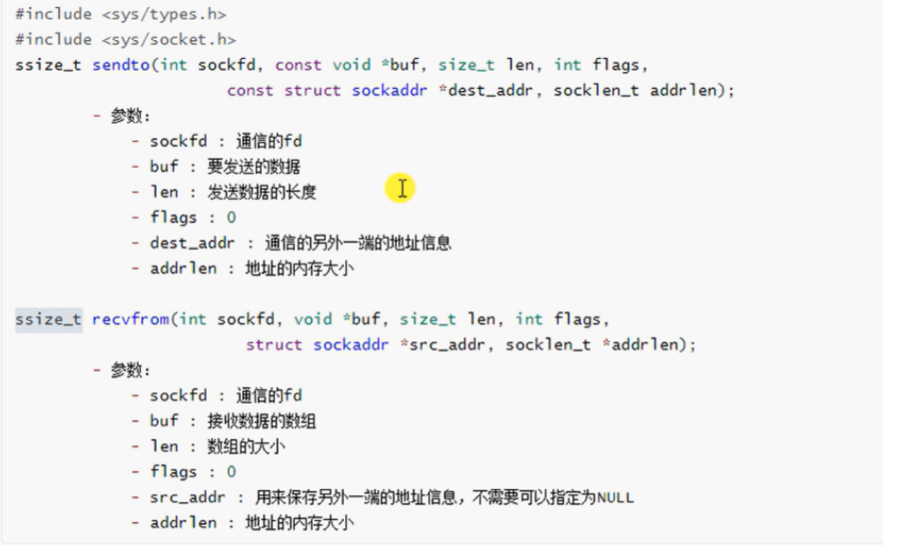
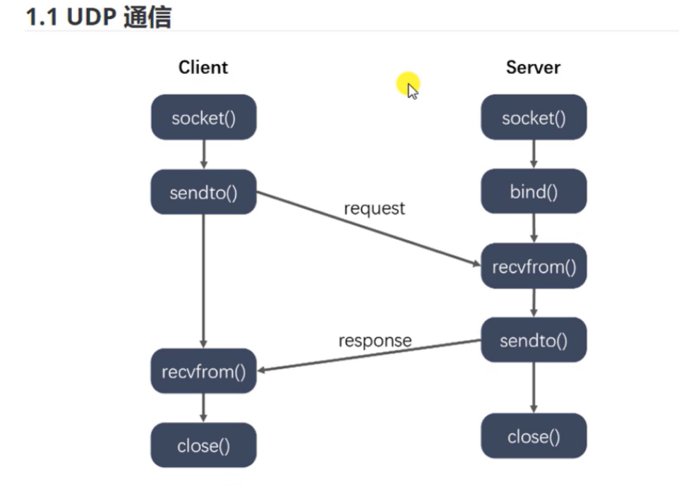
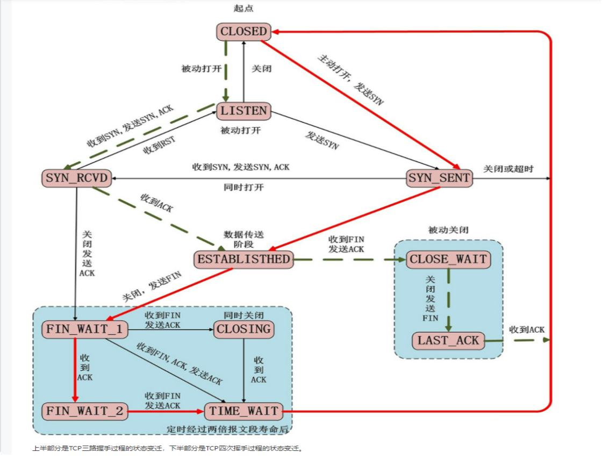
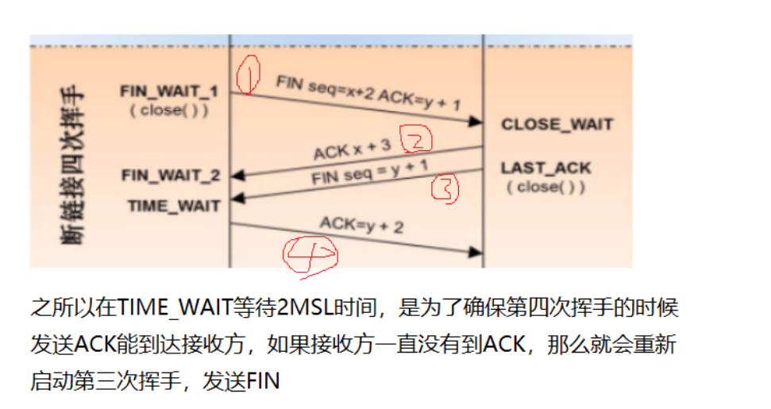
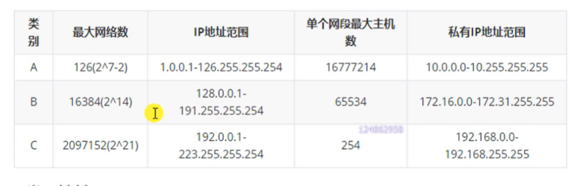
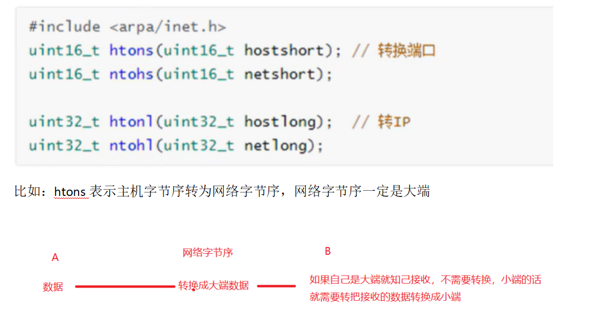

# 网络编程

## 1.TCP头部结构

## 2.请说一下socket网络编程中客户端和服务端用到哪些函数？

### 1）服务器端函数：

（1）socket创建一个套接字

（2）bind绑定ip和port

（3）listen使套接字变为可以被动链接

（4）accept等待客户端的链接

（5）write/read接收发送数据

（6）close关闭连接

 

### 2）客户端函数：

 

（1）创建一个socket，用函数socket()

（2）bind绑定ip和port

（3）连接服务器，用函数connect()

（4）收发数据，用函数send()和recv()，或read()和write()

（5）close关闭连接

## 3.UDP

## 4.网络四层模型

应用层http/TFTP

传输层TCP/UDP

网络层IP/ICMP

链路层

## 5.TCP如何保证可靠性？

**1)检验和：**

通过检验和的方式，接收端可以检测出来数据是否有差错和异常，假如有差错就会直接丢弃TCP段，重新发送。TCP在计算检验和时，会在TCP首部加上一个12字节的伪首部。检验和总共计算3部分：TCP首部、TCP数据、TCP伪首部

 

**2)序列号/ 确认应答、超时重传**

 

数据到达接收方之后，接收方会发送一个确认应答，表示已经收到数据段，并且确认序号会说明了它下一次需要接收的数据序列号，如果发送方没收到确认应答，那么发送方方会进行重发，这个等待时间一般是2*RTT（往返时间）+一个偏差值

如果一个包多次重发没有收到接收端的确认包，就会强制关闭连接

 

 

**3)窗口控制与重发控制/快速重传(重复确认应答)**

 

TCP会利用窗口控制来提高传输速度，意思是在一个窗口大小内，不用一定等到应答才能发送下一段数据，窗口大小就是无需等待确认而可以继续发送数据的最大值，如果不使用窗口控制，每一个没收到应答的数据都要重发

## 6.简述 TCP 滑动窗口以及重传机制

1）滑动窗口协议是传输层进行流控的一种措施，接收方通过通告发送方自己的窗口大小，从而控制发送方的发送速度，从而达到防止发送方发送速度过快而导致自己被淹没的目的。滑动可以理解为缓冲区的大小，告诉发送方，自己还能接受多少数据

 

TCP的滑动窗口解决了端到端的流量控制问题，允许接受方对传输进行限制，直到它拥有足够的缓冲空间来容纳更多的数据。

 

 

2）TCP在发送数据时会设置一个计时器，若到计时器超时仍未收到数据确认信息，则会引发相应的超时或基于计时器的重传操作，计时器超时称为重传超时（RTO） 。另一种方式的重传称为快速重传，通常发生在没有延时的情况下。若TCP累积确认无法返回新的ACK，或者当ACK包含的选择确认信息（SACK）表明出现失序报文时，快速重传会推断出现丢包，需要重传。

## 7.简述 TCP 慢启动

慢启动（Slow Start），是传输控制协议（TCP）使用的一种阻塞控制机制。慢启动也叫做指数增长期。慢启动是指每次TCP接收窗口收到确认时都会增长。增加的大小就是已确认段的数目。这种情况一直保持到要么没有收到一些段，要么窗口大小到达预先定义的阈值。如果发生丢失事件，TCP就认为这是网络阻塞，就会采取措施减轻网络拥挤。一旦发生丢失事件或者到达阈值，TCP就会进入线性增长阶段。这时，每经过一个RTT窗口增长一个段

## 8.TCP建立连接和断开连接过程？

**三次握手和四次挥手**

 

 

**1)三次握手目的：是为了确认客户端和服务器都能收发**

第一次：

 

作用：客户端确认自己可以发   服务器确认自己能收，客户端可以发

 

客户端发送信息给服务器，服务器接受客户端信息   

 

第二次：

作用：客户端确认自己能收，服务器能发也能收   服务器确认自己能发

服务器发送应答给客户端，客户端接收应答和报文

 

第三次：

作用：服务器确认客户端可以收到

客户端应答服务器

三次握手：

第一次：客户端将标志位SYN设置为1，随机产生一个seq=x，并将该数据包发送给服务端，客户端进入SYN_SENT状态，等待服务端确认

第二次：服务端收到数据包后，由标志位SYN=1可知client请求连接，服务端将标志位SYN和ACK都置1，ack=x+1,并将该数据包发送给客户端确认连接请求，服务端进入SYN_RCVD状态

第三次：客户端收到确认后，检查ack是否为x+1,ACK是否为1，如果正确，将数据包发给服务端，服务端检查ACK是否为1，ack是否为y+1，如果是，则连接成功，服务器和客户端都进入ESTABLISHED

**2)四次挥手：**

客户端发送FIN=1给客户端，告诉服务端数据已经发送完毕，请求终止连接，此时客户端不能发送数据(不包括协议，比如应答这些)，但还能接收数据，

 

服务端接受FIN包之后给客户端回一个ACK包告诉它自己已经收到，此时没有断开socket连接，而是等待剩下的数据传输完成

 

服务端等待数据传输完毕之后，向客户端发送FIN包，表明可以断开连接

 

客户端收到后，回应一个ACK包表明已经收到，等待一段时间，确保服务端没有数据再发来，然后彻底断开

## 9.说说 TCP 2次握手行不行？为什么要3次

TCP协议双方都必须维护一个序列号，三次握手的过程及时通信双方互相告知序列号起始值，并确认对方已经收到了序列号

如果只是两次握手，至多只有连接发起方的起始序列号能被确认，另一方选择的序列号则是得不到确认，服务器这边无法判断客户端是否能接收

 

 

 

## **8.** 三次挥手可以吗

 

假设是客户端主动断开，在第一次挥手中客户端发起请求断开，

接着服务器回了个应答(第二次)，表示我已经收到请求

等一段时间，等服务器的数据发送完成之后再向客户端发起断开(第三次)

客户端接受到之后发起应答(第四次)

如果是三次挥手那么只能是第二和第三次合并，即收到第一次挥手之后，发起应答和断开请求，但是这样会存在服务器有些数据还没发送完成就发起断不开

 一句话：服务器回应你的请求断开，服务器可能还有数据没发送，所以应答和FIN就分开发

 

## 10.TCP连接和关闭的状态转移

红色线表示客户端

绿色线表示服务端

## 11.滑动窗口过小怎么办？

数据延迟：

假设滑动窗口只有1，那么每次只能发送一个数据，并且发送只有接收方对这个数据进行确认之后才能进行下个数据的发送，如果数据较大那么就需要不停的对数据进行确认，就会造成很大延迟

## 12.说说三次握手中每次握手信息对方没有收到会怎样？

 如果第一次握手消息丢失，那么请求方不会得到ack消息，超时后进行重传

 

如果第二次握手消息丢失，那么请求方不会得到ack消息，超时后进行重传

 

如果第三次握手消息丢失，那么Server 端该TCP连接的状态为SYN_RECV,并且会根据 TCP的超时重传机制，会等待3秒、6秒、12秒后重新发送SYN+ACK包，以便Client重新发送ACK包，如果重发指定次数之后，仍然未收到 client 的ACK应答，那么一段时间后，Server自动关闭这个连接

## 13.简述 TCP 和 UDP 的区别，它们的头部结构是什么样的(连接、可靠、阻塞、一对一、数据流、报文)

TCP协议是有连接的，有连接的意思是开始传输实际数据之前TCP的客户端和服务器端必须通过三次握手建立连接，会话结束之后也要结束连接。而UDP是无连接的

TCP首部需20个字节（不算可选项），UDP首部字段只需8个字节

TCP有流量控制和拥塞控制，UDP没有，网络拥堵不会影响发送端的发送速率

TCP是一对一的连接，而UDP则可以支持一对一，多对多，一对多的通信。

TCP面向的是字节流的服务，UDP面向的是报文的服务。

## 14.简述域名解析过程，本机如何干预域名解析

1）输入域名后，系统首先会在本地的hosts文件检查是否有这个网址的映射，如果有就调用这个IP地址完成域名的解析

2）如果没有，就会去查找本地DNS解析器缓存，是否有这个网址映射关系，如果有，直接返回，完成解析

3）如果上面两种都没有，首先会找TCP/IP参数设置的首选DNS服务器，再次我们叫它本地DNS服务器，此服务器收到查询时，如果要查询的域名在本地配置区域资源中，则解析

 

通过修改本机host来干预域名解析，例如： 在/etc/hosts文件中添加一句话

  192.168.188.1  www.baidu.com

## 15.说说什么是 TCP 粘包和拆包？

TCP底层并不了解上层业务数据的具体含义，它会根据TCP缓冲区的实际情况进行包的划分，所以在业务上认为，一个完整的包可能会被TCP拆分成多个包进行发送，也有可能把多个小的包封装成一个大的数据包发送，这就是所谓的TCP粘包和拆包问题

## 16.如何解决粘包和拆包问题

粘包的问题出现是因为不知道一个用户消息的边界在哪，如果知道了边界在哪，接收方就可以通过边界来划分出有效的用户消息

所以：

· 固定长度的消息；

· 特殊字符作为边界；要注意特殊字符转义

· 自定义消息结构。

比如这个消息结构体，首先 4 个字节大小的变量来表示数据长度，真正的数据则在后面

## 17.Tcp为什么比UDP可靠

 1.确认和重传机制

主要还三次握手和四次挥手

 2.数据排序

TCP有专门的序列SN字段，可提供re-order

 3.流量控制

窗口和计时器的使用，TCP窗口中指明双方能够接发的最大数据数量

 4.拥塞控制

TCP的拥塞控制由4个核心算法组成，“慢启动”，“拥塞避免”，“”快速重传，“快速恢复”

## 18.什么是HTTP

 

http是超文本连接，是一个基于TCP/IP的通信协议来传递数据

## 19.http有什么特点？

## 20.为什么客户端最后还要等待2MSL

保证客户端发送的最后一个ACK报文能够到达服务器，因为这个报文可能丢失，站在服务器的角度看来，我已经发送了FIN+ACK报文请求断开，客户端没有给我回应，应该是我的请求报文没有收到，于是服务器就会重新发送一次，客户端就能够在这个2MSL时间内收到这个重传的报文，接着回应报文，如图所示

## 20..什么时候应该使用TCP？

 

当对网络通讯质量有要求的时候，比如：整个数据要准确无误的传递给对方，这往往用于一些要求可靠的应用，比如HTTP、HTTPS、FTP等传输文件的协议，POP、SMTP等邮件传输的协议。

## 21.什么时候应该使用UDP？

当对网络通讯质量要求不高的时候，要求网络通讯速度能尽量的快，这时就可以使用UDP

## 22.IPv4和IPv6的区别

1）协议地址的区别

地址长度：IPv4协议具有32位（4字节）地址长度；IPv6协议具有128位（16字节）地址长度

地址的表示方法：IPv4地址是以小数表示的二进制数。 IPv6地址是以十六进制表示的二进制数。

2）地址解析协议

IPv4协议：地址解析协议（ARP）可用于将IPv4地址映射到MAC地址。

IPv6协议：地址解析协议（ARP）被邻居发现协议（NDP）的功能所取代。

3）身份验证和加密

**IPv6提供身份验证和加密，但IPv4不提供。**

4）数据包的区别

包的大小：IPv4协议的数据包最小值为576个字节；IPv6协议的数据包最小值为1280个字节。

包头：IPv4长度为20~40字节；IPv6固定40字节。

## 23.IP地址：

是计算机为每台主机分配的一个逻辑地址，以此来屏蔽物理地址的差异

32位二进制，通常以点十分制表示

每个IP地址包括两个ID，即网络ID和主机ID

子网掩码：

1）什么是子网掩码？

用来指明一个[IP地址](https://baike.so.com/doc/4252723-4455111.html)的哪些位标识的是[主机](https://baike.so.com/doc/5331327-5566564.html)所在的子网，以及哪些位标识的是主机的位掩码

2）作用：求出网络ID和主机ID，判断出是哪类网络

如何利用子网掩码 求出网络ID

公式：IP地址 & 子网掩码

比如 

192.168.1.128

255.255.255.0

 

得出192.168.1.0  即该网络为C类，3个字节表示网络ID，一个字节表示主机ID

 

**对掩码取反之后得**

192.168.1.128

0.0.0.255

可以得出主机ID128

还有种表示比如

192.168.2.128/24 其中24表示的是子网掩码是连续的24个1即255.255.255.0

 

3）如何判断两个IP地址释放在同一个网段

只需要通过IP和子网掩码求出它们的网络ID，相同就是在同一个网段

## **24.** 字节序

大端：数据的高位存放在内存的低地址，低位存放在内存的高地址

小端：数据的高位存放在内存的高地址，低位存放在内存的低地址

不同机器中的大小端是不一样的，有的机器是大端，有的是小端，这个时候通讯就会有问题，

 

解决：

发送端使用API函数转换成大端，接收端再依据自己是小端还是大端对数据进行转换

