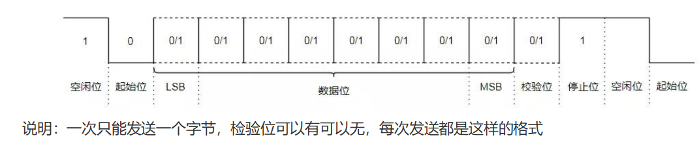
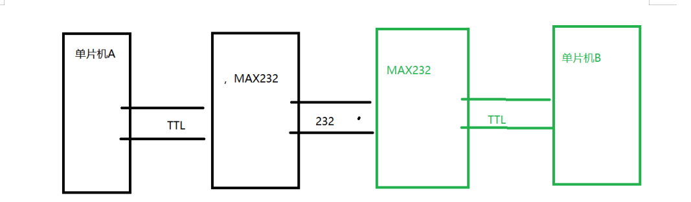
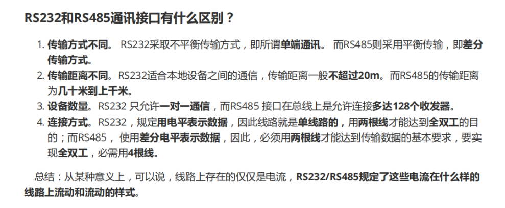
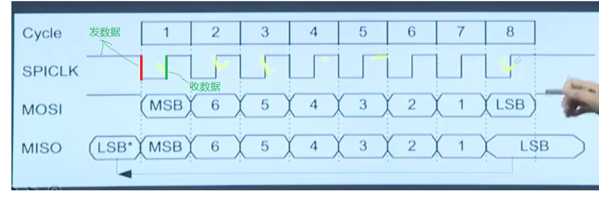

# 通信协议

## 1.USART

通用异步收发器即通用的串行、异步通信总线，该总线有两条数据线，实现全双工的发送和接收

**帧格式**

**波特率**

指每秒可以发送多少位数据

**每次只发一个字节，先发低位**

考虑数据准确性，时间误差的累计，因为波特率规定了每发一个Bit的时间，但是发送方和接收方可能存在时间误差，会导致累计时间误差，导致数据不正确，所以这个时候就需要规定每次只能发送一个字节数据，就可以避免累计时间误差，这也是异步导致的

**硬件连接**

发送方     接收方

TXD- --- ----->RXD

RXD---- ----->TXD

**串口通信存在的问题：**

1)串口只是规定了协议，即帧格式，用高电平表示1，低电平表示0，但是在不同的处理器中这个定义是不一样的机电气特性不一样，所以这两个处理器是不能直接连

2)抗干扰能力差，使用的是 TTL 信号表示0和1，

3)通信距离短,只能用于一个电路板上的两个不同芯片之间的通信

 

由于串口通信存在的问题就出现了RS232、RS485协议,但是软件编程还是串口那样编程，因为改的只是硬件上的电性

**RS232**

（1）无论是RS232还是RS485底层都是串口，只是在电特性上面做了些修改，**使得改善串口的问题**

（2）（接口）RS232有9根线,一般只使用其中的RXD TXD GND

（3）（信号）规定逻辑1的电平为-5V到-15V，逻辑0的电平为+5V到+15V,提高了抗干扰能力，传输距离一般可达15m

由于我们处理器的电平是TTL电平达不到RS232这个电平要求，所以中间还需要一个转换过程，一般使用 MAX232这款芯片，把TTL电平转为RS232

问题：由于RS232的电信号电压较高，容易烧芯片，并且还使用到额外的芯片成本较高，传输速率较低，所以这个时候就出现RS485来改善

**RS232和RS485的区别（抗干扰，距离，电平，设备连接）**

## 2.IIC

串行的、半双工的总线，主要应用于近距离，低速的芯片之间的通信，IIC有两根线

SDA------->数据收发

SCL------->通信双方的时钟的同步

 

想这样两个芯片都挂到对应的总线上就可以实现通信

IIC总线上可以挂很多的器件，这些器件即可以作为主机也可以作为从机，那么总线通过**器件的地址**区分这些器件

**通信过程**

由主机发起启用总线，这个时候其他器件就会知道总线被占用就不会去启动总线

1）主机发送一个字节：字节里面指明要和谁通信和通信的方向是读还是写，这个时候其他器件就回去比较自己的器件地址，看看是不是自己，这个时候确定通信方向之后后面就不能改变通信方向知道通信结束

2）从机对比自己是在叫自己之后就会回应主机

3）发送器发送数据

4）接收器发送回应信号

5）不断循环4、3

6）主机发起停止信号，释放总线

**信号**

1）起始信号

2）停止信号

3）应答信号

4）发送数据信号：寻址或者数据

**总线在空闲的时候SDA和SCL都处在高电平**

起始：在SCL为高电平时，SDA由高变低

停止：在SCL为高电平时，SDA由低变高

**字节发送和应答**

数据位是8位，先发高位再发低位(1表示高，0表示低)，之后接收器会发一位应答位(SCL为低的时候发)，0表示应答

**解决同步问题**

比如发送方发送数据1111 0000 接收方怎么知道连续发了几个1几个0，这里解决的方法不同于串口，串口主要是依靠波特率，和每次只能发送一个字节来解决时差问题

但是IIC是使用同步解决

在SCL为低的时候发送方修改自己的电信号为自己想要发送的信号，在SCL为高的时候接收方就会去总线上读取SDA的数据，这个时候发送方的电信号不能变，不然接收方就不知道你是1还是0，这样就发一个数据位就接收方就收一个bit，不会存在时间误差

**典型的IIC时序**

1)主机发从机收

2）主机收从机发

3）先主机发几个数从机接收后，想让从机发主机收

一般的通信流程是

主机发起起始信号---->主机发送目标器件的地址+读写方向--->器件应答------主机发送从机的寄存器地址----->器件应答

## 3.SPI

spi是高速、全双工、同步的串行通信总线，SPI至少有4根线

MOSI 主机发送从机收

MISO 从机发送主句收

SCLK 时钟---->同步

CS 片选---->寻址

**通信过程**

**先发送高位再发送低位**，发送完一个字节之后**无需应答**即可开始下个字节，没有起始，结束，应答信号，直接发送数据

在时钟线SCL下降沿或者上升沿时，发送器将数据发送到数据线，在紧接着的上升沿或者下降沿接收器从数据线接收数据

**极性和相位------>确定了是上升沿发数据还是收数据**

SPI总线有四种工作模式，取决于极性CPOL和相位CPHA 

1）CPOL表示 空闲时的状态

CPOL=0,空闲时SCLK为低电平

CPOL=1,空闲时SCLK为高电平

2）CPHA表示采样时刻

CPHA=0,每个周期的第一个时钟沿采样--->读取数据

CPHA=1,每个周期的第二个时钟沿采样----->读取数据

**IIC和SPI、串口区别**

相同

均采用同步，串行

均采用TTL电平

均采用主从方式

异：

IIC为半双工，SPI为全双工

IIC有应答机制，信号，SPI无

IIC的时钟和极性是固定的(空闲时高电平，SCL为高电平时读取数据)，SPI是可以变化设置的

寻址方式不同，IIC是发送一个字节去寻址，SPI通过片选位选择

 

串口：异步全双工串行，低--->高

