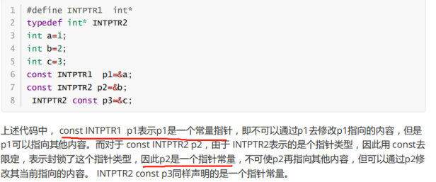

# 预处理

### 1.预处理器标识#error的目的是什么？

编译程序时，只要遇到#error就会生成一个编译错误提醒，并且停止编译，

语法格式:

\#error error-message

实例:

\#ifdef xxx

\#error “xxx has been defined”

\#else

\#endif


### 2.头文件中#ifndef #define #endif

当项目中有多个c文件使用到同一个头文件是，在编译的时候会出现大量的变量，函数声明冲突，解决就是使用

\#ifndef _HEAR_H_

\#define _HEAR_H_

\#endif


### 3.\#define和const

define和const 都可以用于定义常量但以下区别(生效时间，内存占用情况，类型检查)：

（1）define只是单纯的文本替换，define常量的生命生命周期止于编译器，不存在分配内存，存在与程序的代码段

（2）const生效于编译的阶段；define生效于预处理阶段

（3）Const修饰的常量处于程序的数据段，在堆栈中分配空间

（4）Const有数据类型检查，define没有

（5）#define不可调试，const能调试

（6）const定义的变量在C中不是真正的常量

（7）Const 定义的常量不能作为数组的大小

 


### 4.typedef和define（原理、作用域，对指针操作不同）

原理不同：

（1）首先#define是预处理命令，在预处理阶段只是机械的替换带入字符串，并不会左类型检查，

（2）typedef是关键字，作用是给自己的作用域内给一个已经存在的类型起个别名

（3）#define没有作用域的限制，只要是之前预定义过的宏，在以后的程序中都可以使用，而typedef有自己的作用域

（4）对指针的操作不同

比如:#define intper int *

typedef int * pre

inpter p,q;表示定义指针变量p和普通变量q

pre p,q; //表示定义指针变量p和指针变量q

所以在定义多个指针的时候就不是很方便

const Intper p;表示常量指针----->指针指向地址的内容不能改变

const pre p;表示指针常量 


### 5.define的一些坑（缺点）：

```c
#define m(a,b) a*b
// #define m(a,b) (a)*(b)//避免出问题最好加上()
int main()
{

    printf("%d\n",m(5,6));
    printf("%d\n",m(5+1,6));//实际是这样的：5+1*6
    return 0;
}
```


1. 无法进行类型检查
2. 运算优先级问题
3. 无法调试
4. 代码膨胀
5. 无法操作类的私有数据成员


### 6.\#include<头文件>，#include”头文件”的区别

对于.#include<头文件>，表示是系统文件，编译会先从标准库路径下搜索，

编译器设置的头文件路径-->系统变量

对于#include”头文件”，当前头文件目录-->编译器设置的头文件路径-->系统变量


对于编译速度来说：

语句#include< stdlib.h >是正确的，而且程序编译速度比#include “stdlib.h”要快

解释：因为stdlib.h是系统文件，所以存放在系统的默认位置，所以，当#include< stdlib.h >这样时就表示先去系统默认路径下查找，这样就很快找到stdlib.h,

如果#include”stdlib.h”这样的的话，就会现在当前目录下找，但是没有这个文件，还得去默认路径找，所以如果是系统文件的话一般是使用<>,自定义文件的话””


### 7.定义一个常数，用以表明一年有多少秒（忽略闰年）

#define SECOND_PRE_YEAR (60*60*24*365)UL


### 8.简述C++从代码到可执行二进制文件的过程

预处理、编译、汇编、链接

预编译：这个过程主要的处理操作如下：

（1） 将所有的#define删除，并且展开所有的宏定义

（2） 处理所有的条件预编译指令，如#if、#ifdef

（3） 处理#include预编译指令，将被包含的文件插入到该预编译指令的位置。

（4） 过滤所有的注释

（5） 添加行号和文件名标识

编译：这个过程主要的处理操作如下：

（1） 词法分析：将源代码的字符序列分割成一系列的记号。

（2） 语法分析：对记号进行语法分析，产生语法树。

（3） 语义分析：判断表达式是否有意义。

（4） 代码优化：

（5） 目标代码生成：生成汇编代码。

（6） 目标代码优化

汇编：这个过程主要是将汇编代码转变成机器可以执行的指令。

链接：将不同的源文件产生的目标文件进行链接，从而形成一个可以执行的程序


### 9.写一个标准宏MIN

\#define MIN(a,b) ((a)<(b)?(a):(b))


### 10.\#define sqort(a)  ((a)*(a))

实例1：  int a = 5;

  int b = sqort(a++);//( (a++) * (a++) )  先给括号赋值 5之后a再+1=6

  printf("%d\n",b);//30

  printf("%d\n",a);//7

 

实例2： int a = 5;

 int b = sqort(++a);//(（++a）* (++a)) 

 printf("%d\n",b);//49

 printf("%d\n",a);//7

 

这里主要是考察++a和后加加的问题

记住一点：

++a返回的a的引用，a++返回的是a加之前的数值

a的引用是要等最终的那个a才能确定的


### 11.对指针的操作




### 12.在头文件中是否可以定义静态变量

不可以，因为静态变量是有记忆的，不会随函数结束而结束，所以，如果定义在头文件中，那么就会被多个文件开辟空间，浪费资源或者重新出错


### 13.\#和##的作用


### 14.使用宏求结构体的内存偏移地址

#define OffSet(type,filed)((size_t)&(((type*)0)->field))


### 15.枚举和define区别

生效、类型、检查，调试，实体

1. 枚举是在编译器生效，define是在预处理
2. 枚举有类型，具有类型检查
3. 枚举是实体，宏不是
4. 枚举可以定义常量和变量，宏只能定义常量
5. 枚举可以调试


### 16.const和define区别

1. 两者都可以定义常量
2. const会进行类型检查
3. Const可以进行调试
4. Cosnt是在编译期，define是在预处理
5. Const常量分配存在于数据段，分配内存，define不会分配内存


### 17.typedef和define区别


### 18.宏函数和内联函数的区别

1.宏函数不是函数，是宏定义，只是使用起来像函数，宏函数是在预编译的时候把 所有的宏名用宏体来替换，简单的说就是字符串替换

2.内联函数，内联函数本质上是一个函数，内联函数一般用于函数体的代码比较简 单的函数，不能包含复杂的控制语句，while、switch，并且内联函数本身不 能直接调用自身

3.宏函数和内联函数如何提高效率？

内联函数则是在编译的时候进行代码插入，编译器会在每处调用内联函数的地 方直接把内联函数的内容展开，这样可以省去函数的调用的开销，提高效率

宏函数则是在预处理的时候把宏体展开减去了参数压栈，函数调用，返回值等操作

4.宏定义是没有类型检查的，无论对还是错都是直接替换；而内联函数在编译的时候会进行类型的检查，内联函数满足函数的性质，比如有返回值、参数列表


### 19.如何判断一个整数是有符号还是无符号？

\#define isunsing(a) ((a >= 0) && (~a >= 0))  //a代表一个数值 ，如果a>0并且取反之后也是大于0，那么就是无符号

或者

\#define isunsing(type) ((type)0-1 > 0)  //type可以是int char等数据类型


