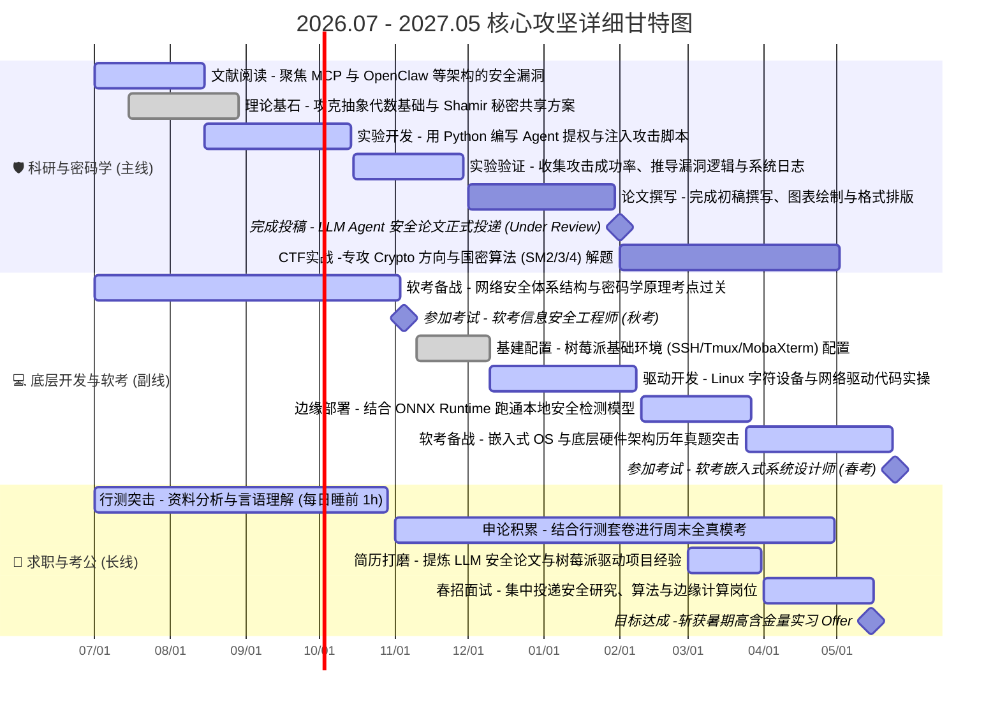

```mermaid
gantt
    title 2026.07 - 2027.05 核心攻坚详细甘特图
    dateFormat YYYY-MM-DD
    axisFormat %m/%d
    todayMarker stroke-width:3px,stroke:red,opacity:1.0

    section 🛡️ 科研与密码学 (主线)
    文献阅读 - 聚焦 MCP 与 OpenClaw 等架构的安全漏洞 :active, a1, 2026-07-01, 45d
    理论基石 - 攻克抽象代数基础与 Shamir 秘密共享方案 :done, a2, 2026-07-15, 45d
    实验开发 - 用 Python 编写 Agent 提权与注入攻击脚本 :active, a3, 2026-08-15, 60d
    实验验证 - 收集攻击成功率、推导漏洞逻辑与系统日志 :active, a4, 2026-10-15, 45d
    论文撰写 - 完成初稿撰写、图表绘制与格式排版 :a5, 2026-12-01, 60d
    完成投稿 - LLM Agent 安全论文正式投递 (Under Review) :milestone, m_paper, 2027-02-01, 0d
    CTF实战 -专攻 Crypto 方向与国密算法 (SM2/3/4) 解题 :a6, 2027-02-01, 90d

    section 💻 底层开发与软考 (副线)
    软考备战 - 网络安全体系结构与密码学原理考点过关 :active, b1, 2026-07-01, 125d
    参加考试 - 软考信息安全工程师 (秋考) :milestone, m_soft1, 2026-11-05, 0d
    基建配置 - 树莓派基础环境 (SSH/Tmux/MobaXterm) 配置 :done, b2, 2026-11-10, 30d
    驱动开发 - Linux 字符设备与网络驱动代码实操 :active, b3, 2026-12-10, 60d
    边缘部署 - 结合 ONNX Runtime 跑通本地安全检测模型 :active, b4, 2027-02-10, 45d
    软考备战 - 嵌入式 OS 与底层硬件架构历年真题突击 :active, b5, 2027-03-25, 60d
    参加考试 - 软考嵌入式系统设计师 (春考) :milestone, m_soft2, 2027-05-25, 0d

    section 🎯 求职与考公 (长线)
    行测突击 - 资料分析与言语理解 (每日睡前 1h) :active, c1, 2026-07-01, 120d
    申论积累 - 结合行测套卷进行周末全真模考 :active, c2, 2026-11-01, 180d
    简历打磨 - 提炼 LLM 安全论文与树莓派驱动项目经验 :active, c3, 2027-03-01, 30d
    春招面试 - 集中投递安全研究、算法与边缘计算岗位 :active, c4, 2027-04-01, 45d
    目标达成 -斩获暑期高含金量实习 Offer :milestone, m_offer, 2027-05-15, 0d
```